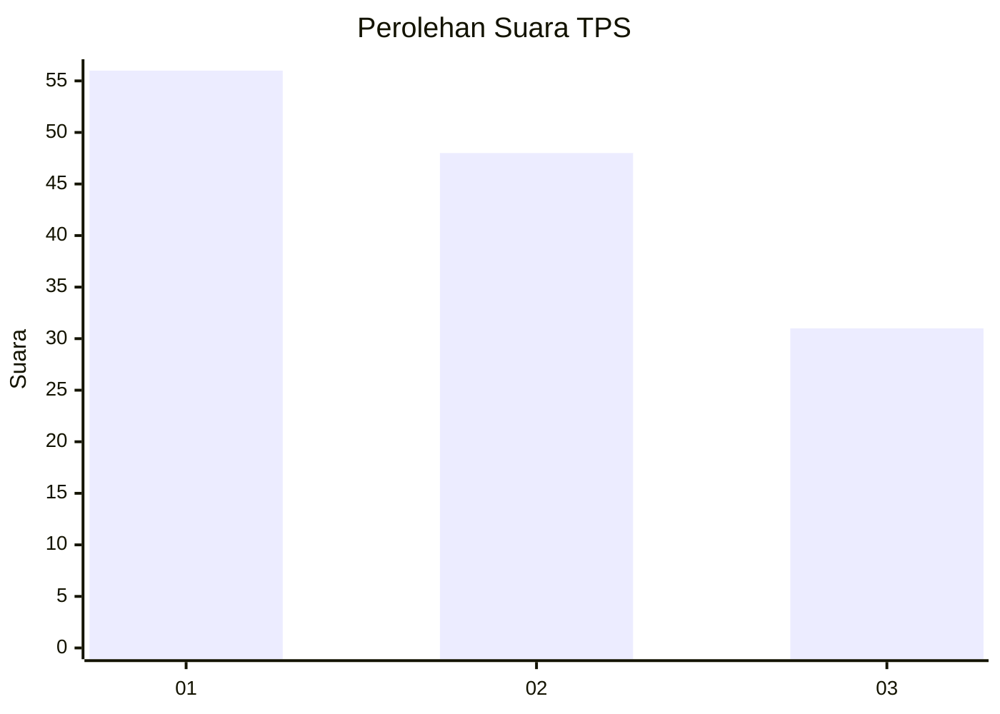
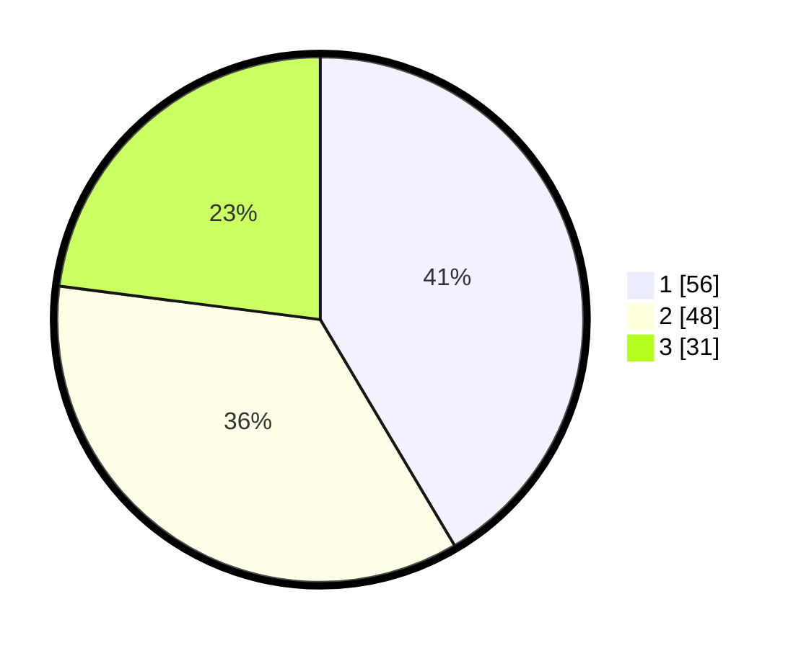

# Hasil

## Grafik

## Tabel

| No. | Nama Paslon    | Suara | Suara (raw) | Persentase |
|:--- |:-------------- | -----:| -----------:| ----------:|
| 1   | ANIES MUHAIMIN | 56    | [56][p-1]   | 41,48      |
| 2   | PRABOWO GIBRAN | 48    | [48][p-2]   | 35,56      |
| 3   | GANJAR MAHFUD  | 31    | [31][p-3]   | 22,96      |

[p-1]: https://github.com/gigit-pemilu/pemilu-2024-35-jawa-timur/blob/main/pilpres/hitung-suara/sub/35-jawa-timur/sub/29-sumenep/sub/04-talango/sub/2001-talango/sub/013-tps/sub/paslon-1.txt
[p-2]: https://github.com/gigit-pemilu/pemilu-2024-35-jawa-timur/blob/main/pilpres/hitung-suara/sub/35-jawa-timur/sub/29-sumenep/sub/04-talango/sub/2001-talango/sub/013-tps/sub/paslon-2.txt
[p-3]: https://github.com/gigit-pemilu/pemilu-2024-35-jawa-timur/blob/main/pilpres/hitung-suara/sub/35-jawa-timur/sub/29-sumenep/sub/04-talango/sub/2001-talango/sub/013-tps/sub/paslon-3.txt

## Foto C Plano

https://sirekap-obj-formc.kpu.go.id/a86d/pemilu/ppwp/35/29/04/20/01/3529042001013-20240215-204510--64137dbd-21f6-456f-b319-6f23d3f82dd6.jpg

https://sirekap-obj-formc.kpu.go.id/a86d/pemilu/ppwp/35/29/04/20/01/3529042001013-20240215-205224--b75d0c05-42e9-4bb6-95b6-bf3438bdc2ca.jpg

https://sirekap-obj-formc.kpu.go.id/a86d/pemilu/ppwp/35/29/04/20/01/3529042001013-20240215-205515--b5bb4f12-58be-4bf9-a76b-31507bbd5db0.jpg

## Metadata

| Key        | Value               |
| ---------- | ------------------- |
| Time Stamp | 2024-02-25 18:00:00 |

