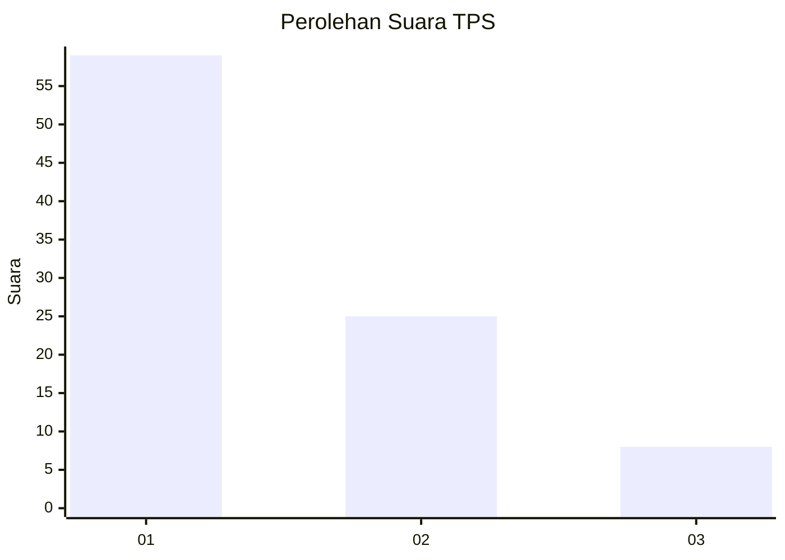
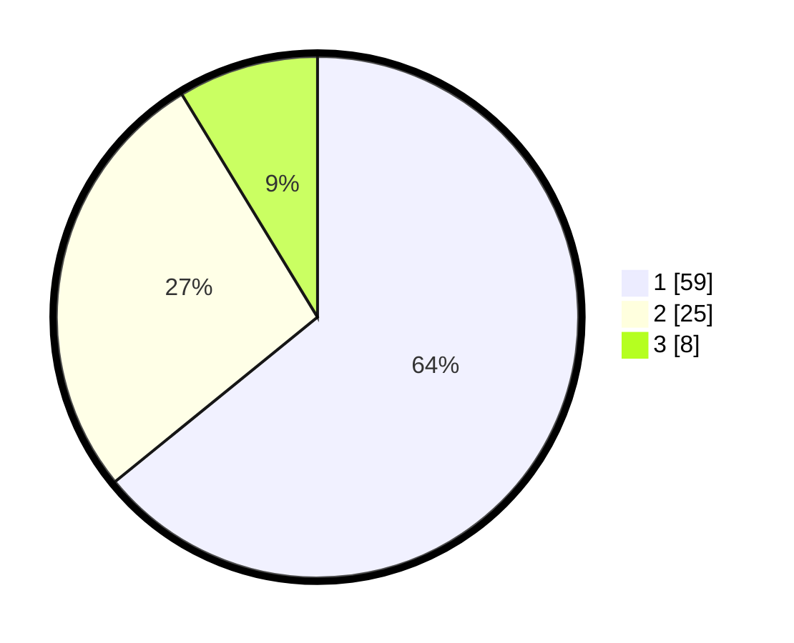

# Hasil

## Grafik

## Tabel

| No. | Nama Paslon    | Suara | Suara (raw) | Persentase |
|:--- |:-------------- | -----:| -----------:| ----------:|
| 1   | ANIES MUHAIMIN | 59    | [59][p-1]   | 64,13      |
| 2   | PRABOWO GIBRAN | 25    | [25][p-2]   | 27,17      |
| 3   | GANJAR MAHFUD  | 8     | [8][p-3]    | 8,70       |

[p-1]: https://github.com/gigit-pemilu/pemilu-2024-35-jawa-timur/blob/main/pilpres/hitung-suara/sub/35-jawa-timur/sub/29-sumenep/sub/04-talango/sub/2001-talango/sub/023-tps/sub/paslon-1.txt
[p-2]: https://github.com/gigit-pemilu/pemilu-2024-35-jawa-timur/blob/main/pilpres/hitung-suara/sub/35-jawa-timur/sub/29-sumenep/sub/04-talango/sub/2001-talango/sub/023-tps/sub/paslon-2.txt
[p-3]: https://github.com/gigit-pemilu/pemilu-2024-35-jawa-timur/blob/main/pilpres/hitung-suara/sub/35-jawa-timur/sub/29-sumenep/sub/04-talango/sub/2001-talango/sub/023-tps/sub/paslon-3.txt

## Foto C Plano

https://sirekap-obj-formc.kpu.go.id/acd7/pemilu/ppwp/35/29/04/20/01/3529042001023-20240214-185109--0d59704f-f3eb-49f4-93fc-aa7ae6382343.jpg

https://sirekap-obj-formc.kpu.go.id/acd7/pemilu/ppwp/35/29/04/20/01/3529042001023-20240214-193516--9c9e3b94-4db7-43ba-a1a4-a43fe83ef5b8.jpg

https://sirekap-obj-formc.kpu.go.id/acd7/pemilu/ppwp/35/29/04/20/01/3529042001023-20240214-193630--a32d05f2-b1df-41e0-bb2f-ee3a7ff7758d.jpg

## Metadata

| Key        | Value               |
| ---------- | ------------------- |
| Time Stamp | 2024-02-24 22:31:28 |

