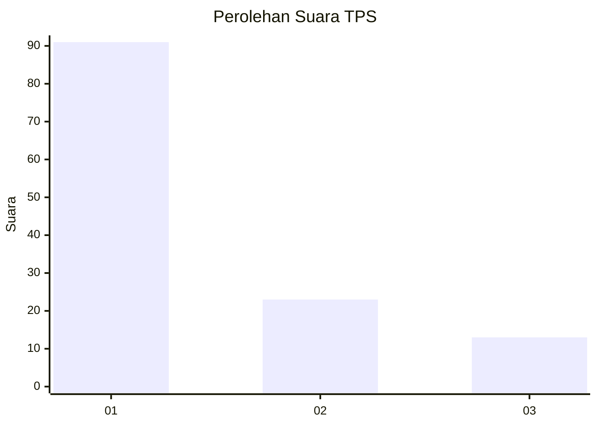
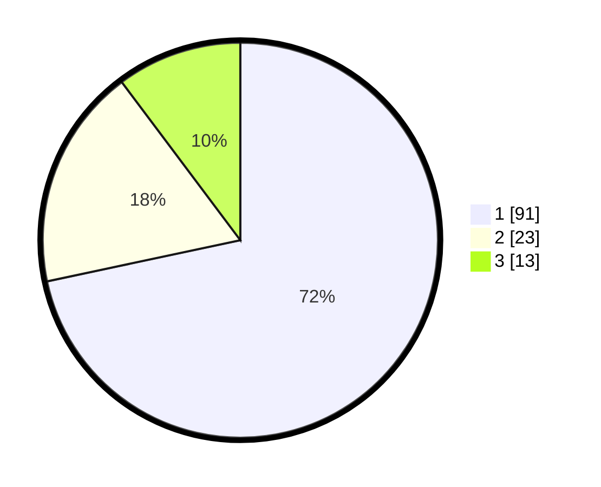

# Hasil

## Grafik

## Tabel

| No. | Nama Paslon    | Suara | Suara (raw) | Persentase |
|:--- |:-------------- | -----:| -----------:| ----------:|
| 1   | ANIES MUHAIMIN | 91    | [91][p-1]   | 71,65      |
| 2   | PRABOWO GIBRAN | 23    | [23][p-2]   | 18,11      |
| 3   | GANJAR MAHFUD  | 13    | [13][p-3]   | 10,24      |

[p-1]: https://github.com/gigit-pemilu/pemilu-2024/blob/main/pilpres/hitung-suara/sub/35-jawa-timur/sub/29-sumenep/sub/04-talango/sub/2002-padike/sub/007-tps/sub/paslon-1.txt
[p-2]: https://github.com/gigit-pemilu/pemilu-2024/blob/main/pilpres/hitung-suara/sub/35-jawa-timur/sub/29-sumenep/sub/04-talango/sub/2002-padike/sub/007-tps/sub/paslon-2.txt
[p-3]: https://github.com/gigit-pemilu/pemilu-2024/blob/main/pilpres/hitung-suara/sub/35-jawa-timur/sub/29-sumenep/sub/04-talango/sub/2002-padike/sub/007-tps/sub/paslon-3.txt

## Foto C Plano

https://sirekap-obj-formc.kpu.go.id/3871/pemilu/ppwp/35/29/04/20/02/3529042002007-20240214-211148--5c23a6d0-9f07-4d45-b297-0da45561af6c.jpg

https://sirekap-obj-formc.kpu.go.id/3871/pemilu/ppwp/35/29/04/20/02/3529042002007-20240214-211309--5cbb0032-1d68-4d29-a9f7-86d350ac843a.jpg

## Metadata

| Key        | Value               |
| ---------- | ------------------- |
| Time Stamp | 2024-02-15 23:29:50 |

