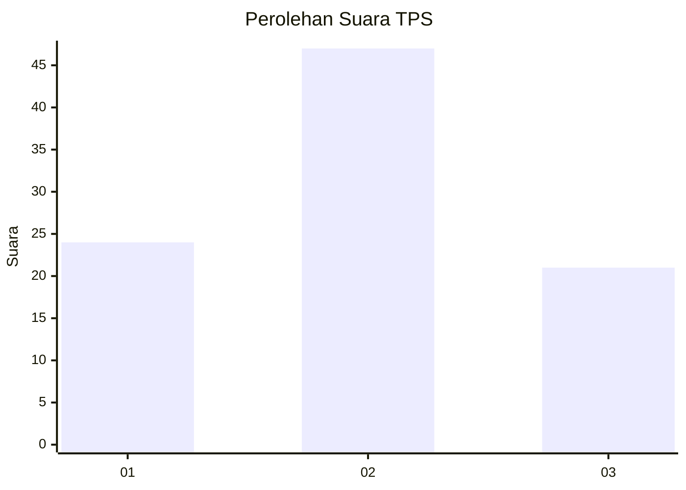
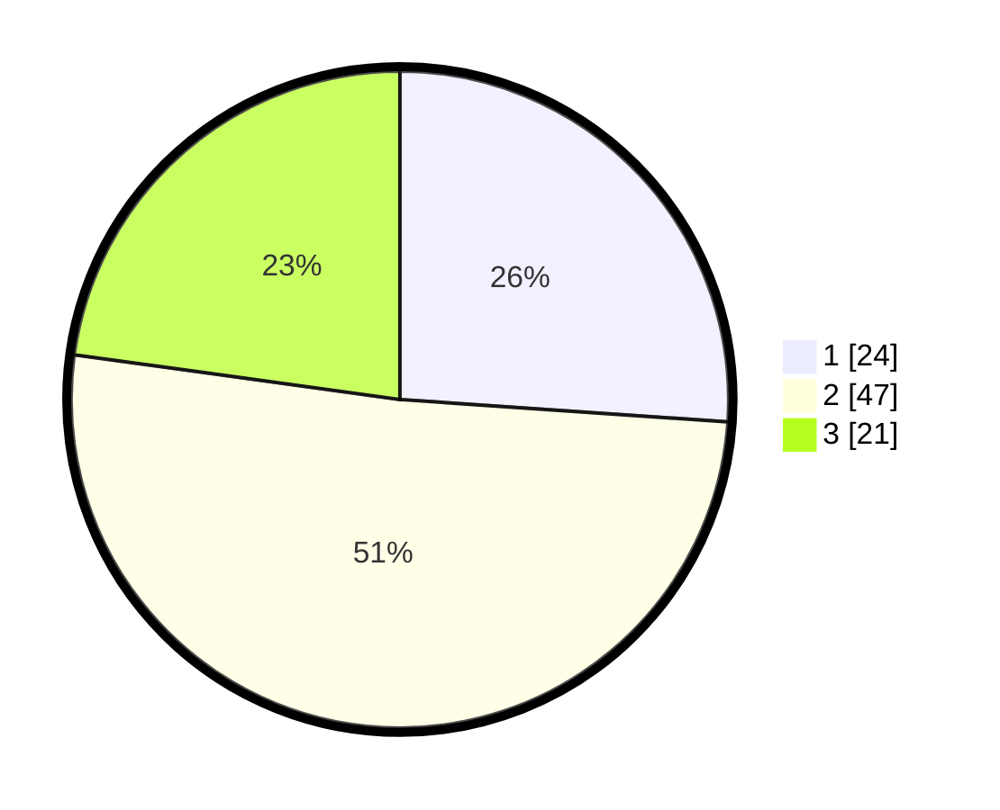

# Hasil

## Grafik

## Tabel

| No. | Nama Paslon    | Suara | Suara (raw) | Persentase |
|:--- |:-------------- | -----:| -----------:| ----------:|
| 1   | ANIES MUHAIMIN | 24    | [24][p-1]   | 26,09      |
| 2   | PRABOWO GIBRAN | 47    | [47][p-2]   | 51,09      |
| 3   | GANJAR MAHFUD  | 21    | [21][p-3]   | 22,83      |

[p-1]: https://github.com/gigit-pemilu/pemilu-2024-35-jawa-timur/blob/main/pilpres/hitung-suara/sub/35-jawa-timur/sub/29-sumenep/sub/04-talango/sub/2004-essang/sub/006-tps/sub/paslon-1.txt
[p-2]: https://github.com/gigit-pemilu/pemilu-2024-35-jawa-timur/blob/main/pilpres/hitung-suara/sub/35-jawa-timur/sub/29-sumenep/sub/04-talango/sub/2004-essang/sub/006-tps/sub/paslon-2.txt
[p-3]: https://github.com/gigit-pemilu/pemilu-2024-35-jawa-timur/blob/main/pilpres/hitung-suara/sub/35-jawa-timur/sub/29-sumenep/sub/04-talango/sub/2004-essang/sub/006-tps/sub/paslon-3.txt

## Foto C Plano

https://sirekap-obj-formc.kpu.go.id/9bdb/pemilu/ppwp/35/29/04/20/04/3529042004006-20240214-223614--87ef1239-6369-41f5-913a-feced0b144b4.jpg

https://sirekap-obj-formc.kpu.go.id/9bdb/pemilu/ppwp/35/29/04/20/04/3529042004006-20240214-224611--0f48926b-d504-4b27-997a-10301bebab7d.jpg

https://sirekap-obj-formc.kpu.go.id/9bdb/pemilu/ppwp/35/29/04/20/04/3529042004006-20240214-224709--d402902f-8c5c-4bed-9cea-b5f179eeb362.jpg

## Metadata

| Key        | Value               |
| ---------- | ------------------- |
| Time Stamp | 2024-02-15 19:00:26 |

