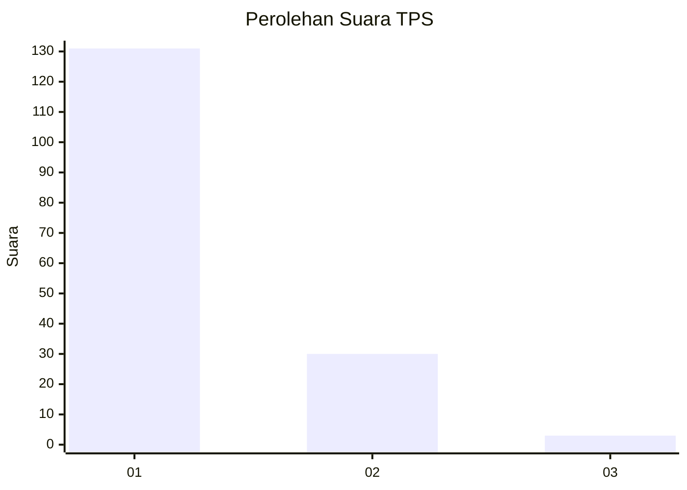
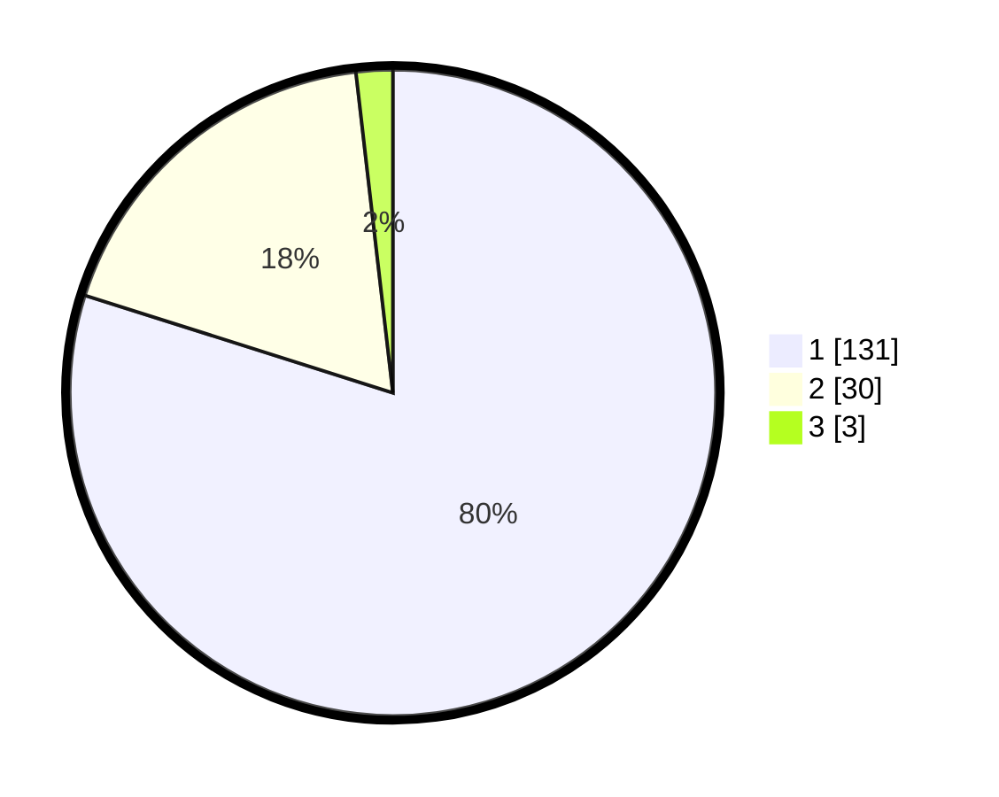

# Hasil

## Grafik

## Tabel

| No. | Nama Paslon    | Suara | Suara (raw) | Persentase |
|:--- |:-------------- | -----:| -----------:| ----------:|
| 1   | ANIES MUHAIMIN | 131   | [131][p-1]  | 79,88      |
| 2   | PRABOWO GIBRAN | 30    | [30][p-2]   | 18,29      |
| 3   | GANJAR MAHFUD  | 3     | [3][p-3]    | 1,83       |

[p-1]: https://github.com/gigit-pemilu/pemilu-2024/blob/main/pilpres/hitung-suara/sub/35-jawa-timur/sub/29-sumenep/sub/04-talango/sub/2006-poteran/sub/003-tps/sub/paslon-1.txt
[p-2]: https://github.com/gigit-pemilu/pemilu-2024/blob/main/pilpres/hitung-suara/sub/35-jawa-timur/sub/29-sumenep/sub/04-talango/sub/2006-poteran/sub/003-tps/sub/paslon-2.txt
[p-3]: https://github.com/gigit-pemilu/pemilu-2024/blob/main/pilpres/hitung-suara/sub/35-jawa-timur/sub/29-sumenep/sub/04-talango/sub/2006-poteran/sub/003-tps/sub/paslon-3.txt

## Foto C Plano

https://sirekap-obj-formc.kpu.go.id/0c31/pemilu/ppwp/35/29/04/20/06/3529042006003-20240214-215114--9e6ad937-3554-4bde-9c2c-9a405ca75bdd.jpg

https://sirekap-obj-formc.kpu.go.id/0c31/pemilu/ppwp/35/29/04/20/06/3529042006003-20240214-213009--52686e11-1ad1-40e9-964a-b9b75aa8a89f.jpg

https://sirekap-obj-formc.kpu.go.id/0c31/pemilu/ppwp/35/29/04/20/06/3529042006003-20240214-201830--8e424571-c4ec-485f-9d41-f521171eaafc.jpg

## Metadata

| Key        | Value               |
| ---------- | ------------------- |
| Time Stamp | 2024-02-15 20:00:44 |

