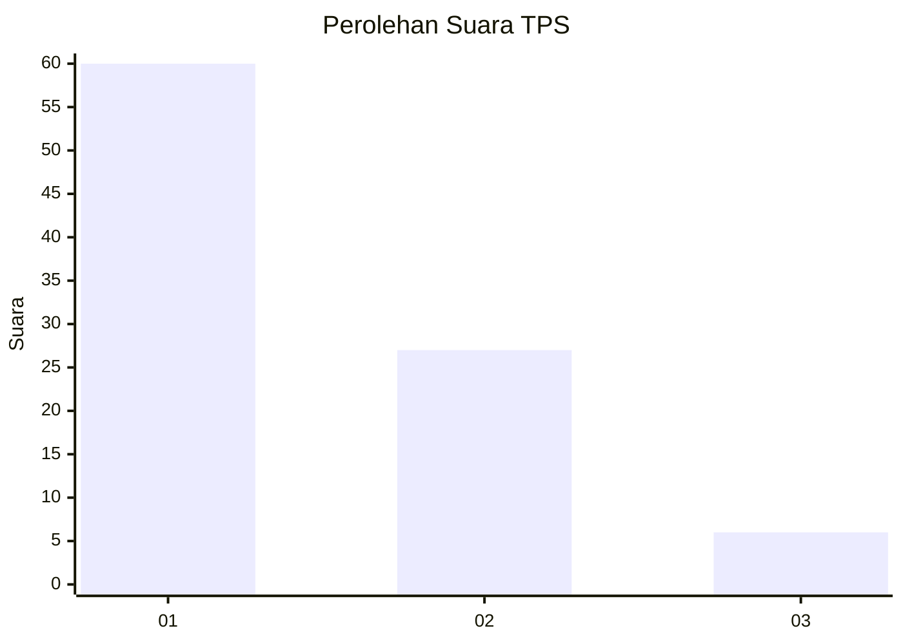
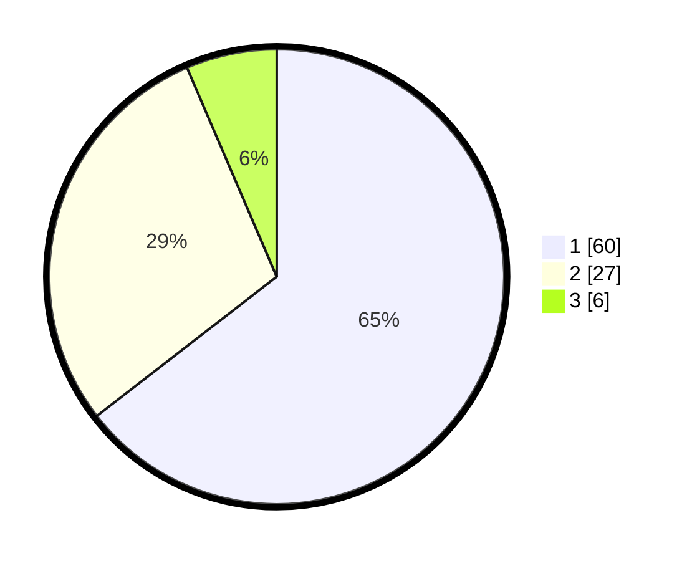

# Hasil

## Grafik

## Tabel

| No. | Nama Paslon    | Suara | Suara (raw) | Persentase |
|:--- |:-------------- | -----:| -----------:| ----------:|
| 1   | ANIES MUHAIMIN | 60    | [60][p-1]   | 64,52      |
| 2   | PRABOWO GIBRAN | 27    | [27][p-2]   | 29,03      |
| 3   | GANJAR MAHFUD  | 6     | [6][p-3]    | 6,45       |

[p-1]: https://github.com/gigit-pemilu/pemilu-2024/blob/main/pilpres/hitung-suara/sub/35-jawa-timur/sub/29-sumenep/sub/04-talango/sub/2006-poteran/sub/013-tps/sub/paslon-1.txt
[p-2]: https://github.com/gigit-pemilu/pemilu-2024/blob/main/pilpres/hitung-suara/sub/35-jawa-timur/sub/29-sumenep/sub/04-talango/sub/2006-poteran/sub/013-tps/sub/paslon-2.txt
[p-3]: https://github.com/gigit-pemilu/pemilu-2024/blob/main/pilpres/hitung-suara/sub/35-jawa-timur/sub/29-sumenep/sub/04-talango/sub/2006-poteran/sub/013-tps/sub/paslon-3.txt

## Foto C Plano

https://sirekap-obj-formc.kpu.go.id/955b/pemilu/ppwp/35/29/04/20/06/3529042006013-20240214-203617--83942773-f244-4a3c-94db-f810a7e952fe.jpg

https://sirekap-obj-formc.kpu.go.id/955b/pemilu/ppwp/35/29/04/20/06/3529042006013-20240214-203713--26fd1abb-330e-4202-ae4c-801f8a1fb23f.jpg

https://sirekap-obj-formc.kpu.go.id/955b/pemilu/ppwp/35/29/04/20/06/3529042006013-20240214-203805--f8389f97-b860-4934-94f5-2c2e47e2cedb.jpg

## Metadata

| Key        | Value               |
| ---------- | ------------------- |
| Time Stamp | 2024-02-25 14:00:00 |

