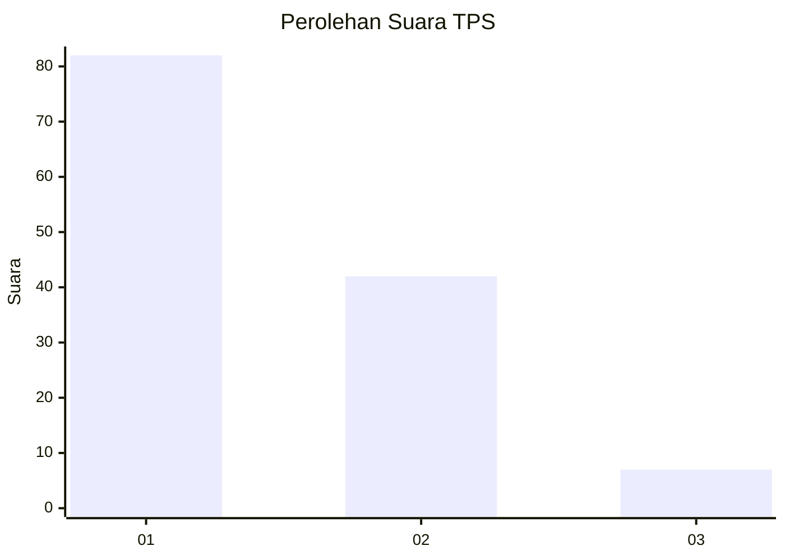
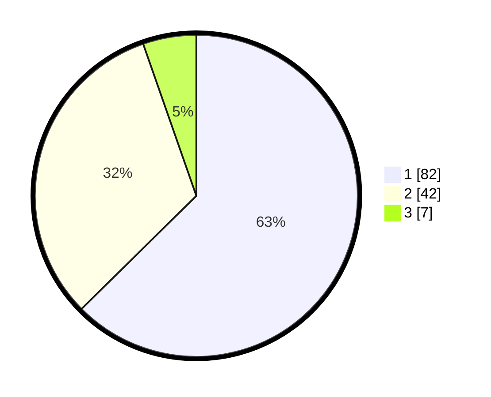

# Hasil

## Grafik

## Tabel

| No. | Nama Paslon    | Suara | Suara (raw) | Persentase |
|:--- |:-------------- | -----:| -----------:| ----------:|
| 1   | ANIES MUHAIMIN | 82    | [82][p-1]   | 62,60      |
| 2   | PRABOWO GIBRAN | 42    | [42][p-2]   | 32,06      |
| 3   | GANJAR MAHFUD  | 7     | [7][p-3]    | 5,34       |

[p-1]: https://github.com/gigit-pemilu/pemilu-2024-35-jawa-timur/blob/main/pilpres/hitung-suara/sub/35-jawa-timur/sub/29-sumenep/sub/04-talango/sub/2006-poteran/sub/014-tps/sub/paslon-1.txt
[p-2]: https://github.com/gigit-pemilu/pemilu-2024-35-jawa-timur/blob/main/pilpres/hitung-suara/sub/35-jawa-timur/sub/29-sumenep/sub/04-talango/sub/2006-poteran/sub/014-tps/sub/paslon-2.txt
[p-3]: https://github.com/gigit-pemilu/pemilu-2024-35-jawa-timur/blob/main/pilpres/hitung-suara/sub/35-jawa-timur/sub/29-sumenep/sub/04-talango/sub/2006-poteran/sub/014-tps/sub/paslon-3.txt

## Foto C Plano

https://sirekap-obj-formc.kpu.go.id/4522/pemilu/ppwp/35/29/04/20/06/3529042006014-20240214-223904--810d5b7a-d59e-4ad2-99a0-0bcbf1c5c1e0.jpg

https://sirekap-obj-formc.kpu.go.id/4522/pemilu/ppwp/35/29/04/20/06/3529042006014-20240214-224046--df6825b5-7290-4cc8-a66b-285b6b233606.jpg

https://sirekap-obj-formc.kpu.go.id/4522/pemilu/ppwp/35/29/04/20/06/3529042006014-20240214-224123--99d196f4-6f50-47d9-baed-03eea07d3ce0.jpg

## Metadata

| Key        | Value               |
| ---------- | ------------------- |
| Time Stamp | 2024-02-15 20:00:44 |

