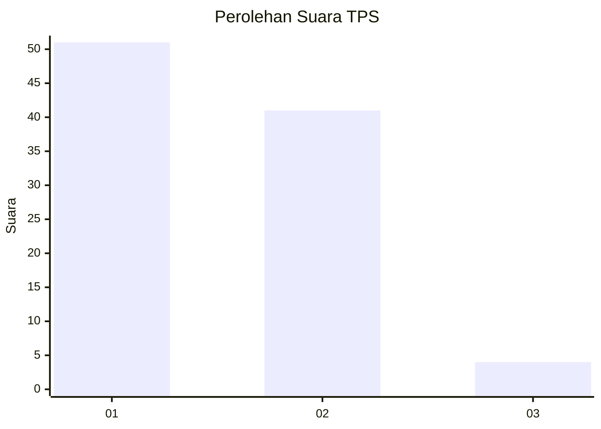
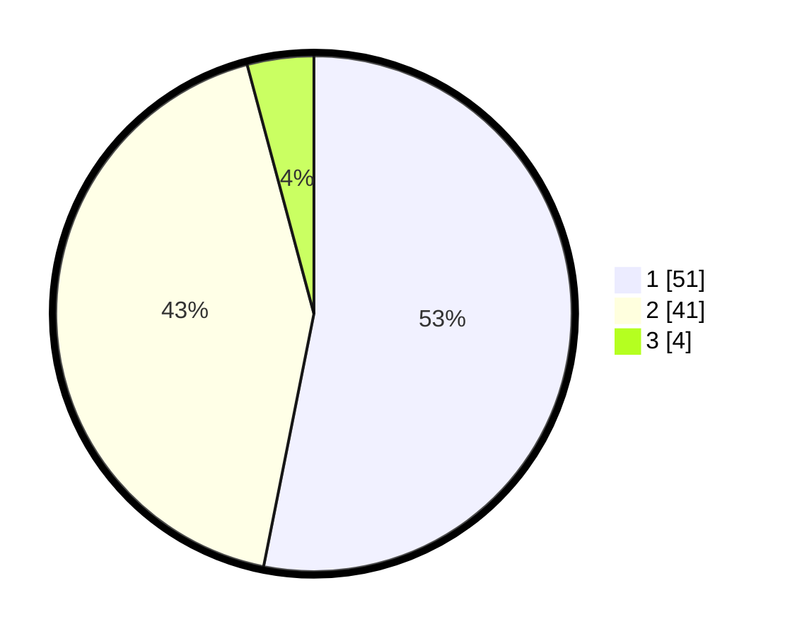

# Hasil

## Grafik

## Tabel

| No. | Nama Paslon    | Suara | Suara (raw) | Persentase |
|:--- |:-------------- | -----:| -----------:| ----------:|
| 1   | ANIES MUHAIMIN | 51    | [51][p-1]   | 53,13      |
| 2   | PRABOWO GIBRAN | 41    | [41][p-2]   | 42,71      |
| 3   | GANJAR MAHFUD  | 4     | [4][p-3]    | 4,17       |

[p-1]: https://github.com/gigit-pemilu/pemilu-2024-35-jawa-timur/blob/main/pilpres/hitung-suara/sub/35-jawa-timur/sub/29-sumenep/sub/04-talango/sub/2006-poteran/sub/015-tps/sub/paslon-1.txt
[p-2]: https://github.com/gigit-pemilu/pemilu-2024-35-jawa-timur/blob/main/pilpres/hitung-suara/sub/35-jawa-timur/sub/29-sumenep/sub/04-talango/sub/2006-poteran/sub/015-tps/sub/paslon-2.txt
[p-3]: https://github.com/gigit-pemilu/pemilu-2024-35-jawa-timur/blob/main/pilpres/hitung-suara/sub/35-jawa-timur/sub/29-sumenep/sub/04-talango/sub/2006-poteran/sub/015-tps/sub/paslon-3.txt

## Foto C Plano

https://sirekap-obj-formc.kpu.go.id/c53b/pemilu/ppwp/35/29/04/20/06/3529042006015-20240214-192052--d6195704-c713-402f-88c1-2fddd5a01ce8.jpg

https://sirekap-obj-formc.kpu.go.id/c53b/pemilu/ppwp/35/29/04/20/06/3529042006015-20240214-202857--2c7af6e9-f8a2-42c4-b0de-0f9bee3f2297.jpg

https://sirekap-obj-formc.kpu.go.id/c53b/pemilu/ppwp/35/29/04/20/06/3529042006015-20240214-203733--b0928846-32a9-42d4-aff6-3f2baa9a975a.jpg

## Metadata

| Key        | Value               |
| ---------- | ------------------- |
| Time Stamp | 2024-02-14 21:46:01 |

