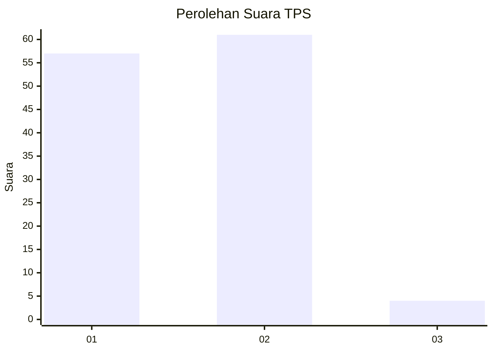
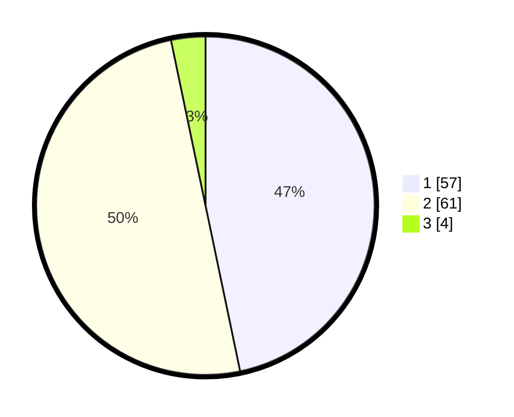

# Hasil

## Grafik

## Tabel

| No. | Nama Paslon    | Suara | Suara (raw) | Persentase |
|:--- |:-------------- | -----:| -----------:| ----------:|
| 1   | ANIES MUHAIMIN | 57    | [57][p-1]   | 46,72      |
| 2   | PRABOWO GIBRAN | 61    | [61][p-2]   | 50,00      |
| 3   | GANJAR MAHFUD  | 4     | [4][p-3]    | 3,28       |

[p-1]: https://github.com/gigit-pemilu/pemilu-2024-35-jawa-timur/blob/main/pilpres/hitung-suara/sub/35-jawa-timur/sub/29-sumenep/sub/04-talango/sub/2006-poteran/sub/016-tps/sub/paslon-1.txt
[p-2]: https://github.com/gigit-pemilu/pemilu-2024-35-jawa-timur/blob/main/pilpres/hitung-suara/sub/35-jawa-timur/sub/29-sumenep/sub/04-talango/sub/2006-poteran/sub/016-tps/sub/paslon-2.txt
[p-3]: https://github.com/gigit-pemilu/pemilu-2024-35-jawa-timur/blob/main/pilpres/hitung-suara/sub/35-jawa-timur/sub/29-sumenep/sub/04-talango/sub/2006-poteran/sub/016-tps/sub/paslon-3.txt

## Foto C Plano

https://sirekap-obj-formc.kpu.go.id/8127/pemilu/ppwp/35/29/04/20/06/3529042006016-20240214-215516--3127925b-2a7d-4aa7-9711-3de3b414360f.jpg

https://sirekap-obj-formc.kpu.go.id/8127/pemilu/ppwp/35/29/04/20/06/3529042006016-20240214-215903--89038415-d494-4120-bf64-d04ed6b7f411.jpg

https://sirekap-obj-formc.kpu.go.id/8127/pemilu/ppwp/35/29/04/20/06/3529042006016-20240214-220002--5210adeb-46f9-4b51-bda3-0e0e6ca80322.jpg

## Metadata

| Key        | Value               |
| ---------- | ------------------- |
| Time Stamp | 2024-02-24 22:31:28 |

