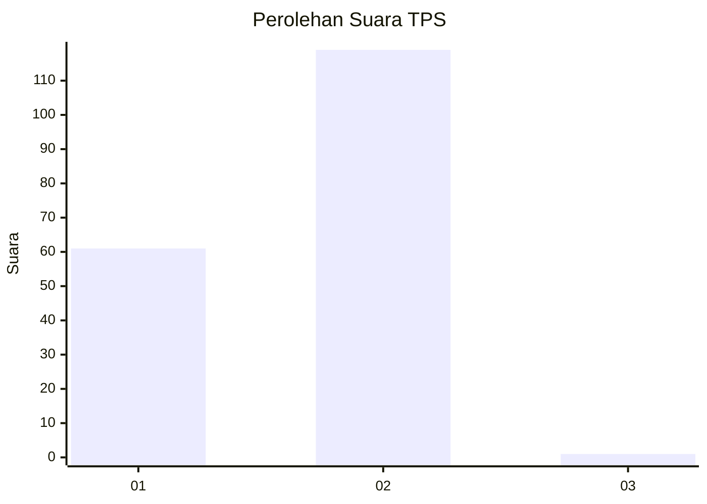
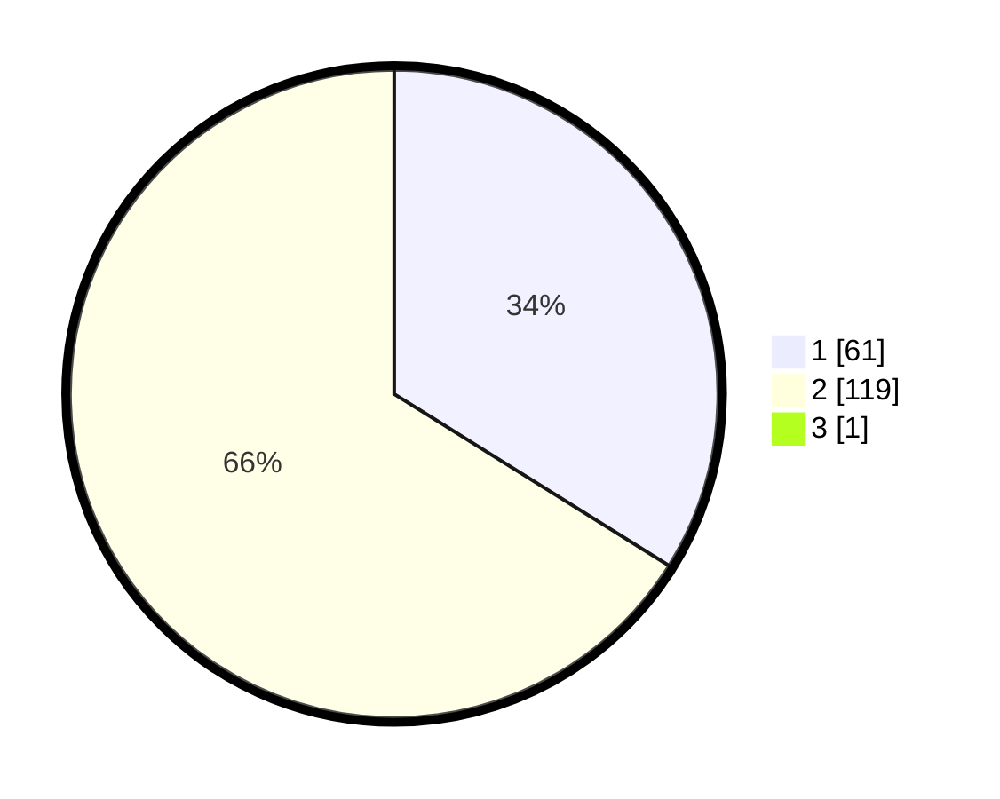

# Hasil

## Grafik

## Tabel

| No. | Nama Paslon    | Suara | Suara (raw) | Persentase |
|:--- |:-------------- | -----:| -----------:| ----------:|
| 1   | ANIES MUHAIMIN | 61    | [61][p-1]   | 33,70      |
| 2   | PRABOWO GIBRAN | 119   | [119][p-2]  | 65,75      |
| 3   | GANJAR MAHFUD  | 1     | [1][p-3]    | 0,55       |

[p-1]: https://github.com/gigit-pemilu/pemilu-2024/blob/main/pilpres/hitung-suara/sub/35-jawa-timur/sub/29-sumenep/sub/04-talango/sub/2008-gapurana/sub/024-tps/sub/paslon-1.txt
[p-2]: https://github.com/gigit-pemilu/pemilu-2024/blob/main/pilpres/hitung-suara/sub/35-jawa-timur/sub/29-sumenep/sub/04-talango/sub/2008-gapurana/sub/024-tps/sub/paslon-2.txt
[p-3]: https://github.com/gigit-pemilu/pemilu-2024/blob/main/pilpres/hitung-suara/sub/35-jawa-timur/sub/29-sumenep/sub/04-talango/sub/2008-gapurana/sub/024-tps/sub/paslon-3.txt

## Foto C Plano

https://sirekap-obj-formc.kpu.go.id/539a/pemilu/ppwp/35/29/04/20/08/3529042008024-20240216-034724--213007a4-d7c8-4596-8968-f62a17c1eb9a.jpg

https://sirekap-obj-formc.kpu.go.id/539a/pemilu/ppwp/35/29/04/20/08/3529042008024-20240216-034901--a23a3630-3442-4196-98a2-58b5f492c0b8.jpg

https://sirekap-obj-formc.kpu.go.id/539a/pemilu/ppwp/35/29/04/20/08/3529042008024-20240216-040537--23a7e0e2-903a-4cc6-8de4-8c8414e77c72.jpg

## Metadata

| Key        | Value               |
| ---------- | ------------------- |
| Time Stamp | 2024-02-20 14:00:00 |

