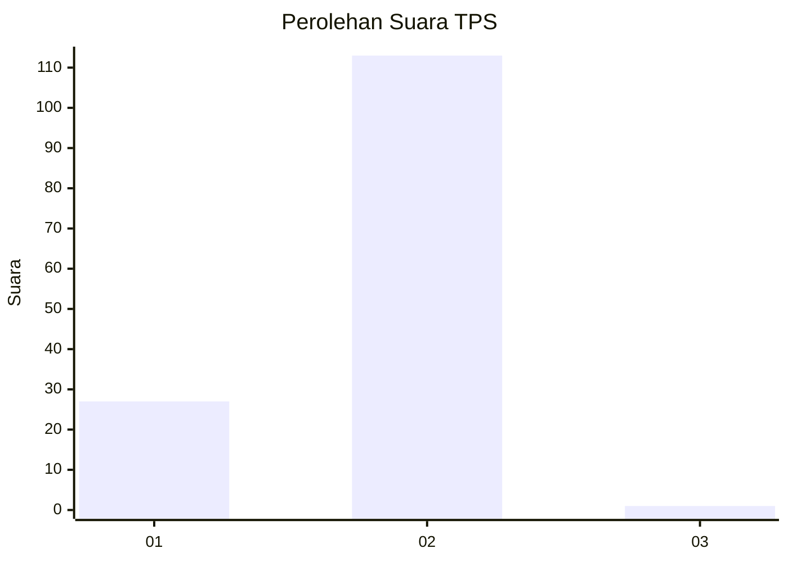
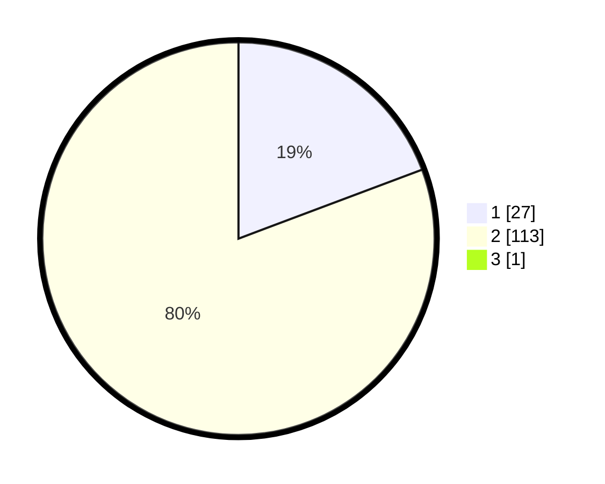

# Hasil

## Grafik

## Tabel

| No. | Nama Paslon    | Suara | Suara (raw) | Persentase |
|:--- |:-------------- | -----:| -----------:| ----------:|
| 1   | ANIES MUHAIMIN | 27    | [27][p-1]   | 19,15      |
| 2   | PRABOWO GIBRAN | 113   | [113][p-2]  | 80,14      |
| 3   | GANJAR MAHFUD  | 1     | [1][p-3]    | 0,71       |

[p-1]: https://github.com/gigit-pemilu/pemilu-2024/blob/main/pilpres/hitung-suara/sub/35-jawa-timur/sub/29-sumenep/sub/04-talango/sub/2008-gapurana/sub/025-tps/sub/paslon-1.txt
[p-2]: https://github.com/gigit-pemilu/pemilu-2024/blob/main/pilpres/hitung-suara/sub/35-jawa-timur/sub/29-sumenep/sub/04-talango/sub/2008-gapurana/sub/025-tps/sub/paslon-2.txt
[p-3]: https://github.com/gigit-pemilu/pemilu-2024/blob/main/pilpres/hitung-suara/sub/35-jawa-timur/sub/29-sumenep/sub/04-talango/sub/2008-gapurana/sub/025-tps/sub/paslon-3.txt

## Foto C Plano

https://sirekap-obj-formc.kpu.go.id/31f2/pemilu/ppwp/35/29/04/20/08/3529042008025-20240215-000511--4171bb5f-0a4c-4c9b-aecf-4708fe4c18b6.jpg

https://sirekap-obj-formc.kpu.go.id/31f2/pemilu/ppwp/35/29/04/20/08/3529042008025-20240215-000740--81c0ec24-3ff3-41bf-b876-aa6149530bc2.jpg

https://sirekap-obj-formc.kpu.go.id/31f2/pemilu/ppwp/35/29/04/20/08/3529042008025-20240215-000903--78a8aea9-0993-4102-9a16-c978069c6a97.jpg

## Metadata

| Key        | Value               |
| ---------- | ------------------- |
| Time Stamp | 2024-02-15 20:00:44 |

