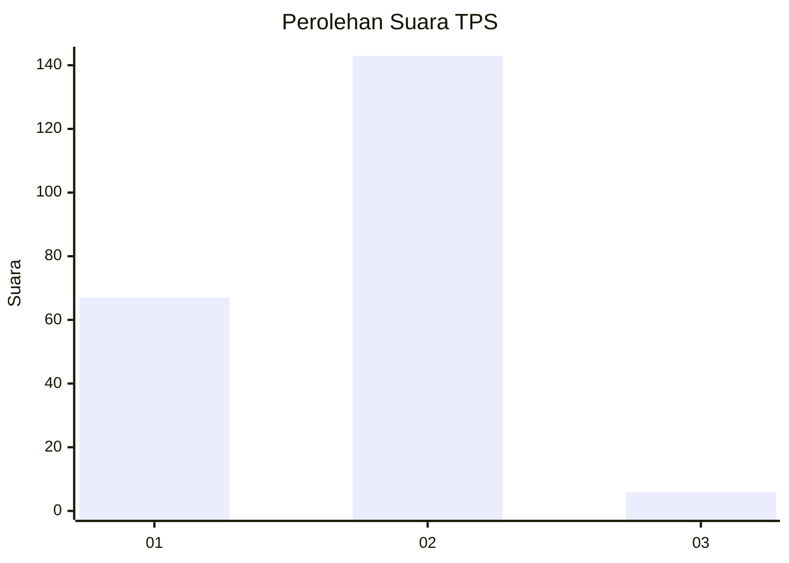
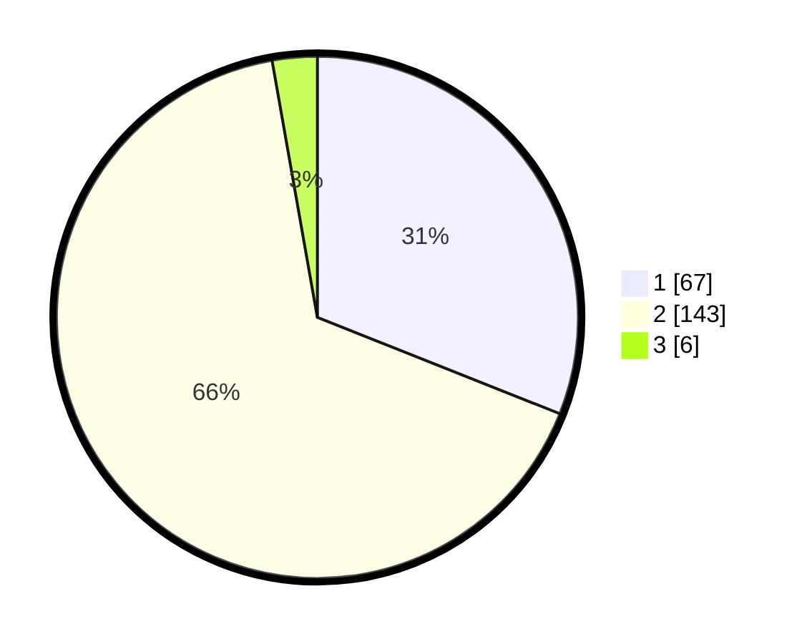

# Hasil

## Grafik

## Tabel

| No. | Nama Paslon    | Suara | Suara (raw) | Persentase |
|:--- |:-------------- | -----:| -----------:| ----------:|
| 1   | ANIES MUHAIMIN | 67    | [67][p-1]   | 31,02      |
| 2   | PRABOWO GIBRAN | 143   | [143][p-2]  | 66,20      |
| 3   | GANJAR MAHFUD  | 6     | [6][p-3]    | 2,78       |

[p-1]: https://github.com/gigit-pemilu/pemilu-2024/blob/main/pilpres/hitung-suara/sub/35-jawa-timur/sub/29-sumenep/sub/05-bluto/sub/2001-guluk-manjung/sub/005-tps/sub/paslon-1.txt
[p-2]: https://github.com/gigit-pemilu/pemilu-2024/blob/main/pilpres/hitung-suara/sub/35-jawa-timur/sub/29-sumenep/sub/05-bluto/sub/2001-guluk-manjung/sub/005-tps/sub/paslon-2.txt
[p-3]: https://github.com/gigit-pemilu/pemilu-2024/blob/main/pilpres/hitung-suara/sub/35-jawa-timur/sub/29-sumenep/sub/05-bluto/sub/2001-guluk-manjung/sub/005-tps/sub/paslon-3.txt

## Foto C Plano

https://sirekap-obj-formc.kpu.go.id/ad1b/pemilu/ppwp/35/29/05/20/01/3529052001005-20240214-220927--342f9354-5384-4cab-b943-a3dec590c05a.jpg

https://sirekap-obj-formc.kpu.go.id/ad1b/pemilu/ppwp/35/29/05/20/01/3529052001005-20240214-221038--b67fa50e-3f25-4f3c-a214-eb0650b84093.jpg

https://sirekap-obj-formc.kpu.go.id/ad1b/pemilu/ppwp/35/29/05/20/01/3529052001005-20240214-221114--abc4c16b-52b9-4198-848d-77f1f302a17a.jpg

## Metadata

| Key        | Value               |
| ---------- | ------------------- |
| Time Stamp | 2024-02-24 22:31:28 |

