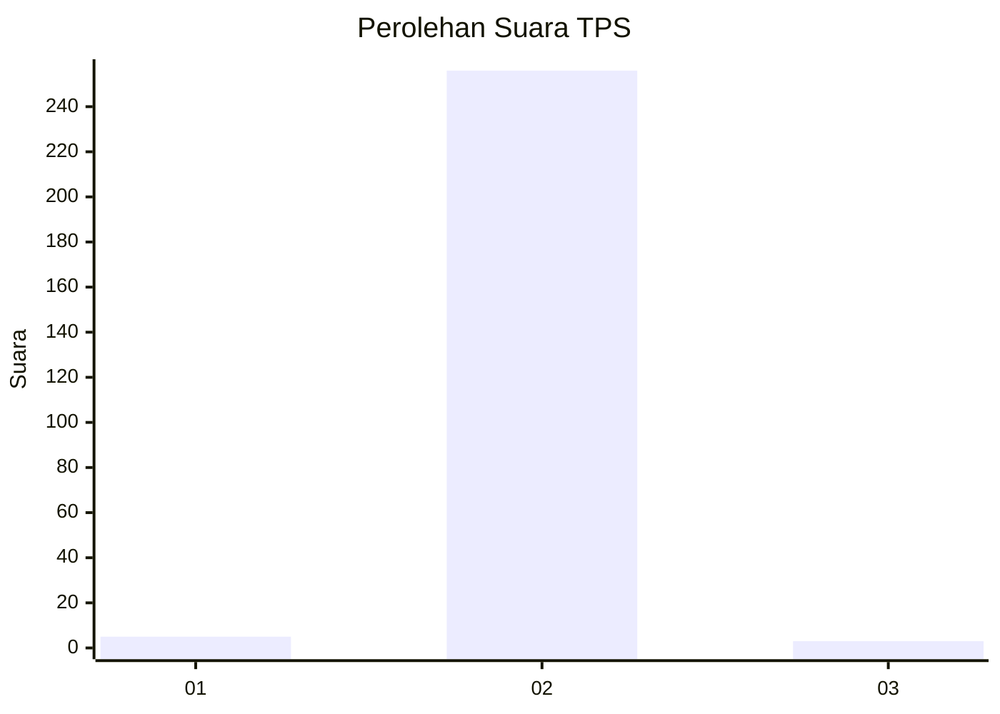
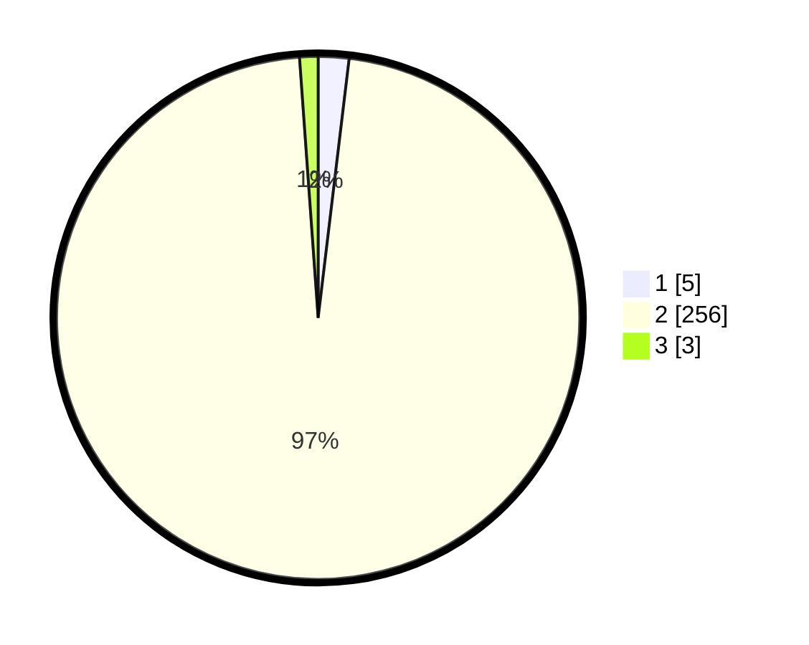

# Hasil

## Grafik

## Tabel

| No. | Nama Paslon    | Suara | Suara (raw) | Persentase |
|:--- |:-------------- | -----:| -----------:| ----------:|
| 1   | ANIES MUHAIMIN | 5     | [5][p-1]    | 1,89       |
| 2   | PRABOWO GIBRAN | 256   | [256][p-2]  | 96,97      |
| 3   | GANJAR MAHFUD  | 3     | [3][p-3]    | 1,14       |

[p-1]: https://github.com/gigit-pemilu/pemilu-2024/blob/main/pilpres/hitung-suara/sub/35-jawa-timur/sub/29-sumenep/sub/05-bluto/sub/2001-guluk-manjung/sub/006-tps/sub/paslon-1.txt
[p-2]: https://github.com/gigit-pemilu/pemilu-2024/blob/main/pilpres/hitung-suara/sub/35-jawa-timur/sub/29-sumenep/sub/05-bluto/sub/2001-guluk-manjung/sub/006-tps/sub/paslon-2.txt
[p-3]: https://github.com/gigit-pemilu/pemilu-2024/blob/main/pilpres/hitung-suara/sub/35-jawa-timur/sub/29-sumenep/sub/05-bluto/sub/2001-guluk-manjung/sub/006-tps/sub/paslon-3.txt

## Foto C Plano

https://sirekap-obj-formc.kpu.go.id/33ff/pemilu/ppwp/35/29/05/20/01/3529052001006-20240214-224136--cc9897d3-6166-4199-ab6e-2e0b59d7d080.jpg

https://sirekap-obj-formc.kpu.go.id/33ff/pemilu/ppwp/35/29/05/20/01/3529052001006-20240214-224249--3c57b9a2-6224-4b90-9f27-939d403be77f.jpg

https://sirekap-obj-formc.kpu.go.id/33ff/pemilu/ppwp/35/29/05/20/01/3529052001006-20240214-224358--63384299-f02a-44a7-9232-cd9ea22b017b.jpg

## Metadata

| Key        | Value               |
| ---------- | ------------------- |
| Time Stamp | 2024-02-25 17:00:00 |

