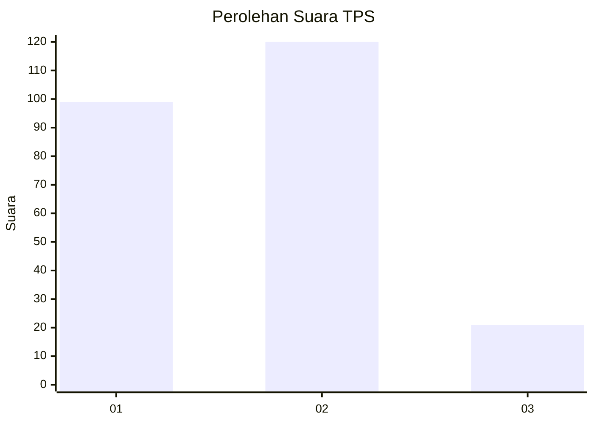
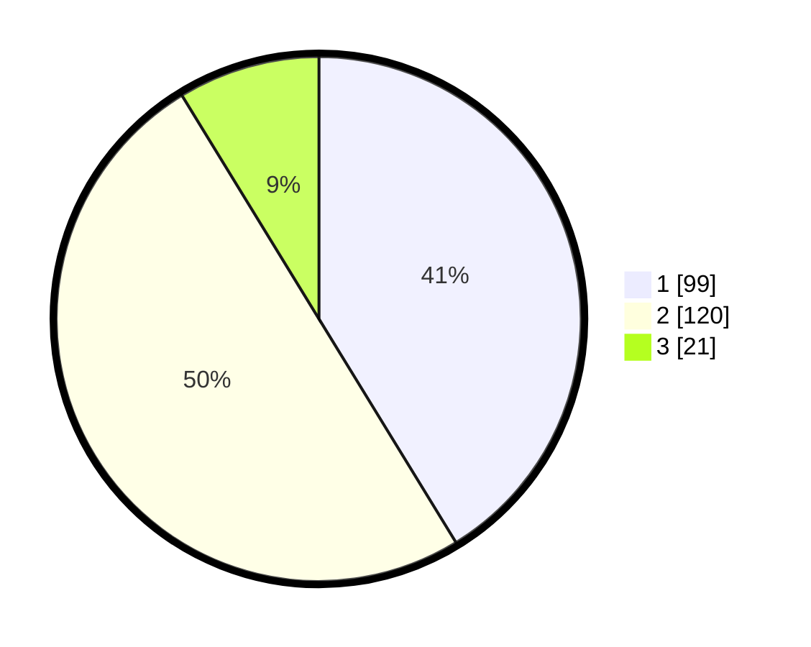

# Hasil

## Grafik

## Tabel

| No. | Nama Paslon    | Suara | Suara (raw) | Persentase |
|:--- |:-------------- | -----:| -----------:| ----------:|
| 1   | ANIES MUHAIMIN | 99    | [99][p-1]   | 41,25      |
| 2   | PRABOWO GIBRAN | 120   | [120][p-2]  | 50,00      |
| 3   | GANJAR MAHFUD  | 21    | [21][p-3]   | 8,75       |

[p-1]: https://github.com/gigit-pemilu/pemilu-2024-35-jawa-timur/blob/main/pilpres/hitung-suara/sub/35-jawa-timur/sub/29-sumenep/sub/05-bluto/sub/2002-kapedi/sub/002-tps/sub/paslon-1.txt
[p-2]: https://github.com/gigit-pemilu/pemilu-2024-35-jawa-timur/blob/main/pilpres/hitung-suara/sub/35-jawa-timur/sub/29-sumenep/sub/05-bluto/sub/2002-kapedi/sub/002-tps/sub/paslon-2.txt
[p-3]: https://github.com/gigit-pemilu/pemilu-2024-35-jawa-timur/blob/main/pilpres/hitung-suara/sub/35-jawa-timur/sub/29-sumenep/sub/05-bluto/sub/2002-kapedi/sub/002-tps/sub/paslon-3.txt

## Foto C Plano

https://sirekap-obj-formc.kpu.go.id/420e/pemilu/ppwp/35/29/05/20/02/3529052002002-20240215-021950--c1e0efbf-2993-4169-a434-fddbc9ba088b.jpg

https://sirekap-obj-formc.kpu.go.id/420e/pemilu/ppwp/35/29/05/20/02/3529052002002-20240215-020213--cce4a8e9-69b8-4bdb-a2e1-9b9a7b5a3ccc.jpg

https://sirekap-obj-formc.kpu.go.id/420e/pemilu/ppwp/35/29/05/20/02/3529052002002-20240215-020957--ac226723-a6af-4863-a04e-38ff35c56248.jpg

## Metadata

| Key        | Value               |
| ---------- | ------------------- |
| Time Stamp | 2024-02-25 11:00:00 |

