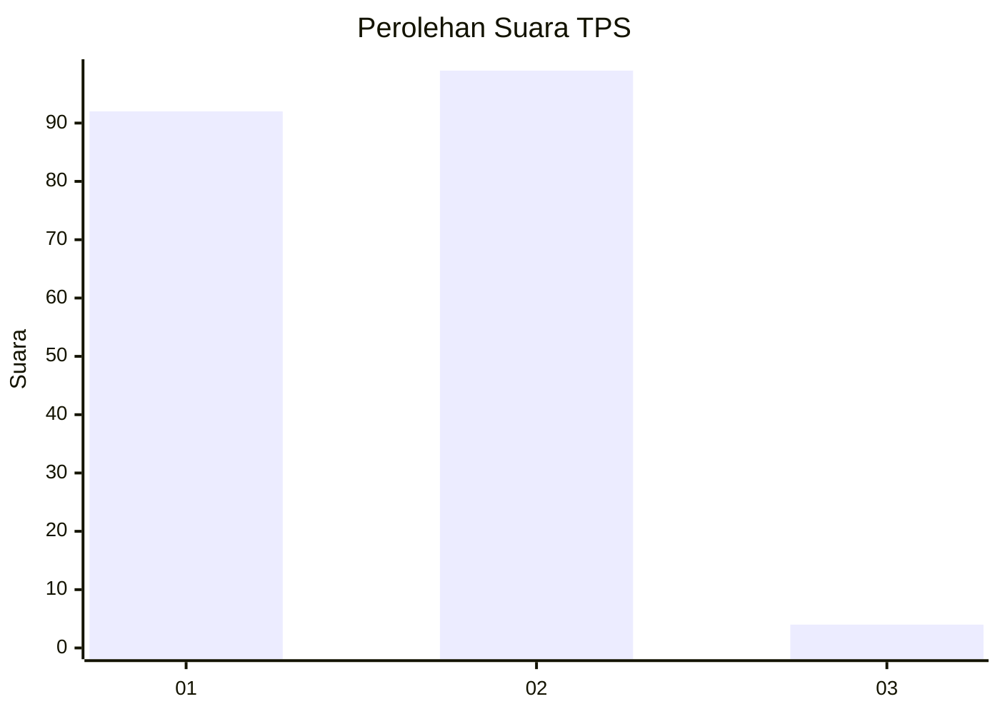
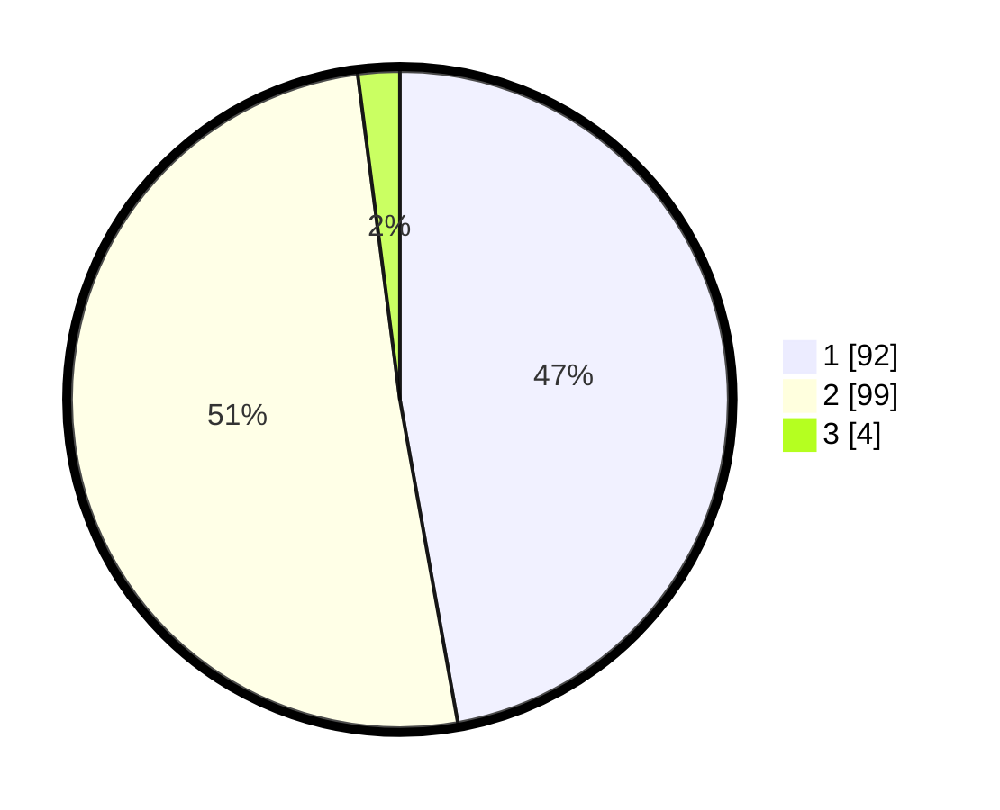

# Hasil

## Grafik

## Tabel

| No. | Nama Paslon    | Suara | Suara (raw) | Persentase |
|:--- |:-------------- | -----:| -----------:| ----------:|
| 1   | ANIES MUHAIMIN | 92    | [92][p-1]   | 47,18      |
| 2   | PRABOWO GIBRAN | 99    | [99][p-2]   | 50,77      |
| 3   | GANJAR MAHFUD  | 4     | [4][p-3]    | 2,05       |

[p-1]: https://github.com/gigit-pemilu/pemilu-2024/blob/main/pilpres/hitung-suara/sub/35-jawa-timur/sub/29-sumenep/sub/05-bluto/sub/2002-kapedi/sub/010-tps/sub/paslon-1.txt
[p-2]: https://github.com/gigit-pemilu/pemilu-2024/blob/main/pilpres/hitung-suara/sub/35-jawa-timur/sub/29-sumenep/sub/05-bluto/sub/2002-kapedi/sub/010-tps/sub/paslon-2.txt
[p-3]: https://github.com/gigit-pemilu/pemilu-2024/blob/main/pilpres/hitung-suara/sub/35-jawa-timur/sub/29-sumenep/sub/05-bluto/sub/2002-kapedi/sub/010-tps/sub/paslon-3.txt

## Foto C Plano

https://sirekap-obj-formc.kpu.go.id/0442/pemilu/ppwp/35/29/05/20/02/3529052002010-20240214-205008--33c77f49-fd6b-4098-8a0e-221aa8b32d7d.jpg

https://sirekap-obj-formc.kpu.go.id/0442/pemilu/ppwp/35/29/05/20/02/3529052002010-20240214-205015--b5def053-c512-47b9-978d-7943e813b844.jpg

https://sirekap-obj-formc.kpu.go.id/0442/pemilu/ppwp/35/29/05/20/02/3529052002010-20240214-205047--d489c20f-10b0-4cc9-9e1c-5320ace6b3dc.jpg

## Metadata

| Key        | Value               |
| ---------- | ------------------- |
| Time Stamp | 2024-02-15 20:00:44 |

