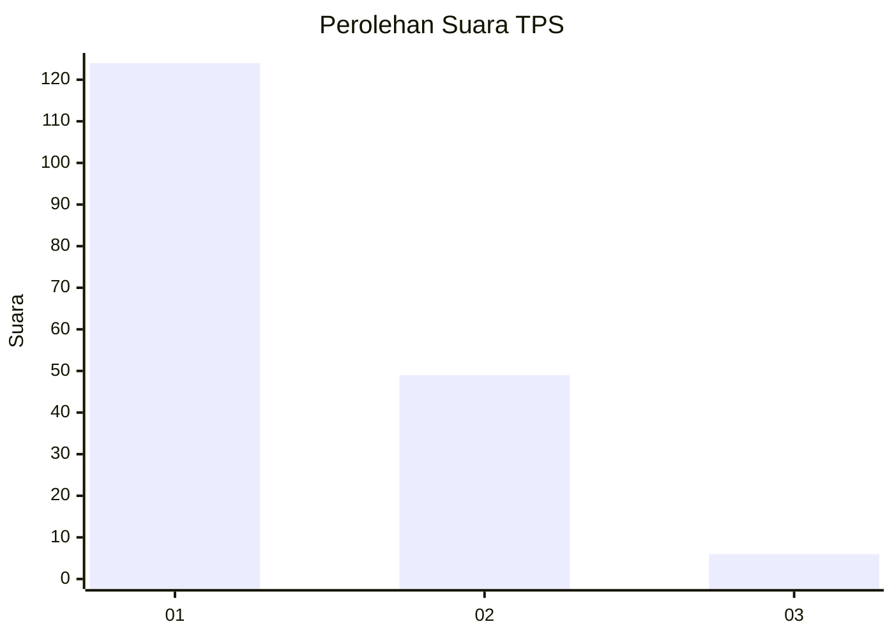
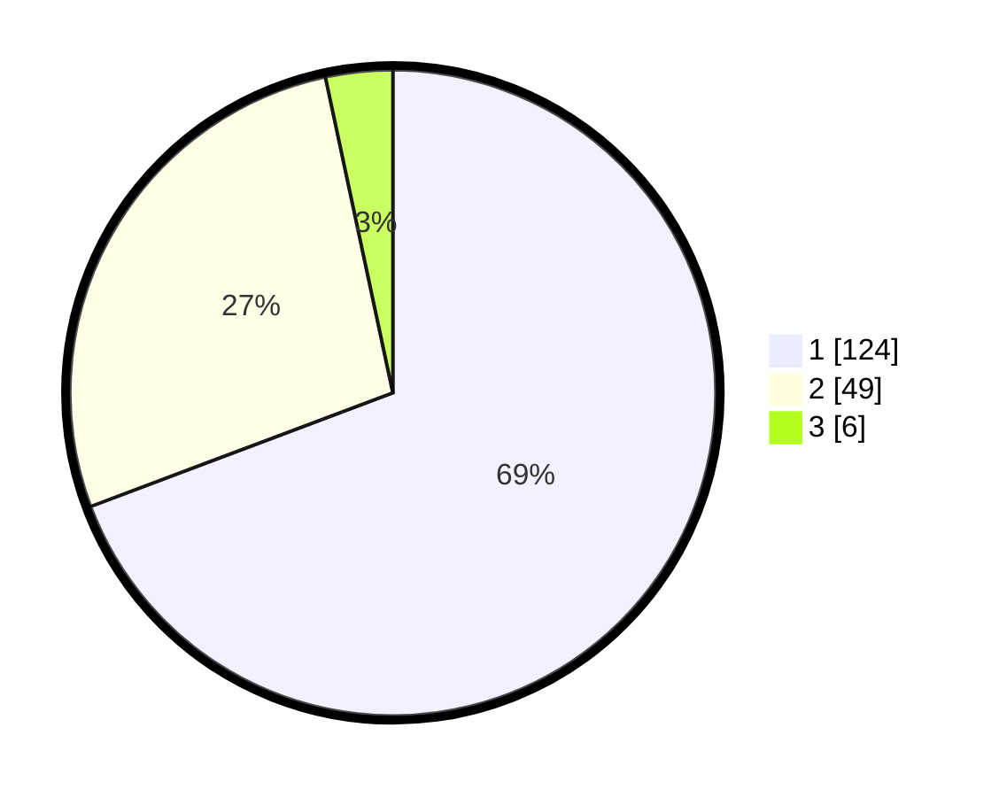

# Hasil

## Grafik

## Tabel

| No. | Nama Paslon    | Suara | Suara (raw) | Persentase |
|:--- |:-------------- | -----:| -----------:| ----------:|
| 1   | ANIES MUHAIMIN | 124   | [124][p-1]  | 69,27      |
| 2   | PRABOWO GIBRAN | 49    | [49][p-2]   | 27,37      |
| 3   | GANJAR MAHFUD  | 6     | [6][p-3]    | 3,35       |

[p-1]: https://github.com/gigit-pemilu/pemilu-2024/blob/main/pilpres/hitung-suara/sub/35-jawa-timur/sub/29-sumenep/sub/05-bluto/sub/2002-kapedi/sub/013-tps/sub/paslon-1.txt
[p-2]: https://github.com/gigit-pemilu/pemilu-2024/blob/main/pilpres/hitung-suara/sub/35-jawa-timur/sub/29-sumenep/sub/05-bluto/sub/2002-kapedi/sub/013-tps/sub/paslon-2.txt
[p-3]: https://github.com/gigit-pemilu/pemilu-2024/blob/main/pilpres/hitung-suara/sub/35-jawa-timur/sub/29-sumenep/sub/05-bluto/sub/2002-kapedi/sub/013-tps/sub/paslon-3.txt

## Foto C Plano

https://sirekap-obj-formc.kpu.go.id/795e/pemilu/ppwp/35/29/05/20/02/3529052002013-20240215-015032--1ed12f5b-e43f-42d2-84af-dc0a460b8699.jpg

https://sirekap-obj-formc.kpu.go.id/795e/pemilu/ppwp/35/29/05/20/02/3529052002013-20240215-015818--2b1137d6-1f05-43d4-8173-091e131dc596.jpg

https://sirekap-obj-formc.kpu.go.id/795e/pemilu/ppwp/35/29/05/20/02/3529052002013-20240215-015957--0c05b004-7698-4399-8c3f-c484b321465a.jpg

## Metadata

| Key        | Value               |
| ---------- | ------------------- |
| Time Stamp | 2024-02-15 23:29:50 |

