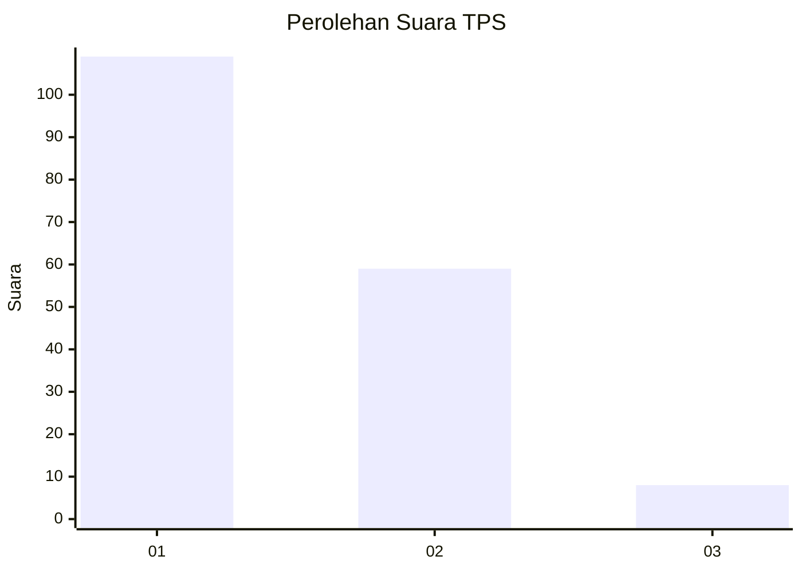
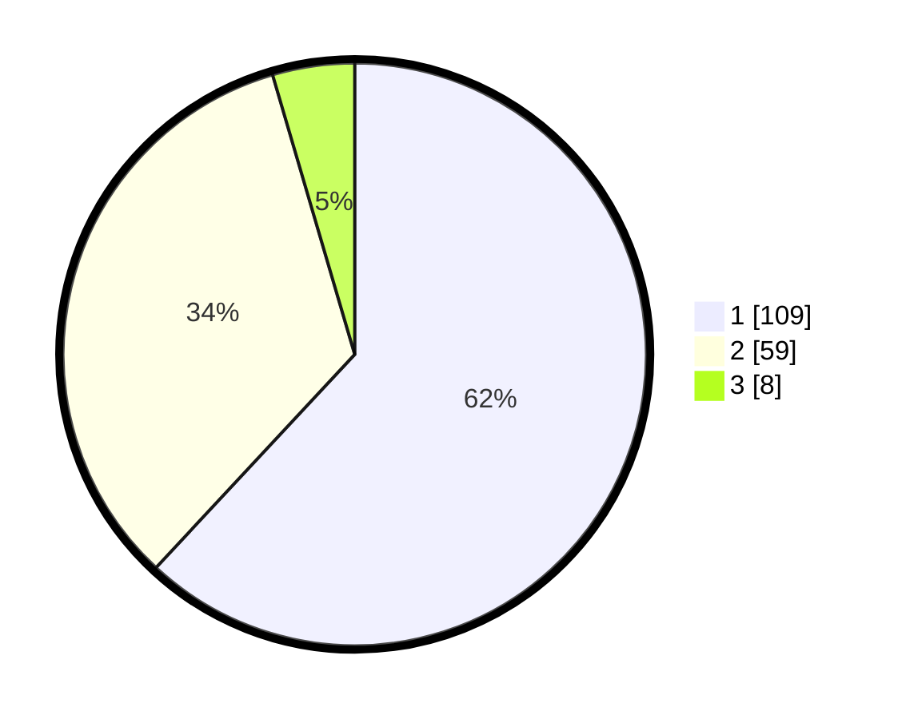

# Hasil

## Grafik

## Tabel

| No. | Nama Paslon    | Suara | Suara (raw) | Persentase |
|:--- |:-------------- | -----:| -----------:| ----------:|
| 1   | ANIES MUHAIMIN | 109   | [109][p-1]  | 61,93      |
| 2   | PRABOWO GIBRAN | 59    | [59][p-2]   | 33,52      |
| 3   | GANJAR MAHFUD  | 8     | [8][p-3]    | 4,55       |

[p-1]: https://github.com/gigit-pemilu/pemilu-2024/blob/main/pilpres/hitung-suara/sub/35-jawa-timur/sub/29-sumenep/sub/05-bluto/sub/2002-kapedi/sub/014-tps/sub/paslon-1.txt
[p-2]: https://github.com/gigit-pemilu/pemilu-2024/blob/main/pilpres/hitung-suara/sub/35-jawa-timur/sub/29-sumenep/sub/05-bluto/sub/2002-kapedi/sub/014-tps/sub/paslon-2.txt
[p-3]: https://github.com/gigit-pemilu/pemilu-2024/blob/main/pilpres/hitung-suara/sub/35-jawa-timur/sub/29-sumenep/sub/05-bluto/sub/2002-kapedi/sub/014-tps/sub/paslon-3.txt

## Foto C Plano

https://sirekap-obj-formc.kpu.go.id/9a3f/pemilu/ppwp/35/29/05/20/02/3529052002014-20240214-234730--4e905b33-0c54-4b76-bd34-25c98f5fc31e.jpg

https://sirekap-obj-formc.kpu.go.id/9a3f/pemilu/ppwp/35/29/05/20/02/3529052002014-20240214-235115--c1e62b4a-fbb7-4cb7-a3eb-73b5f2edfb04.jpg

https://sirekap-obj-formc.kpu.go.id/9a3f/pemilu/ppwp/35/29/05/20/02/3529052002014-20240214-235510--2aa1cac4-de5c-469c-9f73-5d4409902cc9.jpg

## Metadata

| Key        | Value               |
| ---------- | ------------------- |
| Time Stamp | 2024-02-25 13:00:00 |

