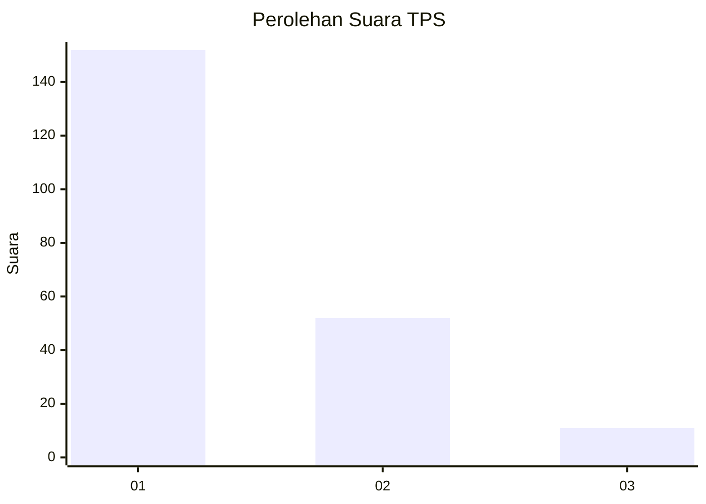
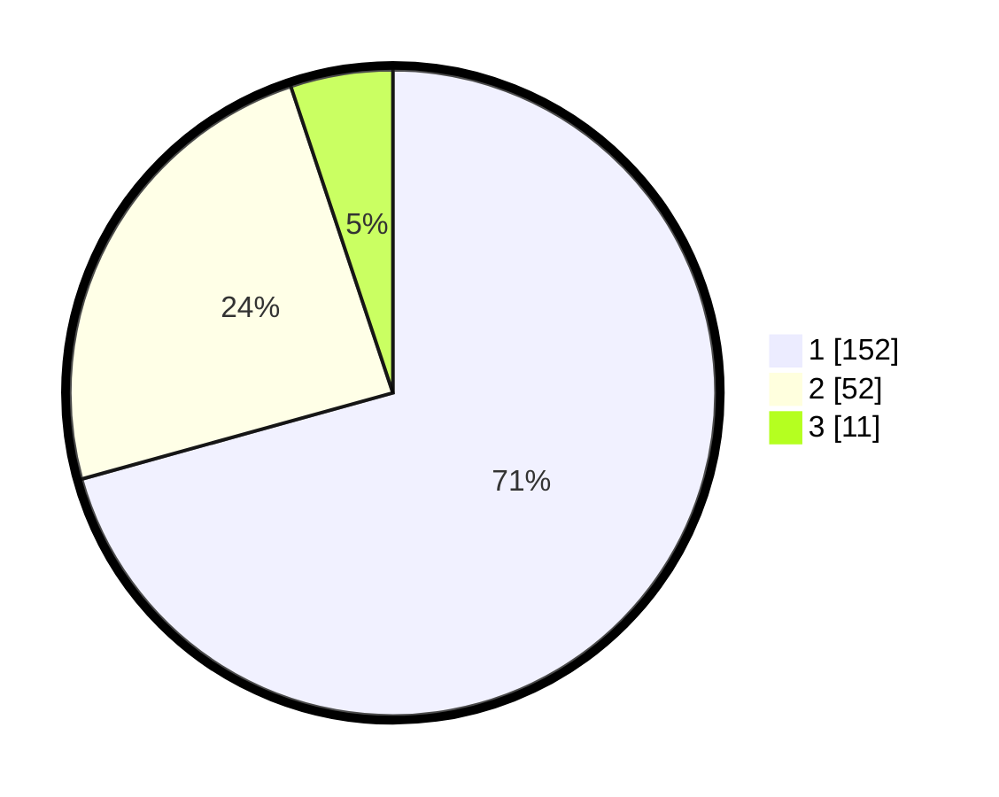

# Hasil

## Grafik

## Tabel

| No. | Nama Paslon    | Suara | Suara (raw) | Persentase |
|:--- |:-------------- | -----:| -----------:| ----------:|
| 1   | ANIES MUHAIMIN | 152   | [152][p-1]  | 70,70      |
| 2   | PRABOWO GIBRAN | 52    | [52][p-2]   | 24,19      |
| 3   | GANJAR MAHFUD  | 11    | [11][p-3]   | 5,12       |

[p-1]: https://github.com/gigit-pemilu/pemilu-2024/blob/main/pilpres/hitung-suara/sub/35-jawa-timur/sub/29-sumenep/sub/05-bluto/sub/2002-kapedi/sub/019-tps/sub/paslon-1.txt
[p-2]: https://github.com/gigit-pemilu/pemilu-2024/blob/main/pilpres/hitung-suara/sub/35-jawa-timur/sub/29-sumenep/sub/05-bluto/sub/2002-kapedi/sub/019-tps/sub/paslon-2.txt
[p-3]: https://github.com/gigit-pemilu/pemilu-2024/blob/main/pilpres/hitung-suara/sub/35-jawa-timur/sub/29-sumenep/sub/05-bluto/sub/2002-kapedi/sub/019-tps/sub/paslon-3.txt

## Foto C Plano

https://sirekap-obj-formc.kpu.go.id/4276/pemilu/ppwp/35/29/05/20/02/3529052002019-20240215-001945--c1f8fa7c-bf8f-4a85-b78b-9422d5019809.jpg

https://sirekap-obj-formc.kpu.go.id/4276/pemilu/ppwp/35/29/05/20/02/3529052002019-20240215-002224--cd71aa88-ebb6-4d06-b5e9-b228d7af3115.jpg

https://sirekap-obj-formc.kpu.go.id/4276/pemilu/ppwp/35/29/05/20/02/3529052002019-20240215-002416--6b98ed95-0e6c-4f4c-b7f5-81891e7059bd.jpg

## Metadata

| Key        | Value               |
| ---------- | ------------------- |
| Time Stamp | 2024-02-24 22:31:28 |

