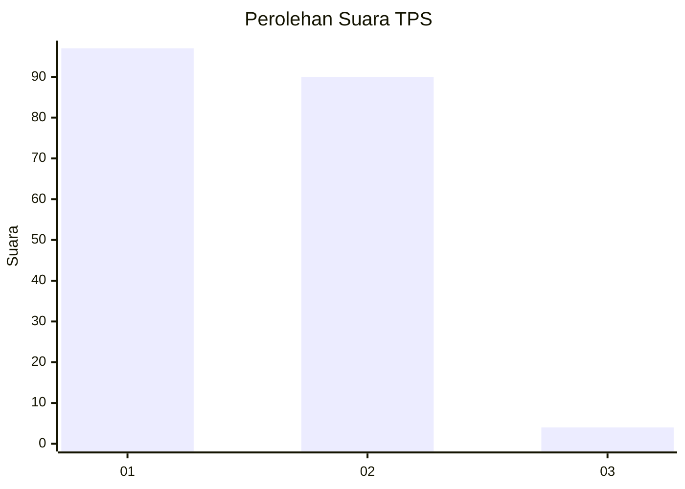
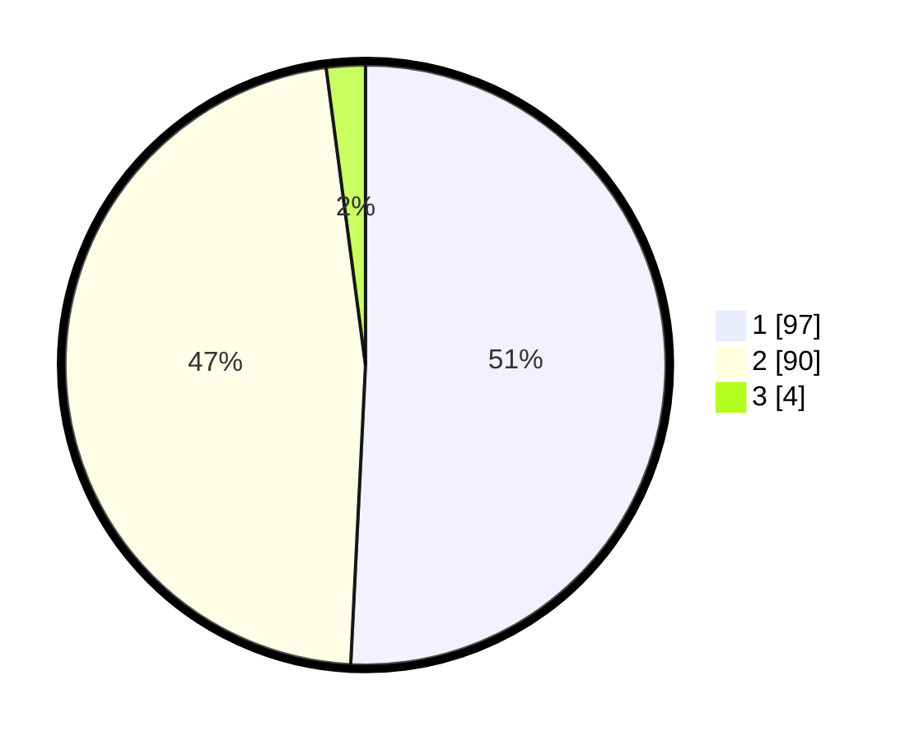

# Hasil

## Grafik

## Tabel

| No. | Nama Paslon    | Suara | Suara (raw) | Persentase |
|:--- |:-------------- | -----:| -----------:| ----------:|
| 1   | ANIES MUHAIMIN | 97    | [97][p-1]   | 50,79      |
| 2   | PRABOWO GIBRAN | 90    | [90][p-2]   | 47,12      |
| 3   | GANJAR MAHFUD  | 4     | [4][p-3]    | 2,09       |

[p-1]: https://github.com/gigit-pemilu/pemilu-2024-35-jawa-timur/blob/main/pilpres/hitung-suara/sub/35-jawa-timur/sub/29-sumenep/sub/05-bluto/sub/2002-kapedi/sub/023-tps/sub/paslon-1.txt
[p-2]: https://github.com/gigit-pemilu/pemilu-2024-35-jawa-timur/blob/main/pilpres/hitung-suara/sub/35-jawa-timur/sub/29-sumenep/sub/05-bluto/sub/2002-kapedi/sub/023-tps/sub/paslon-2.txt
[p-3]: https://github.com/gigit-pemilu/pemilu-2024-35-jawa-timur/blob/main/pilpres/hitung-suara/sub/35-jawa-timur/sub/29-sumenep/sub/05-bluto/sub/2002-kapedi/sub/023-tps/sub/paslon-3.txt

## Foto C Plano

https://sirekap-obj-formc.kpu.go.id/ef4c/pemilu/ppwp/35/29/05/20/02/3529052002023-20240215-003411--4d59df53-e378-4822-9c91-20cc6fb81096.jpg

https://sirekap-obj-formc.kpu.go.id/ef4c/pemilu/ppwp/35/29/05/20/02/3529052002023-20240215-003543--4115f303-835d-457e-9132-114856f127b6.jpg

https://sirekap-obj-formc.kpu.go.id/ef4c/pemilu/ppwp/35/29/05/20/02/3529052002023-20240215-003724--c4960120-8a68-47cb-a29e-3d9801030a6f.jpg

## Metadata

| Key        | Value               |
| ---------- | ------------------- |
| Time Stamp | 2024-02-25 17:00:00 |

