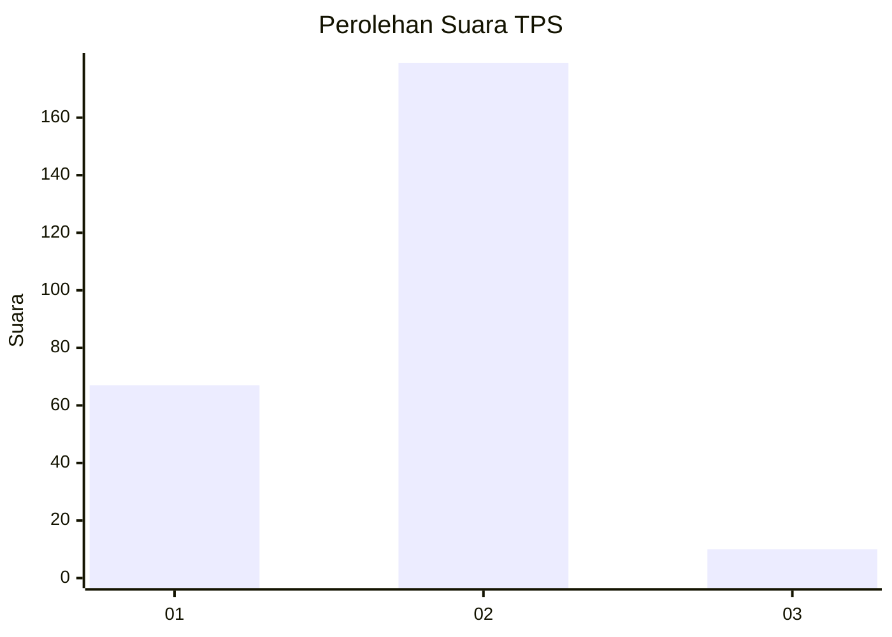
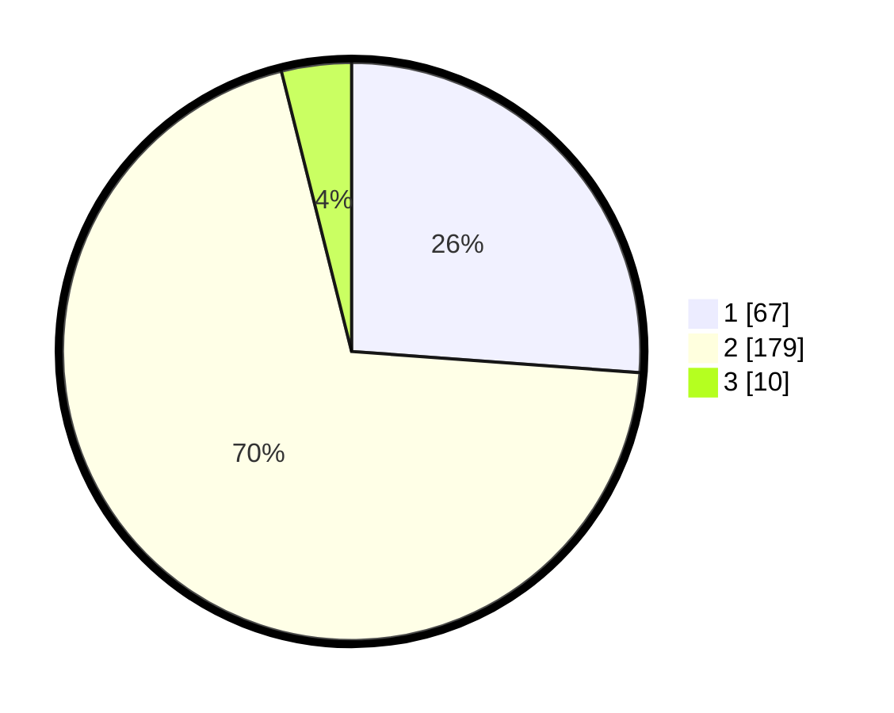

# Hasil

## Grafik

## Tabel

| No. | Nama Paslon    | Suara | Suara (raw) | Persentase |
|:--- |:-------------- | -----:| -----------:| ----------:|
| 1   | ANIES MUHAIMIN | 67    | [67][p-1]   | 26,17      |
| 2   | PRABOWO GIBRAN | 179   | [179][p-2]  | 69,92      |
| 3   | GANJAR MAHFUD  | 10    | [10][p-3]   | 3,91       |

[p-1]: https://github.com/gigit-pemilu/pemilu-2024/blob/main/pilpres/hitung-suara/sub/35-jawa-timur/sub/29-sumenep/sub/05-bluto/sub/2003-pakandangan-barat/sub/008-tps/sub/paslon-1.txt
[p-2]: https://github.com/gigit-pemilu/pemilu-2024/blob/main/pilpres/hitung-suara/sub/35-jawa-timur/sub/29-sumenep/sub/05-bluto/sub/2003-pakandangan-barat/sub/008-tps/sub/paslon-2.txt
[p-3]: https://github.com/gigit-pemilu/pemilu-2024/blob/main/pilpres/hitung-suara/sub/35-jawa-timur/sub/29-sumenep/sub/05-bluto/sub/2003-pakandangan-barat/sub/008-tps/sub/paslon-3.txt

## Foto C Plano

https://sirekap-obj-formc.kpu.go.id/7a70/pemilu/ppwp/35/29/05/20/03/3529052003008-20240214-221136--d6514bad-5697-4ddf-8cd4-0d382c9fa0b3.jpg

https://sirekap-obj-formc.kpu.go.id/7a70/pemilu/ppwp/35/29/05/20/03/3529052003008-20240214-221227--e4f6a23b-16bd-4fa2-96d4-7a837ac60b22.jpg

https://sirekap-obj-formc.kpu.go.id/7a70/pemilu/ppwp/35/29/05/20/03/3529052003008-20240214-221318--5b583960-f3c0-4b96-b0b4-2e77fba437f7.jpg

## Metadata

| Key        | Value               |
| ---------- | ------------------- |
| Time Stamp | 2024-02-15 20:30:46 |

