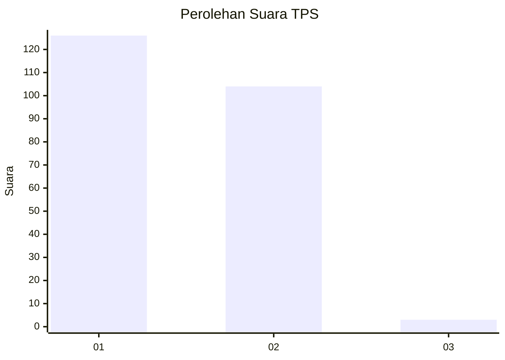
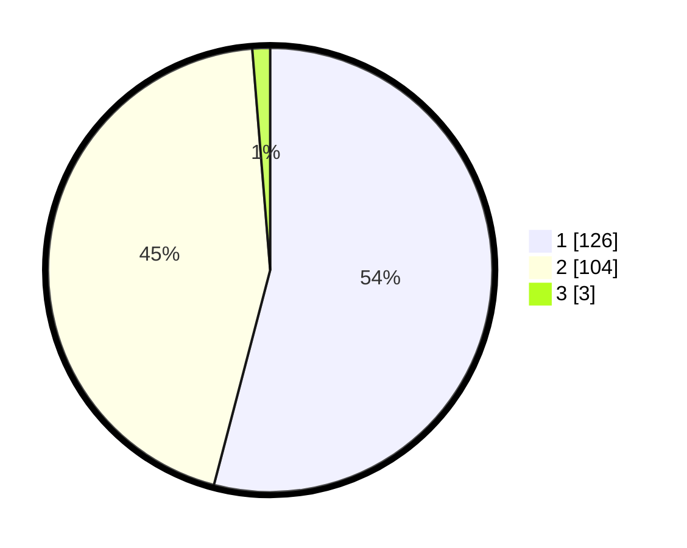

# Hasil

## Grafik

## Tabel

| No. | Nama Paslon    | Suara | Suara (raw) | Persentase |
|:--- |:-------------- | -----:| -----------:| ----------:|
| 1   | ANIES MUHAIMIN | 126   | [126][p-1]  | 54,08      |
| 2   | PRABOWO GIBRAN | 104   | [104][p-2]  | 44,64      |
| 3   | GANJAR MAHFUD  | 3     | [3][p-3]    | 1,29       |

[p-1]: https://github.com/gigit-pemilu/pemilu-2024-35-jawa-timur/blob/main/pilpres/hitung-suara/sub/35-jawa-timur/sub/29-sumenep/sub/05-bluto/sub/2005-pakandangan-sangra/sub/002-tps/sub/paslon-1.txt
[p-2]: https://github.com/gigit-pemilu/pemilu-2024-35-jawa-timur/blob/main/pilpres/hitung-suara/sub/35-jawa-timur/sub/29-sumenep/sub/05-bluto/sub/2005-pakandangan-sangra/sub/002-tps/sub/paslon-2.txt
[p-3]: https://github.com/gigit-pemilu/pemilu-2024-35-jawa-timur/blob/main/pilpres/hitung-suara/sub/35-jawa-timur/sub/29-sumenep/sub/05-bluto/sub/2005-pakandangan-sangra/sub/002-tps/sub/paslon-3.txt

## Foto C Plano

https://sirekap-obj-formc.kpu.go.id/a1bc/pemilu/ppwp/35/29/05/20/05/3529052005002-20240215-000102--a74e2c10-89ba-4ffd-8281-b9c9e8d935ab.jpg

https://sirekap-obj-formc.kpu.go.id/a1bc/pemilu/ppwp/35/29/05/20/05/3529052005002-20240215-000159--1bfd6263-b864-4dbd-a081-7b1e0396592a.jpg

https://sirekap-obj-formc.kpu.go.id/a1bc/pemilu/ppwp/35/29/05/20/05/3529052005002-20240215-000340--b183dd4c-9328-43c4-b935-e59dcd70c57a.jpg

## Metadata

| Key        | Value               |
| ---------- | ------------------- |
| Time Stamp | 2024-02-24 22:31:28 |

