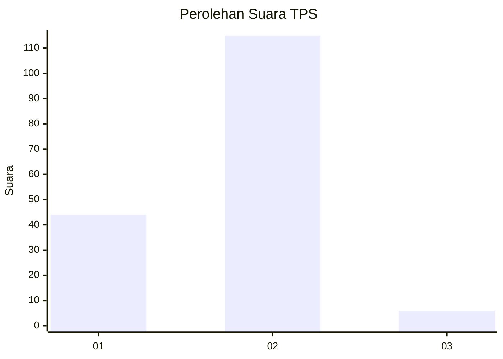
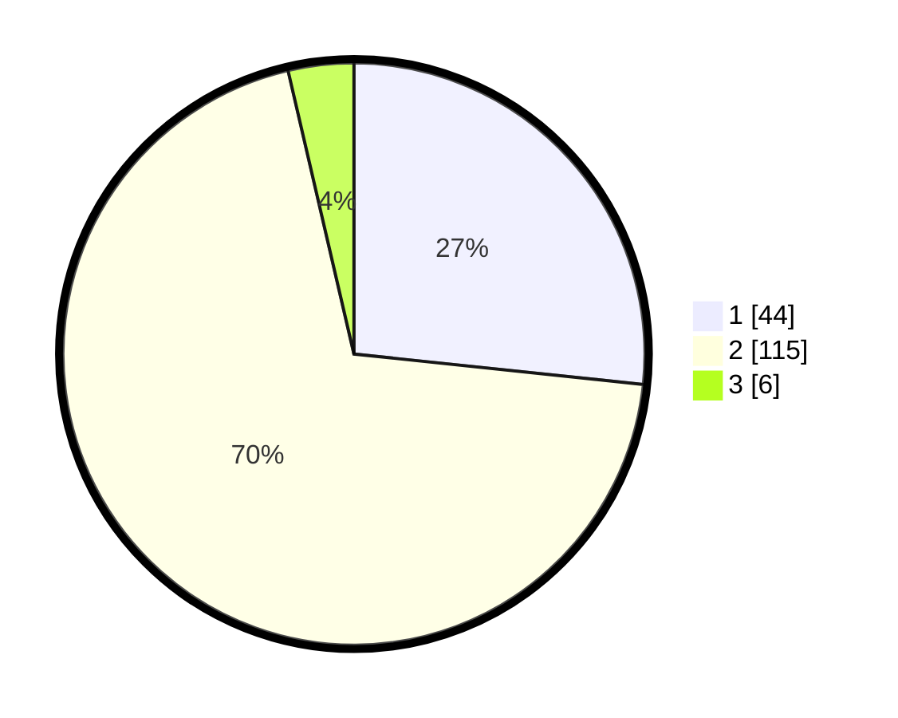

# Hasil

## Grafik

## Tabel

| No. | Nama Paslon    | Suara | Suara (raw) | Persentase |
|:--- |:-------------- | -----:| -----------:| ----------:|
| 1   | ANIES MUHAIMIN | 44    | [44][p-1]   | 26,67      |
| 2   | PRABOWO GIBRAN | 115   | [115][p-2]  | 69,70      |
| 3   | GANJAR MAHFUD  | 6     | [6][p-3]    | 3,64       |

[p-1]: https://github.com/gigit-pemilu/pemilu-2024-35-jawa-timur/blob/main/pilpres/hitung-suara/sub/35-jawa-timur/sub/29-sumenep/sub/05-bluto/sub/2005-pakandangan-sangra/sub/006-tps/sub/paslon-1.txt
[p-2]: https://github.com/gigit-pemilu/pemilu-2024-35-jawa-timur/blob/main/pilpres/hitung-suara/sub/35-jawa-timur/sub/29-sumenep/sub/05-bluto/sub/2005-pakandangan-sangra/sub/006-tps/sub/paslon-2.txt
[p-3]: https://github.com/gigit-pemilu/pemilu-2024-35-jawa-timur/blob/main/pilpres/hitung-suara/sub/35-jawa-timur/sub/29-sumenep/sub/05-bluto/sub/2005-pakandangan-sangra/sub/006-tps/sub/paslon-3.txt

## Foto C Plano

https://sirekap-obj-formc.kpu.go.id/a04f/pemilu/ppwp/35/29/05/20/05/3529052005006-20240215-005024--e6e1ca2c-5570-4dca-a2fb-6042ea144b74.jpg

https://sirekap-obj-formc.kpu.go.id/a04f/pemilu/ppwp/35/29/05/20/05/3529052005006-20240215-005125--00beecb7-15a2-4a40-9367-c9d9758e70c4.jpg

https://sirekap-obj-formc.kpu.go.id/a04f/pemilu/ppwp/35/29/05/20/05/3529052005006-20240215-005205--2ebc8d80-0a12-40d3-866c-9d83ae71ce69.jpg

## Metadata

| Key        | Value               |
| ---------- | ------------------- |
| Time Stamp | 2024-02-15 21:01:18 |

