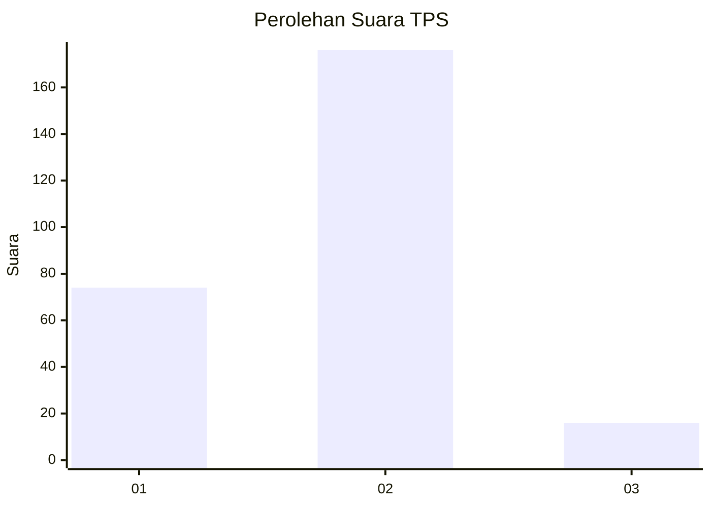
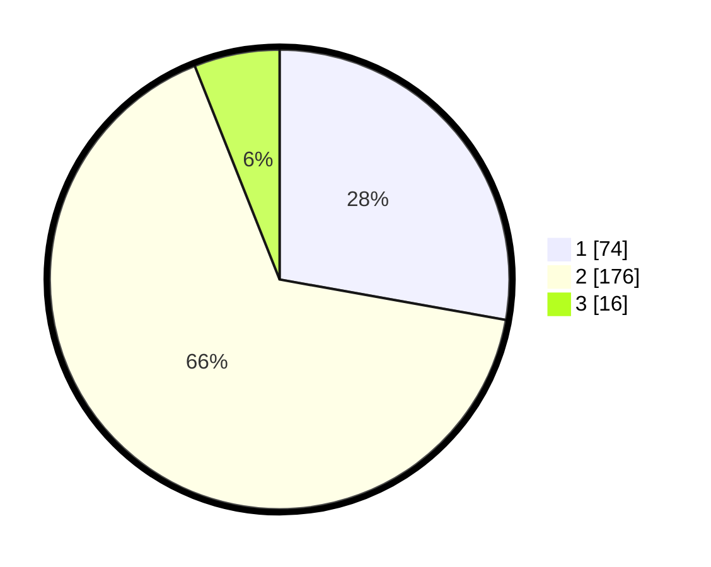

# Hasil

## Grafik

## Tabel

| No. | Nama Paslon    | Suara | Suara (raw) | Persentase |
|:--- |:-------------- | -----:| -----------:| ----------:|
| 1   | ANIES MUHAIMIN | 74    | [74][p-1]   | 27,82      |
| 2   | PRABOWO GIBRAN | 176   | [176][p-2]  | 66,17      |
| 3   | GANJAR MAHFUD  | 16    | [16][p-3]   | 6,02       |

[p-1]: https://github.com/gigit-pemilu/pemilu-2024/blob/main/pilpres/hitung-suara/sub/35-jawa-timur/sub/29-sumenep/sub/05-bluto/sub/2007-aeng-baja-kenek/sub/007-tps/sub/paslon-1.txt
[p-2]: https://github.com/gigit-pemilu/pemilu-2024/blob/main/pilpres/hitung-suara/sub/35-jawa-timur/sub/29-sumenep/sub/05-bluto/sub/2007-aeng-baja-kenek/sub/007-tps/sub/paslon-2.txt
[p-3]: https://github.com/gigit-pemilu/pemilu-2024/blob/main/pilpres/hitung-suara/sub/35-jawa-timur/sub/29-sumenep/sub/05-bluto/sub/2007-aeng-baja-kenek/sub/007-tps/sub/paslon-3.txt

## Foto C Plano

https://sirekap-obj-formc.kpu.go.id/f0c0/pemilu/ppwp/35/29/05/20/07/3529052007007-20240214-204719--a4564212-d453-4800-8898-c48ce8dc66c2.jpg

https://sirekap-obj-formc.kpu.go.id/f0c0/pemilu/ppwp/35/29/05/20/07/3529052007007-20240214-204848--73a6717c-5b24-4e9f-86dd-5ff887eed105.jpg

## Metadata

| Key        | Value               |
| ---------- | ------------------- |
| Time Stamp | 2024-02-25 12:00:00 |

