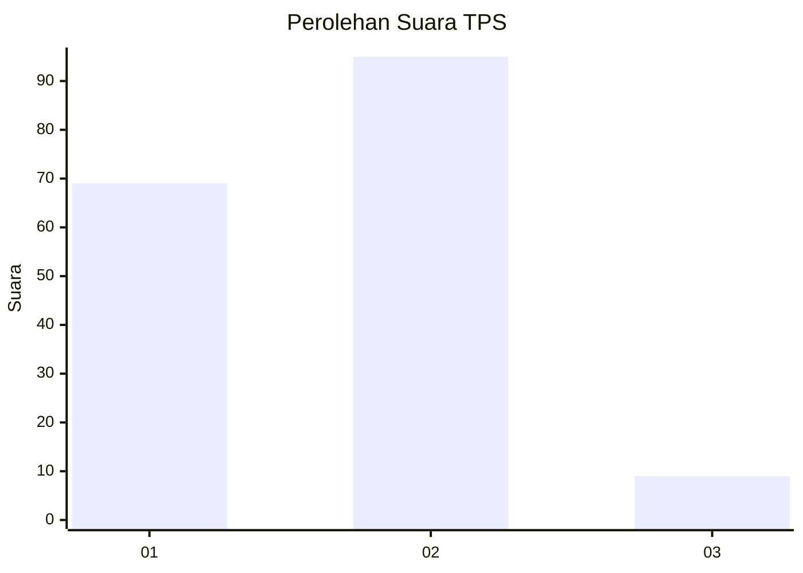
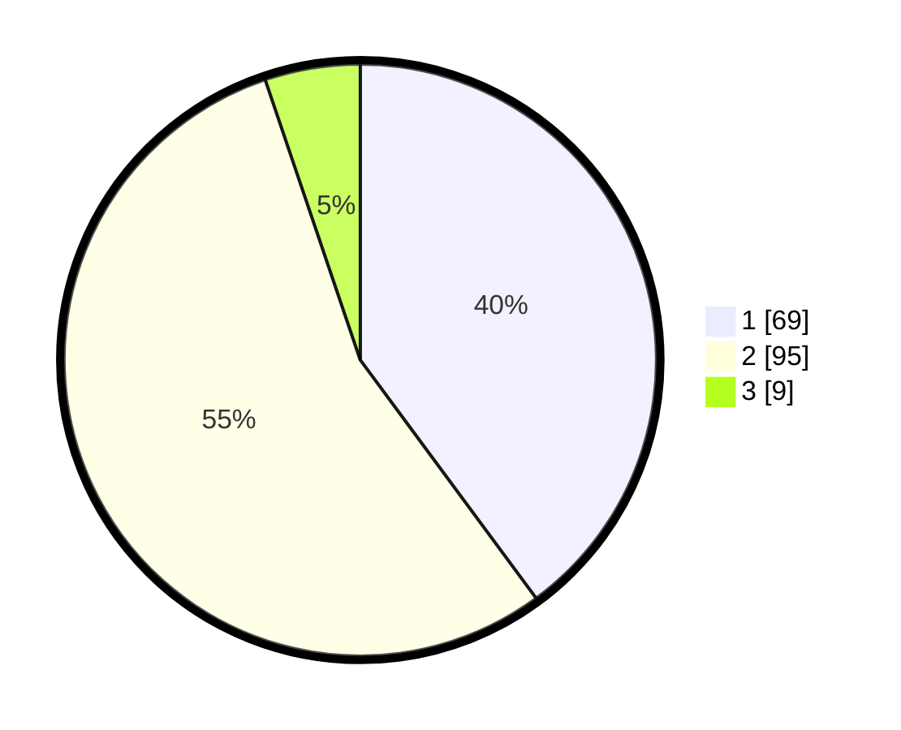

# Hasil

## Grafik

## Tabel

| No. | Nama Paslon    | Suara | Suara (raw) | Persentase |
|:--- |:-------------- | -----:| -----------:| ----------:|
| 1   | ANIES MUHAIMIN | 69    | [69][p-1]   | 39,88      |
| 2   | PRABOWO GIBRAN | 95    | [95][p-2]   | 54,91      |
| 3   | GANJAR MAHFUD  | 9     | [9][p-3]    | 5,20       |

[p-1]: https://github.com/gigit-pemilu/pemilu-2024-35-jawa-timur/blob/main/pilpres/hitung-suara/sub/35-jawa-timur/sub/29-sumenep/sub/05-bluto/sub/2009-lobuk/sub/006-tps/sub/paslon-1.txt
[p-2]: https://github.com/gigit-pemilu/pemilu-2024-35-jawa-timur/blob/main/pilpres/hitung-suara/sub/35-jawa-timur/sub/29-sumenep/sub/05-bluto/sub/2009-lobuk/sub/006-tps/sub/paslon-2.txt
[p-3]: https://github.com/gigit-pemilu/pemilu-2024-35-jawa-timur/blob/main/pilpres/hitung-suara/sub/35-jawa-timur/sub/29-sumenep/sub/05-bluto/sub/2009-lobuk/sub/006-tps/sub/paslon-3.txt

## Foto C Plano

https://sirekap-obj-formc.kpu.go.id/d4fc/pemilu/ppwp/35/29/05/20/09/3529052009006-20240215-005402--6b5e9a29-3c52-4423-a184-3673b372263c.jpg

https://sirekap-obj-formc.kpu.go.id/d4fc/pemilu/ppwp/35/29/05/20/09/3529052009006-20240215-005513--e605f2db-8485-4c27-8b31-8ddd9cb3f9e9.jpg

https://sirekap-obj-formc.kpu.go.id/d4fc/pemilu/ppwp/35/29/05/20/09/3529052009006-20240215-005610--4fb6501d-3fbf-435e-9597-d5588253ab3f.jpg

## Metadata

| Key        | Value               |
| ---------- | ------------------- |
| Time Stamp | 2024-02-25 11:00:00 |

