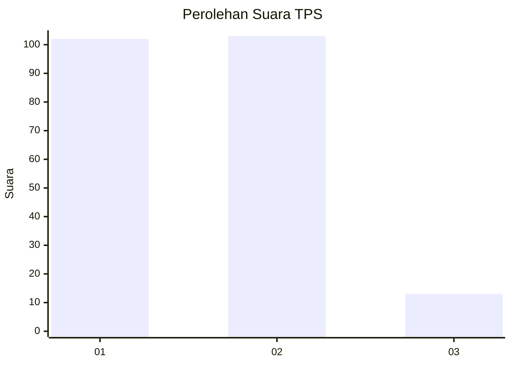
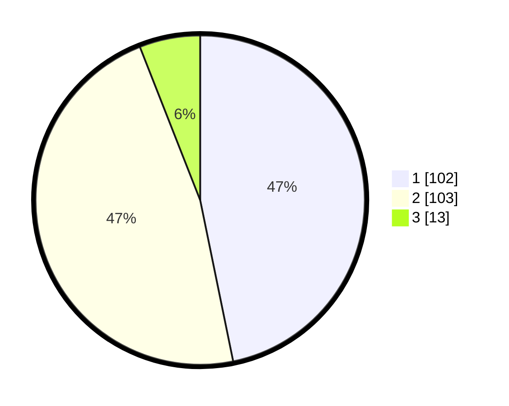

# Hasil

## Grafik

## Tabel

| No. | Nama Paslon    | Suara | Suara (raw) | Persentase |
|:--- |:-------------- | -----:| -----------:| ----------:|
| 1   | ANIES MUHAIMIN | 102   | [102][p-1]  | 46,79      |
| 2   | PRABOWO GIBRAN | 103   | [103][p-2]  | 47,25      |
| 3   | GANJAR MAHFUD  | 13    | [13][p-3]   | 5,96       |

[p-1]: https://github.com/gigit-pemilu/pemilu-2024/blob/main/pilpres/hitung-suara/sub/35-jawa-timur/sub/29-sumenep/sub/05-bluto/sub/2010-bumbungan/sub/004-tps/sub/paslon-1.txt
[p-2]: https://github.com/gigit-pemilu/pemilu-2024/blob/main/pilpres/hitung-suara/sub/35-jawa-timur/sub/29-sumenep/sub/05-bluto/sub/2010-bumbungan/sub/004-tps/sub/paslon-2.txt
[p-3]: https://github.com/gigit-pemilu/pemilu-2024/blob/main/pilpres/hitung-suara/sub/35-jawa-timur/sub/29-sumenep/sub/05-bluto/sub/2010-bumbungan/sub/004-tps/sub/paslon-3.txt

## Foto C Plano

https://sirekap-obj-formc.kpu.go.id/fc51/pemilu/ppwp/35/29/05/20/10/3529052010004-20240221-141257--29e5f853-f121-48a5-ab73-73f7141ad1a5.jpg

https://sirekap-obj-formc.kpu.go.id/fc51/pemilu/ppwp/35/29/05/20/10/3529052010004-20240221-141701--caa2644a-f2d5-4104-a837-f2156e0e2dfb.jpg

https://sirekap-obj-formc.kpu.go.id/fc51/pemilu/ppwp/35/29/05/20/10/3529052010004-20240214-225341--5d5c4b97-6244-4835-9523-72c49db0736d.jpg

## Metadata

| Key        | Value               |
| ---------- | ------------------- |
| Time Stamp | 2024-02-25 14:00:00 |

