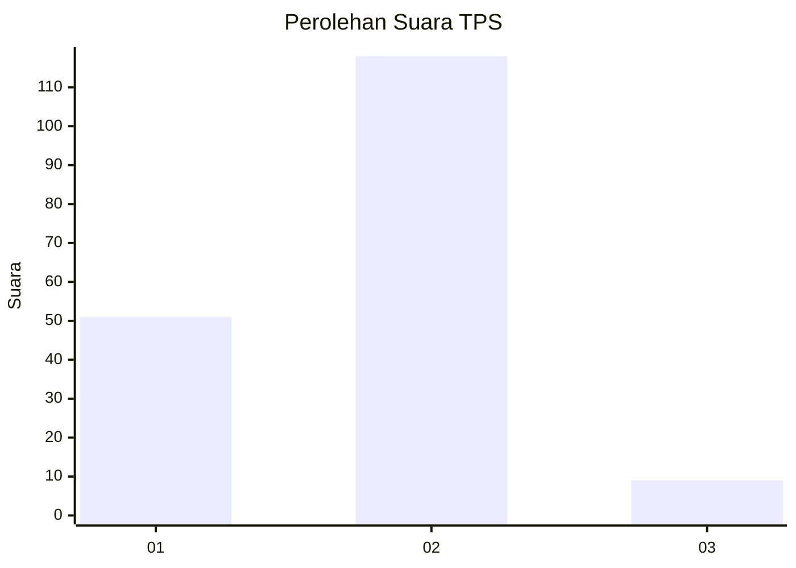
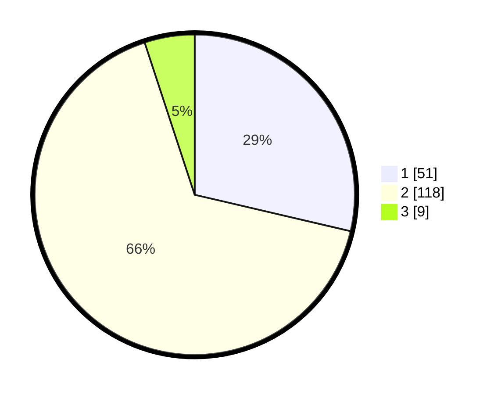

# Hasil

## Grafik

## Tabel

| No. | Nama Paslon    | Suara | Suara (raw) | Persentase |
|:--- |:-------------- | -----:| -----------:| ----------:|
| 1   | ANIES MUHAIMIN | 51    | [51][p-1]   | 28,65      |
| 2   | PRABOWO GIBRAN | 118   | [118][p-2]  | 66,29      |
| 3   | GANJAR MAHFUD  | 9     | [9][p-3]    | 5,06       |

[p-1]: https://github.com/gigit-pemilu/pemilu-2024/blob/main/pilpres/hitung-suara/sub/35-jawa-timur/sub/29-sumenep/sub/05-bluto/sub/2013-aeng-baja-raja/sub/001-tps/sub/paslon-1.txt
[p-2]: https://github.com/gigit-pemilu/pemilu-2024/blob/main/pilpres/hitung-suara/sub/35-jawa-timur/sub/29-sumenep/sub/05-bluto/sub/2013-aeng-baja-raja/sub/001-tps/sub/paslon-2.txt
[p-3]: https://github.com/gigit-pemilu/pemilu-2024/blob/main/pilpres/hitung-suara/sub/35-jawa-timur/sub/29-sumenep/sub/05-bluto/sub/2013-aeng-baja-raja/sub/001-tps/sub/paslon-3.txt

## Foto C Plano

https://sirekap-obj-formc.kpu.go.id/8145/pemilu/ppwp/35/29/05/20/13/3529052013001-20240214-225742--b4d9d81b-3f32-431e-a73e-f566432fe017.jpg

https://sirekap-obj-formc.kpu.go.id/8145/pemilu/ppwp/35/29/05/20/13/3529052013001-20240214-225829--33dbea0f-1518-4473-b1c5-02bd1f28da4a.jpg

https://sirekap-obj-formc.kpu.go.id/8145/pemilu/ppwp/35/29/05/20/13/3529052013001-20240214-225919--40af76e1-b42f-4bb0-8fb5-f5a849f54849.jpg

## Metadata

| Key        | Value               |
| ---------- | ------------------- |
| Time Stamp | 2024-02-15 15:00:29 |

