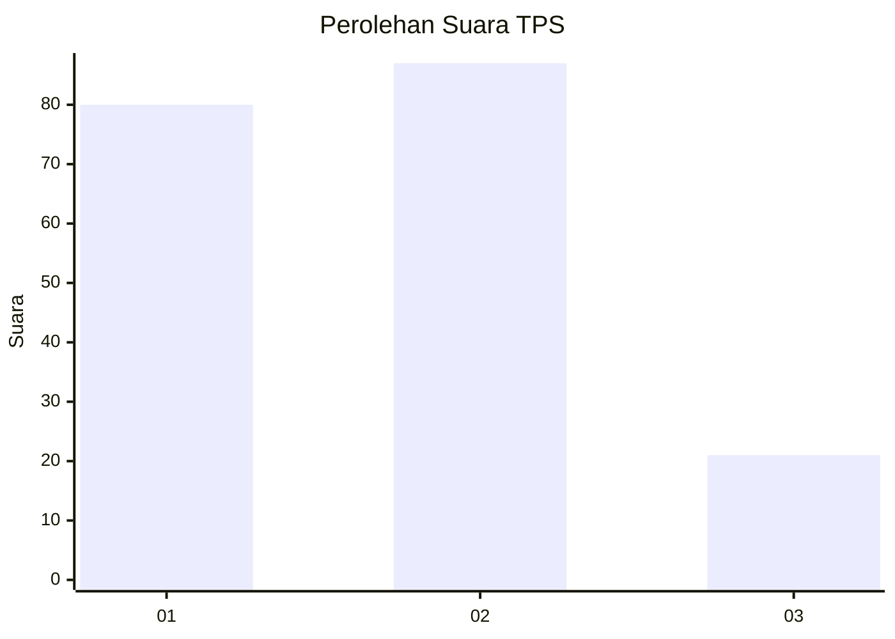
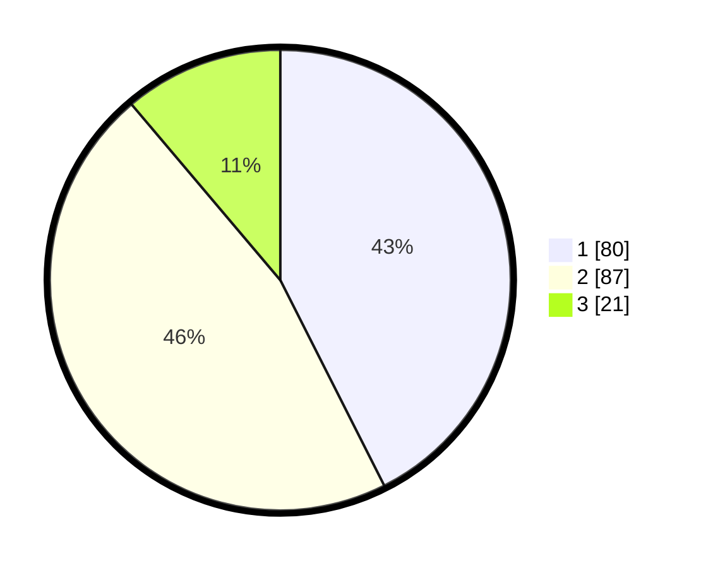

# Hasil

## Grafik

## Tabel

| No. | Nama Paslon    | Suara | Suara (raw) | Persentase |
|:--- |:-------------- | -----:| -----------:| ----------:|
| 1   | ANIES MUHAIMIN | 80    | [80][p-1]   | 42,55      |
| 2   | PRABOWO GIBRAN | 87    | [87][p-2]   | 46,28      |
| 3   | GANJAR MAHFUD  | 21    | [21][p-3]   | 11,17      |

[p-1]: https://github.com/gigit-pemilu/pemilu-2024-35-jawa-timur/blob/main/pilpres/hitung-suara/sub/35-jawa-timur/sub/29-sumenep/sub/05-bluto/sub/2015-sera-barat/sub/005-tps/sub/paslon-1.txt
[p-2]: https://github.com/gigit-pemilu/pemilu-2024-35-jawa-timur/blob/main/pilpres/hitung-suara/sub/35-jawa-timur/sub/29-sumenep/sub/05-bluto/sub/2015-sera-barat/sub/005-tps/sub/paslon-2.txt
[p-3]: https://github.com/gigit-pemilu/pemilu-2024-35-jawa-timur/blob/main/pilpres/hitung-suara/sub/35-jawa-timur/sub/29-sumenep/sub/05-bluto/sub/2015-sera-barat/sub/005-tps/sub/paslon-3.txt

## Foto C Plano

https://sirekap-obj-formc.kpu.go.id/11cf/pemilu/ppwp/35/29/05/20/15/3529052015005-20240215-004146--4495ce44-939d-40ff-9021-91a66ac81fe5.jpg

https://sirekap-obj-formc.kpu.go.id/11cf/pemilu/ppwp/35/29/05/20/15/3529052015005-20240215-004300--d06823b3-1480-4b48-90be-836656aef738.jpg

https://sirekap-obj-formc.kpu.go.id/11cf/pemilu/ppwp/35/29/05/20/15/3529052015005-20240215-004421--949ec48a-1efd-43c4-8256-4e9662148dc9.jpg

## Metadata

| Key        | Value               |
| ---------- | ------------------- |
| Time Stamp | 2024-02-24 22:31:28 |

