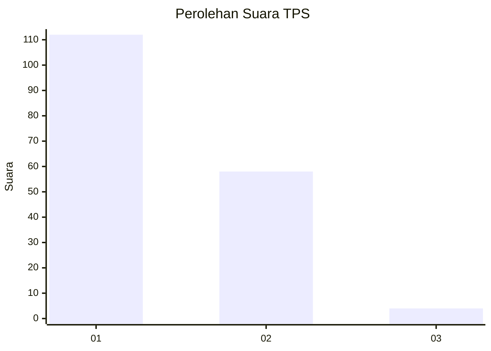
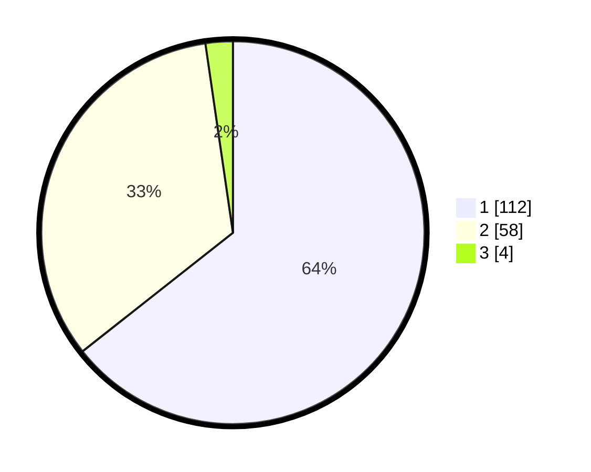

# Hasil

## Grafik

## Tabel

| No. | Nama Paslon    | Suara | Suara (raw) | Persentase |
|:--- |:-------------- | -----:| -----------:| ----------:|
| 1   | ANIES MUHAIMIN | 112   | [112][p-1]  | 64,37      |
| 2   | PRABOWO GIBRAN | 58    | [58][p-2]   | 33,33      |
| 3   | GANJAR MAHFUD  | 4     | [4][p-3]    | 2,30       |

[p-1]: https://github.com/gigit-pemilu/pemilu-2024/blob/main/pilpres/hitung-suara/sub/35-jawa-timur/sub/29-sumenep/sub/05-bluto/sub/2016-sera-tengah/sub/003-tps/sub/paslon-1.txt
[p-2]: https://github.com/gigit-pemilu/pemilu-2024/blob/main/pilpres/hitung-suara/sub/35-jawa-timur/sub/29-sumenep/sub/05-bluto/sub/2016-sera-tengah/sub/003-tps/sub/paslon-2.txt
[p-3]: https://github.com/gigit-pemilu/pemilu-2024/blob/main/pilpres/hitung-suara/sub/35-jawa-timur/sub/29-sumenep/sub/05-bluto/sub/2016-sera-tengah/sub/003-tps/sub/paslon-3.txt

## Foto C Plano

https://sirekap-obj-formc.kpu.go.id/0c48/pemilu/ppwp/35/29/05/20/16/3529052016003-20240215-010937--fbf2fd27-e8a2-452e-b11a-59472b2577d5.jpg

https://sirekap-obj-formc.kpu.go.id/0c48/pemilu/ppwp/35/29/05/20/16/3529052016003-20240215-011302--6cb3f3fb-4934-4d44-a593-340f88046407.jpg

https://sirekap-obj-formc.kpu.go.id/0c48/pemilu/ppwp/35/29/05/20/16/3529052016003-20240216-202736--bb3d5b03-3867-45ec-9f45-7b5dfcf3da48.jpg

## Metadata

| Key        | Value               |
| ---------- | ------------------- |
| Time Stamp | 2024-02-16 21:01:00 |

