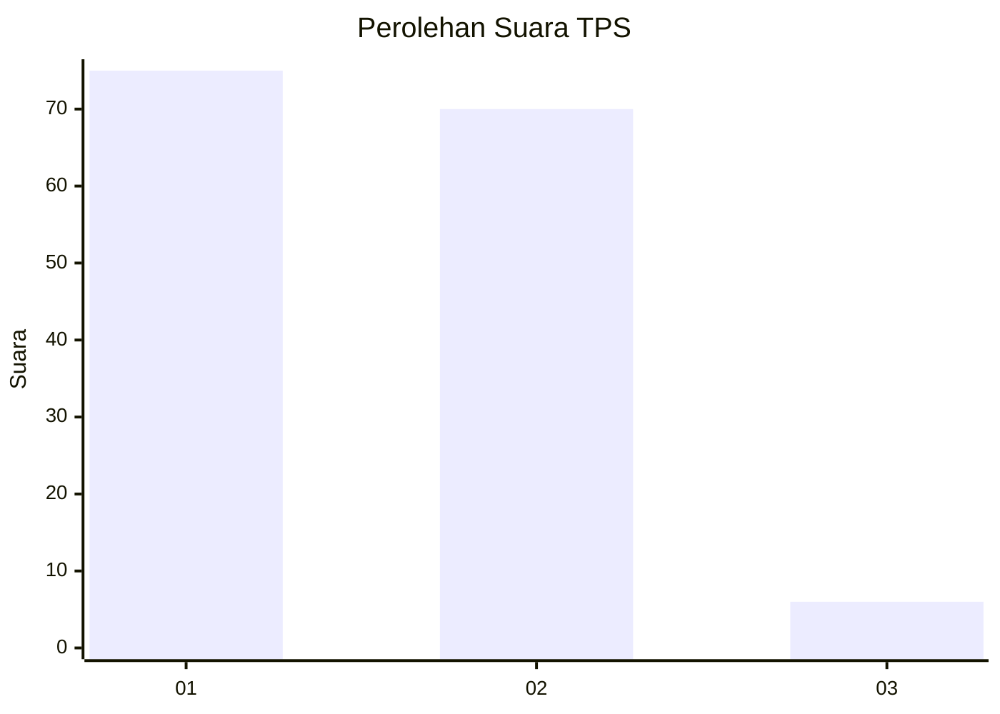
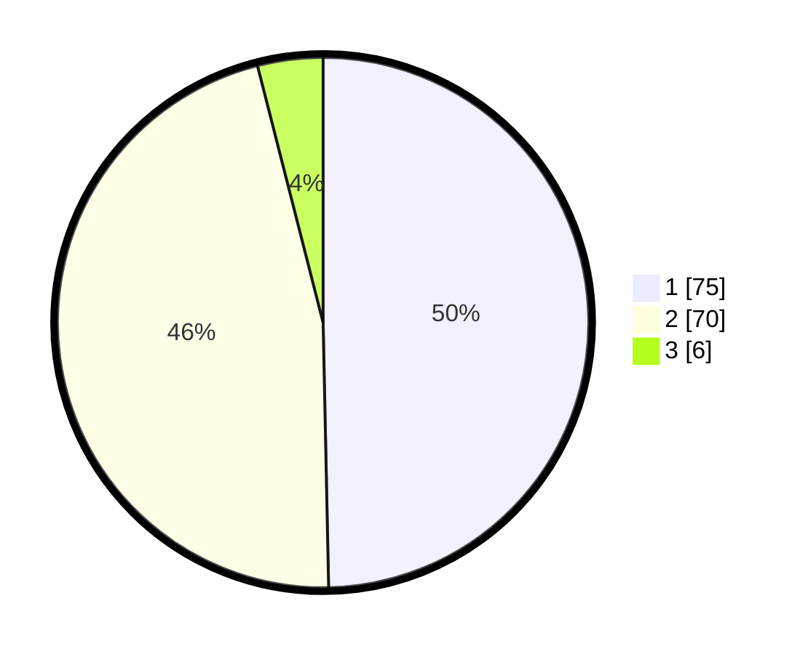

# Hasil

## Grafik

## Tabel

| No. | Nama Paslon    | Suara | Suara (raw) | Persentase |
|:--- |:-------------- | -----:| -----------:| ----------:|
| 1   | ANIES MUHAIMIN | 75    | [75][p-1]   | 49,67      |
| 2   | PRABOWO GIBRAN | 70    | [70][p-2]   | 46,36      |
| 3   | GANJAR MAHFUD  | 6     | [6][p-3]    | 3,97       |

[p-1]: https://github.com/gigit-pemilu/pemilu-2024-35-jawa-timur/blob/main/pilpres/hitung-suara/sub/35-jawa-timur/sub/29-sumenep/sub/05-bluto/sub/2017-sera-timur/sub/003-tps/sub/paslon-1.txt
[p-2]: https://github.com/gigit-pemilu/pemilu-2024-35-jawa-timur/blob/main/pilpres/hitung-suara/sub/35-jawa-timur/sub/29-sumenep/sub/05-bluto/sub/2017-sera-timur/sub/003-tps/sub/paslon-2.txt
[p-3]: https://github.com/gigit-pemilu/pemilu-2024-35-jawa-timur/blob/main/pilpres/hitung-suara/sub/35-jawa-timur/sub/29-sumenep/sub/05-bluto/sub/2017-sera-timur/sub/003-tps/sub/paslon-3.txt

## Foto C Plano

https://sirekap-obj-formc.kpu.go.id/60c3/pemilu/ppwp/35/29/05/20/17/3529052017003-20240215-200825--f0b1ca29-2d44-4173-a965-87a3ddd31e61.jpg

https://sirekap-obj-formc.kpu.go.id/60c3/pemilu/ppwp/35/29/05/20/17/3529052017003-20240215-000848--dbabf19e-c048-4c90-bc0f-daa723b7667e.jpg

https://sirekap-obj-formc.kpu.go.id/60c3/pemilu/ppwp/35/29/05/20/17/3529052017003-20240215-001517--fd24cf6f-8c54-4306-8d46-02cb0f5e1424.jpg

## Metadata

| Key        | Value               |
| ---------- | ------------------- |
| Time Stamp | 2024-02-25 15:00:00 |

