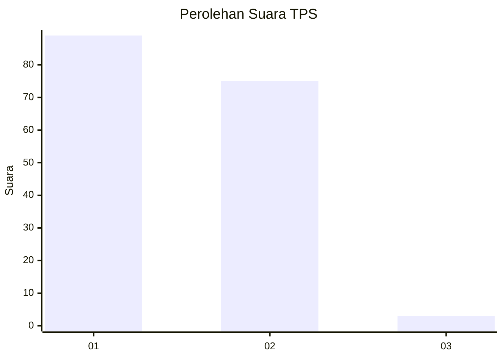
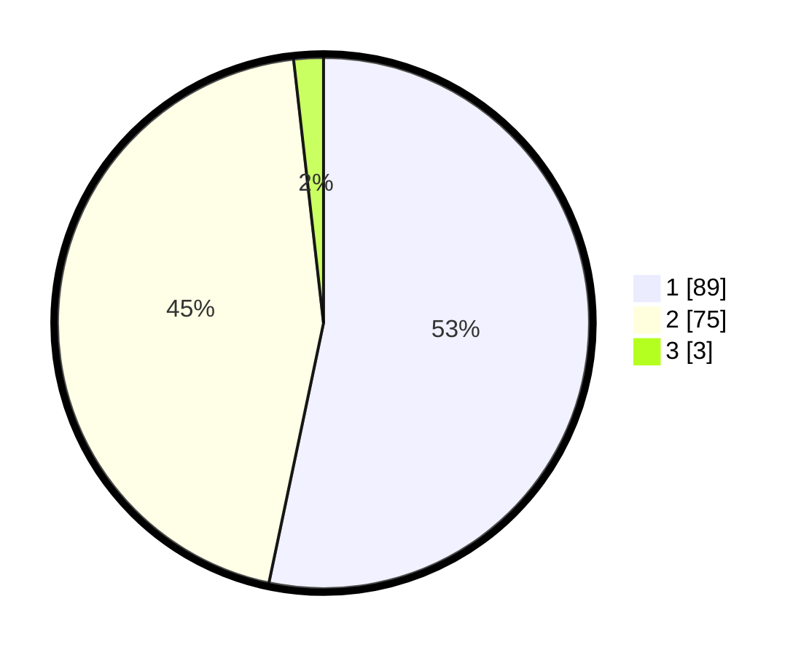

# Hasil

## Grafik

## Tabel

| No. | Nama Paslon    | Suara | Suara (raw) | Persentase |
|:--- |:-------------- | -----:| -----------:| ----------:|
| 1   | ANIES MUHAIMIN | 89    | [89][p-1]   | 53,29      |
| 2   | PRABOWO GIBRAN | 75    | [75][p-2]   | 44,91      |
| 3   | GANJAR MAHFUD  | 3     | [3][p-3]    | 1,80       |

[p-1]: https://github.com/gigit-pemilu/pemilu-2024-35-jawa-timur/blob/main/pilpres/hitung-suara/sub/35-jawa-timur/sub/29-sumenep/sub/05-bluto/sub/2017-sera-timur/sub/004-tps/sub/paslon-1.txt
[p-2]: https://github.com/gigit-pemilu/pemilu-2024-35-jawa-timur/blob/main/pilpres/hitung-suara/sub/35-jawa-timur/sub/29-sumenep/sub/05-bluto/sub/2017-sera-timur/sub/004-tps/sub/paslon-2.txt
[p-3]: https://github.com/gigit-pemilu/pemilu-2024-35-jawa-timur/blob/main/pilpres/hitung-suara/sub/35-jawa-timur/sub/29-sumenep/sub/05-bluto/sub/2017-sera-timur/sub/004-tps/sub/paslon-3.txt

## Foto C Plano

https://sirekap-obj-formc.kpu.go.id/c0a6/pemilu/ppwp/35/29/05/20/17/3529052017004-20240215-154025--3eba6e17-07d3-4583-bfa8-f29bd068f244.jpg

https://sirekap-obj-formc.kpu.go.id/c0a6/pemilu/ppwp/35/29/05/20/17/3529052017004-20240215-020947--c891ac95-3b69-42d1-8033-61d8e7d4dcc8.jpg

https://sirekap-obj-formc.kpu.go.id/c0a6/pemilu/ppwp/35/29/05/20/17/3529052017004-20240215-021128--8f527699-4a69-44d4-b87d-f882e4f11d0c.jpg

## Metadata

| Key        | Value               |
| ---------- | ------------------- |
| Time Stamp | 2024-02-27 22:00:00 |

