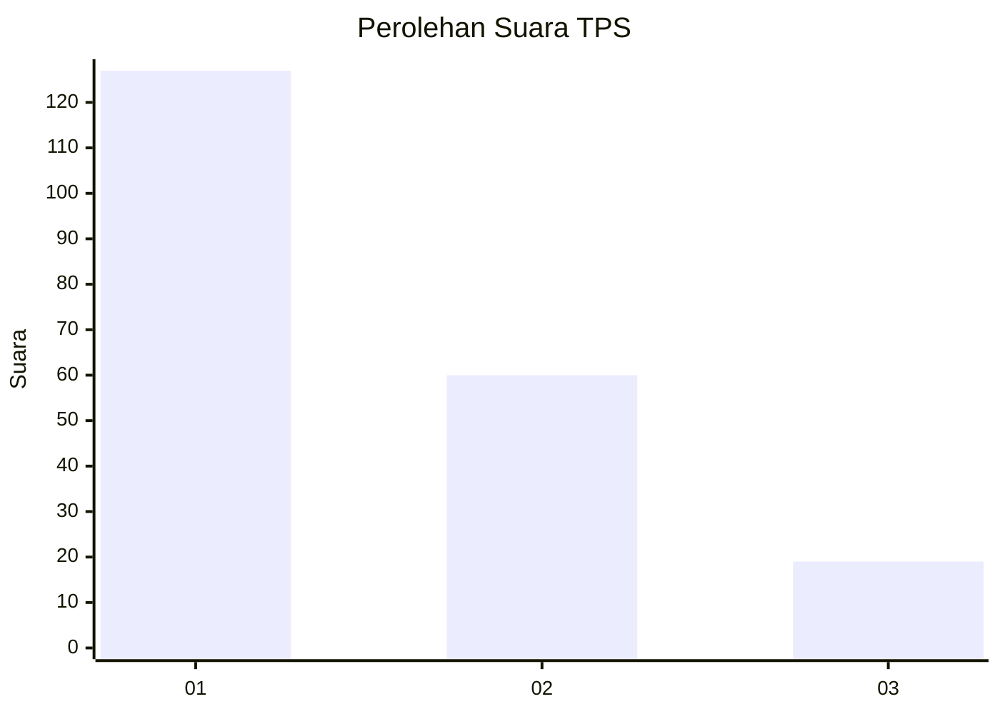
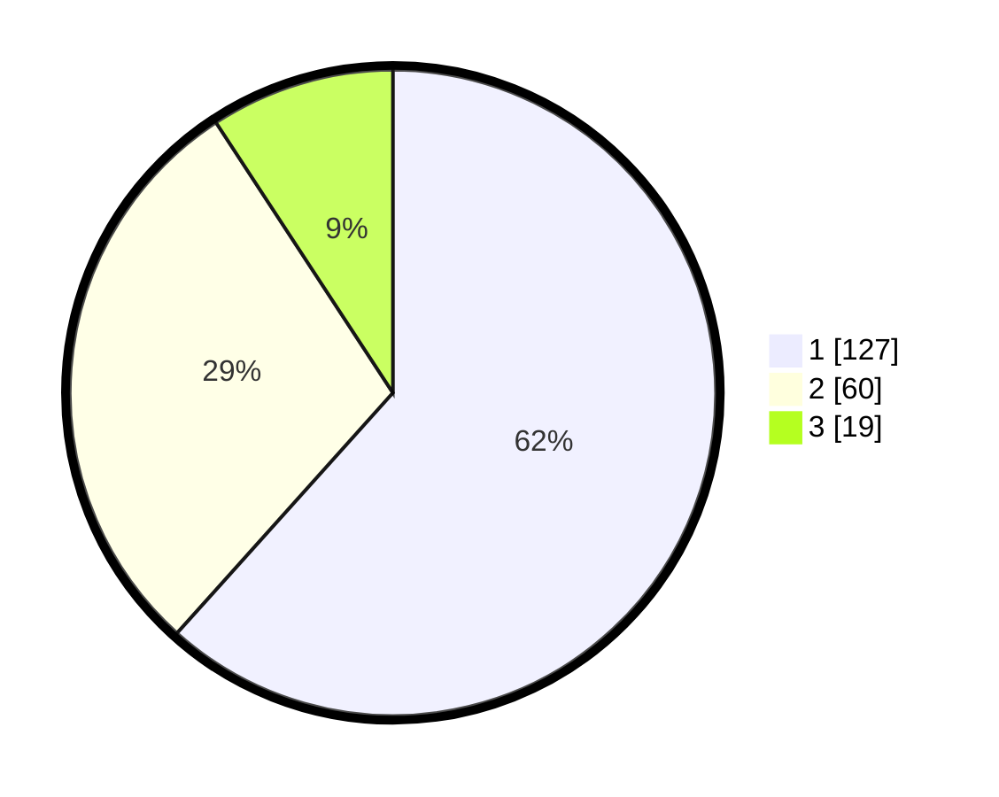

# Hasil

## Grafik

## Tabel

| No. | Nama Paslon    | Suara | Suara (raw) | Persentase |
|:--- |:-------------- | -----:| -----------:| ----------:|
| 1   | ANIES MUHAIMIN | 127   | [127][p-1]  | 61,65      |
| 2   | PRABOWO GIBRAN | 60    | [60][p-2]   | 29,13      |
| 3   | GANJAR MAHFUD  | 19    | [19][p-3]   | 9,22       |

[p-1]: https://github.com/gigit-pemilu/pemilu-2024-35-jawa-timur/blob/main/pilpres/hitung-suara/sub/35-jawa-timur/sub/29-sumenep/sub/05-bluto/sub/2019-errabu/sub/004-tps/sub/paslon-1.txt
[p-2]: https://github.com/gigit-pemilu/pemilu-2024-35-jawa-timur/blob/main/pilpres/hitung-suara/sub/35-jawa-timur/sub/29-sumenep/sub/05-bluto/sub/2019-errabu/sub/004-tps/sub/paslon-2.txt
[p-3]: https://github.com/gigit-pemilu/pemilu-2024-35-jawa-timur/blob/main/pilpres/hitung-suara/sub/35-jawa-timur/sub/29-sumenep/sub/05-bluto/sub/2019-errabu/sub/004-tps/sub/paslon-3.txt

## Foto C Plano

https://sirekap-obj-formc.kpu.go.id/6e4a/pemilu/ppwp/35/29/05/20/19/3529052019004-20240214-222134--3e4cd925-dae3-44cd-bc78-493050143505.jpg

https://sirekap-obj-formc.kpu.go.id/6e4a/pemilu/ppwp/35/29/05/20/19/3529052019004-20240214-222700--09713383-4287-475d-a593-90adbfa79ae9.jpg

https://sirekap-obj-formc.kpu.go.id/6e4a/pemilu/ppwp/35/29/05/20/19/3529052019004-20240214-222811--88929af6-f445-4e6b-b8c8-b8534b731577.jpg

## Metadata

| Key        | Value               |
| ---------- | ------------------- |
| Time Stamp | 2024-02-26 13:00:00 |

