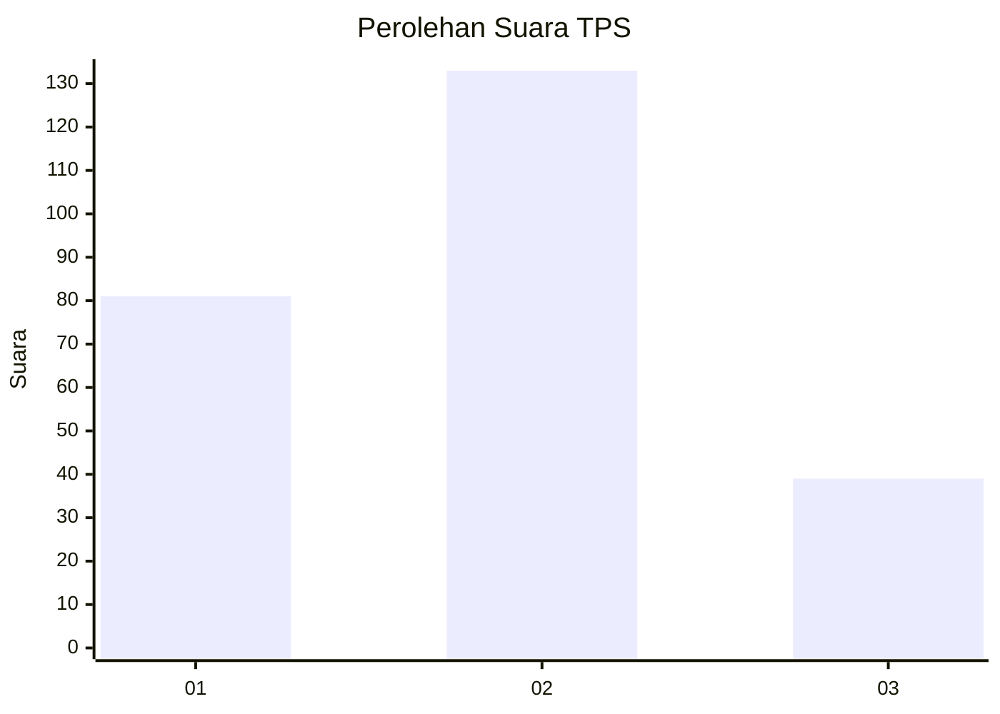
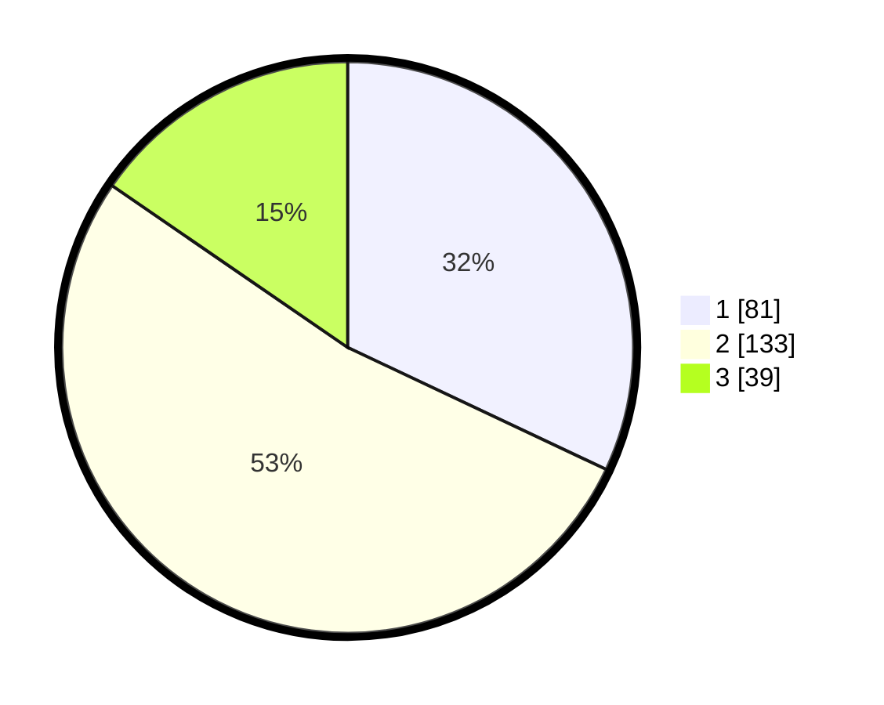

# Hasil

## Grafik

## Tabel

| No. | Nama Paslon    | Suara | Suara (raw) | Persentase |
|:--- |:-------------- | -----:| -----------:| ----------:|
| 1   | ANIES MUHAIMIN | 81    | [81][p-1]   | 32,02      |
| 2   | PRABOWO GIBRAN | 133   | [133][p-2]  | 52,57      |
| 3   | GANJAR MAHFUD  | 39    | [39][p-3]   | 15,42      |

[p-1]: https://github.com/gigit-pemilu/pemilu-2024/blob/main/pilpres/hitung-suara/sub/35-jawa-timur/sub/29-sumenep/sub/05-bluto/sub/2020-gilang/sub/001-tps/sub/paslon-1.txt
[p-2]: https://github.com/gigit-pemilu/pemilu-2024/blob/main/pilpres/hitung-suara/sub/35-jawa-timur/sub/29-sumenep/sub/05-bluto/sub/2020-gilang/sub/001-tps/sub/paslon-2.txt
[p-3]: https://github.com/gigit-pemilu/pemilu-2024/blob/main/pilpres/hitung-suara/sub/35-jawa-timur/sub/29-sumenep/sub/05-bluto/sub/2020-gilang/sub/001-tps/sub/paslon-3.txt

## Foto C Plano

https://sirekap-obj-formc.kpu.go.id/6535/pemilu/ppwp/35/29/05/20/20/3529052020001-20240214-234515--2c8cce83-01dc-46e2-81e5-c7ed2bd477df.jpg

https://sirekap-obj-formc.kpu.go.id/6535/pemilu/ppwp/35/29/05/20/20/3529052020001-20240214-234757--f4c2e231-eb6a-41a2-823d-03e5d835f4e4.jpg

https://sirekap-obj-formc.kpu.go.id/6535/pemilu/ppwp/35/29/05/20/20/3529052020001-20240214-235011--66b40c3b-ffbf-41bd-9178-78f540152d96.jpg

## Metadata

| Key        | Value               |
| ---------- | ------------------- |
| Time Stamp | 2024-02-15 22:40:13 |

