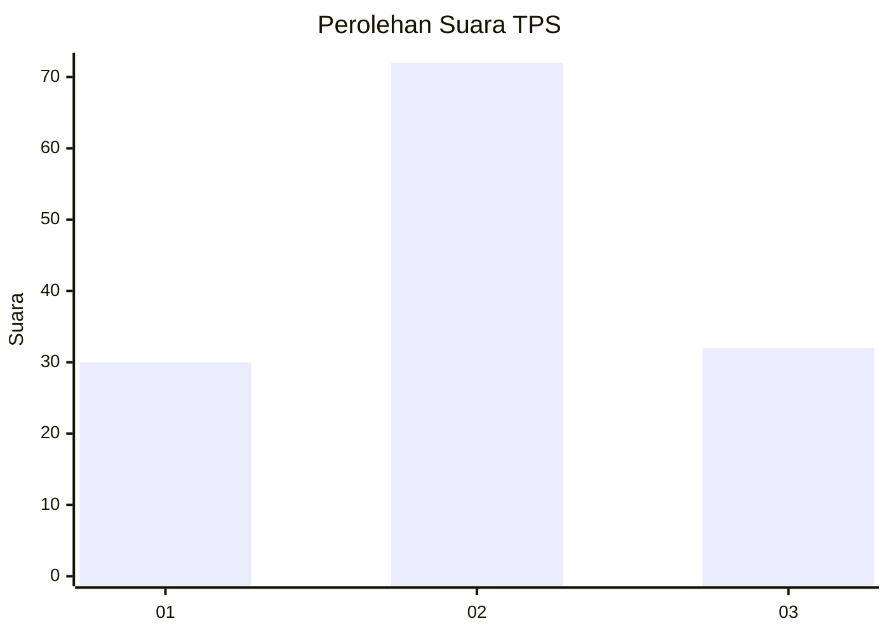
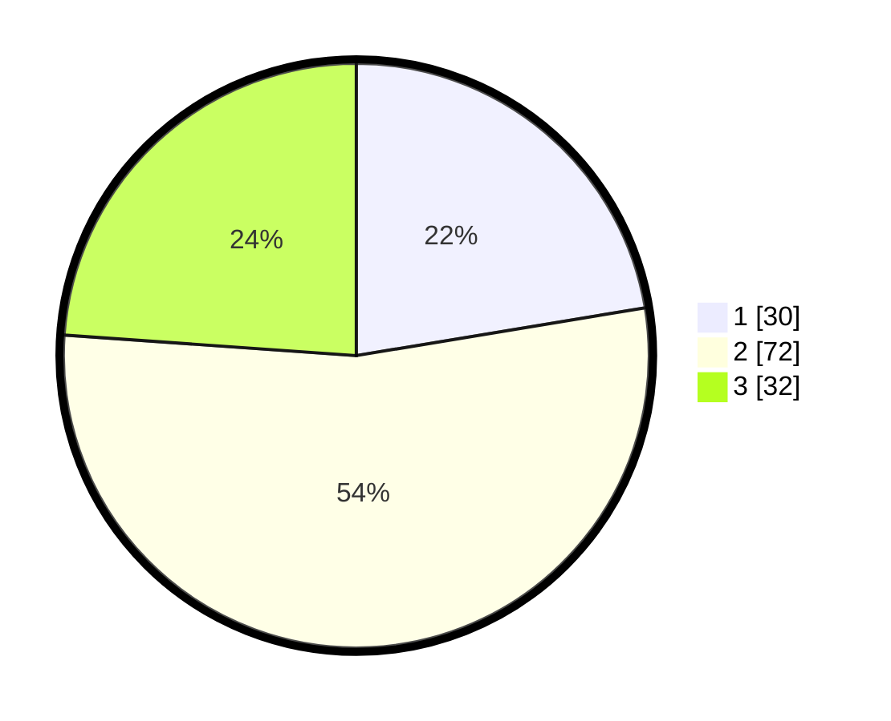

# Hasil

## Grafik

## Tabel

| No. | Nama Paslon    | Suara | Suara (raw) | Persentase |
|:--- |:-------------- | -----:| -----------:| ----------:|
| 1   | ANIES MUHAIMIN | 30    | [30][p-1]   | 22,39      |
| 2   | PRABOWO GIBRAN | 72    | [72][p-2]   | 53,73      |
| 3   | GANJAR MAHFUD  | 32    | [32][p-3]   | 23,88      |

[p-1]: https://github.com/gigit-pemilu/pemilu-2024/blob/main/pilpres/hitung-suara/sub/35-jawa-timur/sub/29-sumenep/sub/05-bluto/sub/2020-gilang/sub/002-tps/sub/paslon-1.txt
[p-2]: https://github.com/gigit-pemilu/pemilu-2024/blob/main/pilpres/hitung-suara/sub/35-jawa-timur/sub/29-sumenep/sub/05-bluto/sub/2020-gilang/sub/002-tps/sub/paslon-2.txt
[p-3]: https://github.com/gigit-pemilu/pemilu-2024/blob/main/pilpres/hitung-suara/sub/35-jawa-timur/sub/29-sumenep/sub/05-bluto/sub/2020-gilang/sub/002-tps/sub/paslon-3.txt

## Foto C Plano

https://sirekap-obj-formc.kpu.go.id/6b37/pemilu/ppwp/35/29/05/20/20/3529052020002-20240214-213900--6f7bc8dd-2ff0-4a44-9310-a67be6e65d8f.jpg

https://sirekap-obj-formc.kpu.go.id/6b37/pemilu/ppwp/35/29/05/20/20/3529052020002-20240214-214100--b42ad575-a78b-4b7e-9ca6-ae167798ebfe.jpg

https://sirekap-obj-formc.kpu.go.id/6b37/pemilu/ppwp/35/29/05/20/20/3529052020002-20240214-214250--30294ffc-489a-472b-938d-f79cd367c1e9.jpg

## Metadata

| Key        | Value               |
| ---------- | ------------------- |
| Time Stamp | 2024-02-25 21:00:00 |

