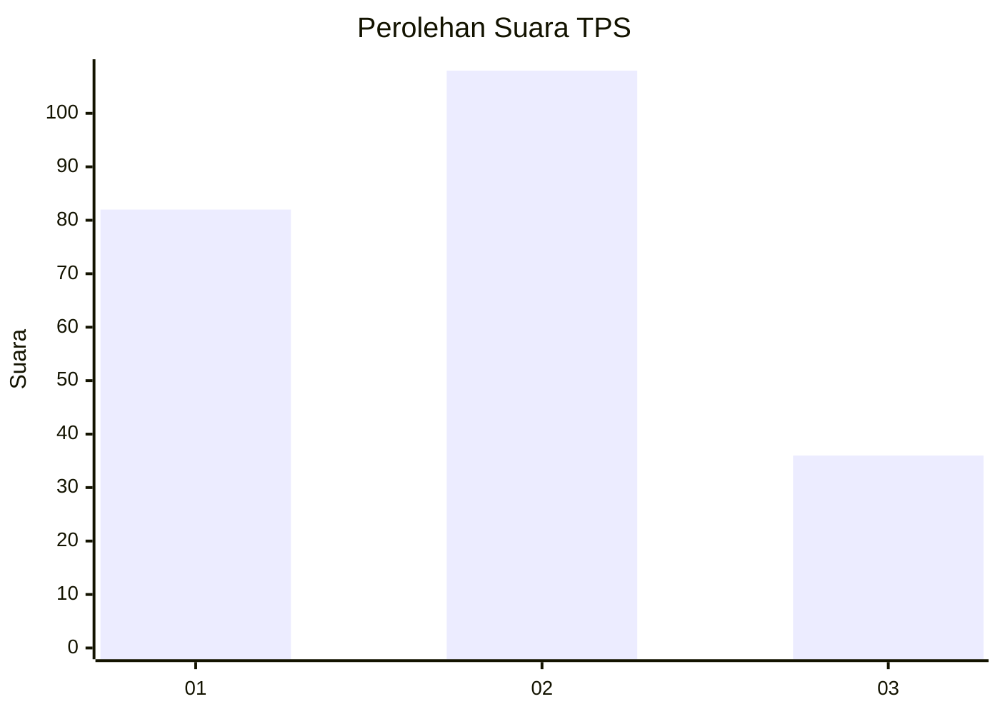
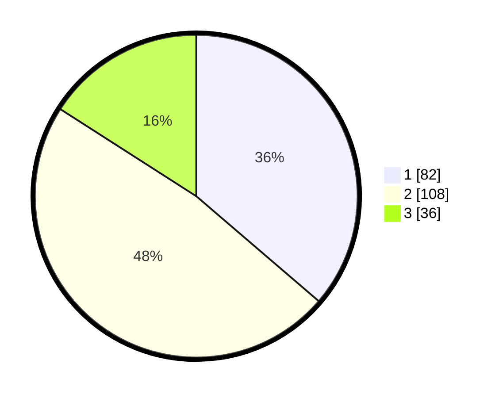

# Hasil

## Grafik

## Tabel

| No. | Nama Paslon    | Suara | Suara (raw) | Persentase |
|:--- |:-------------- | -----:| -----------:| ----------:|
| 1   | ANIES MUHAIMIN | 82    | [82][p-1]   | 36,28      |
| 2   | PRABOWO GIBRAN | 108   | [108][p-2]  | 47,79      |
| 3   | GANJAR MAHFUD  | 36    | [36][p-3]   | 15,93      |

[p-1]: https://github.com/gigit-pemilu/pemilu-2024-35-jawa-timur/blob/main/pilpres/hitung-suara/sub/35-jawa-timur/sub/29-sumenep/sub/06-saronggi/sub/2001-pagar-batu/sub/001-tps/sub/paslon-1.txt
[p-2]: https://github.com/gigit-pemilu/pemilu-2024-35-jawa-timur/blob/main/pilpres/hitung-suara/sub/35-jawa-timur/sub/29-sumenep/sub/06-saronggi/sub/2001-pagar-batu/sub/001-tps/sub/paslon-2.txt
[p-3]: https://github.com/gigit-pemilu/pemilu-2024-35-jawa-timur/blob/main/pilpres/hitung-suara/sub/35-jawa-timur/sub/29-sumenep/sub/06-saronggi/sub/2001-pagar-batu/sub/001-tps/sub/paslon-3.txt

## Foto C Plano

https://sirekap-obj-formc.kpu.go.id/1415/pemilu/ppwp/35/29/06/20/01/3529062001001-20240214-195302--74e11e83-bc80-4b9e-9602-3c4ffb578d96.jpg

https://sirekap-obj-formc.kpu.go.id/1415/pemilu/ppwp/35/29/06/20/01/3529062001001-20240214-195422--d5a049e7-d4eb-4167-b6f7-7345812c7bdb.jpg

https://sirekap-obj-formc.kpu.go.id/1415/pemilu/ppwp/35/29/06/20/01/3529062001001-20240214-195525--e52fe0e0-2cb0-4c07-a93f-d61fc650b8ba.jpg

## Metadata

| Key        | Value               |
| ---------- | ------------------- |
| Time Stamp | 2024-02-16 12:51:22 |

