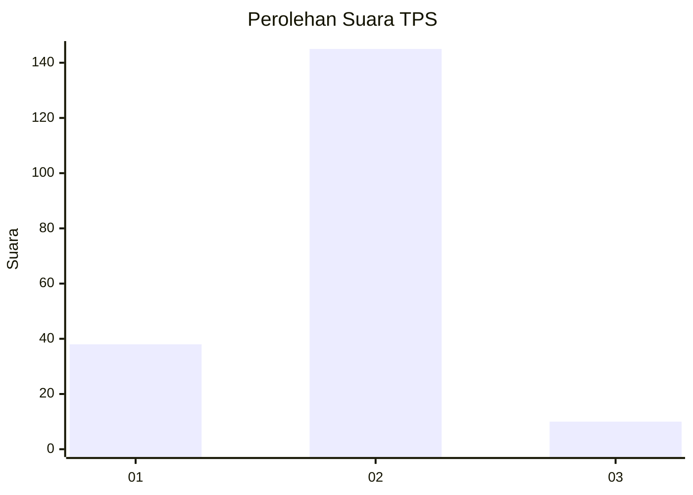
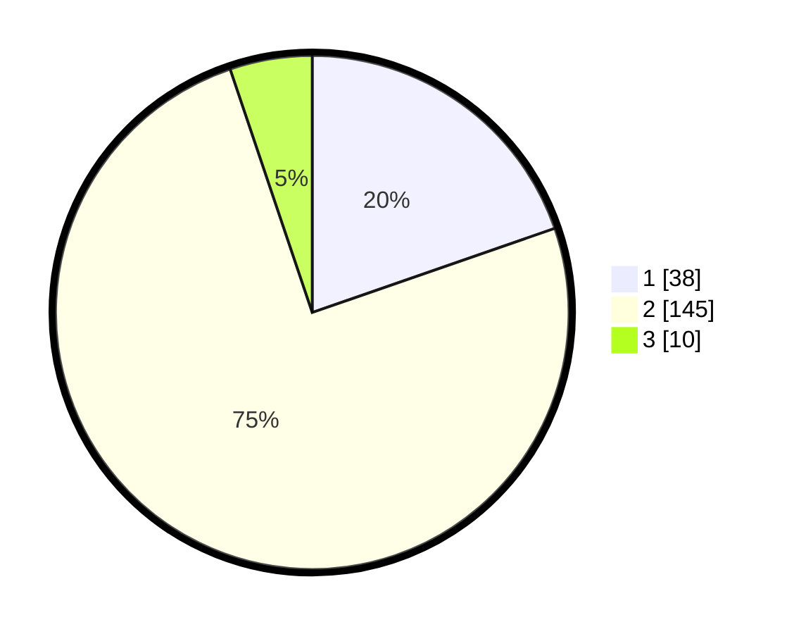

# Hasil

## Grafik

## Tabel

| No. | Nama Paslon    | Suara | Suara (raw) | Persentase |
|:--- |:-------------- | -----:| -----------:| ----------:|
| 1   | ANIES MUHAIMIN | 38    | [38][p-1]   | 19,69      |
| 2   | PRABOWO GIBRAN | 145   | [145][p-2]  | 75,13      |
| 3   | GANJAR MAHFUD  | 10    | [10][p-3]   | 5,18       |

[p-1]: https://github.com/gigit-pemilu/pemilu-2024-35-jawa-timur/blob/main/pilpres/hitung-suara/sub/35-jawa-timur/sub/29-sumenep/sub/06-saronggi/sub/2001-pagar-batu/sub/003-tps/sub/paslon-1.txt
[p-2]: https://github.com/gigit-pemilu/pemilu-2024-35-jawa-timur/blob/main/pilpres/hitung-suara/sub/35-jawa-timur/sub/29-sumenep/sub/06-saronggi/sub/2001-pagar-batu/sub/003-tps/sub/paslon-2.txt
[p-3]: https://github.com/gigit-pemilu/pemilu-2024-35-jawa-timur/blob/main/pilpres/hitung-suara/sub/35-jawa-timur/sub/29-sumenep/sub/06-saronggi/sub/2001-pagar-batu/sub/003-tps/sub/paslon-3.txt

## Foto C Plano

https://sirekap-obj-formc.kpu.go.id/eccd/pemilu/ppwp/35/29/06/20/01/3529062001003-20240215-073608--1f7dfac2-425c-436e-966b-a01a9cea5e3c.jpg

https://sirekap-obj-formc.kpu.go.id/eccd/pemilu/ppwp/35/29/06/20/01/3529062001003-20240215-073822--6e4a8cb2-f893-48aa-8da9-99ea3937b91c.jpg

https://sirekap-obj-formc.kpu.go.id/eccd/pemilu/ppwp/35/29/06/20/01/3529062001003-20240215-073928--33d2895b-01d3-4ca0-86a1-258896ee450b.jpg

## Metadata

| Key        | Value               |
| ---------- | ------------------- |
| Time Stamp | 2024-02-25 12:00:00 |

