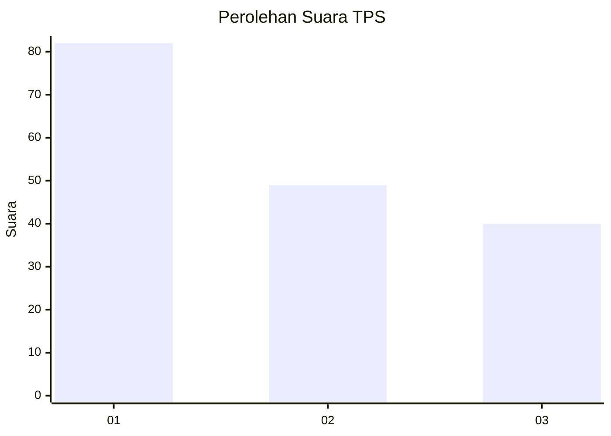
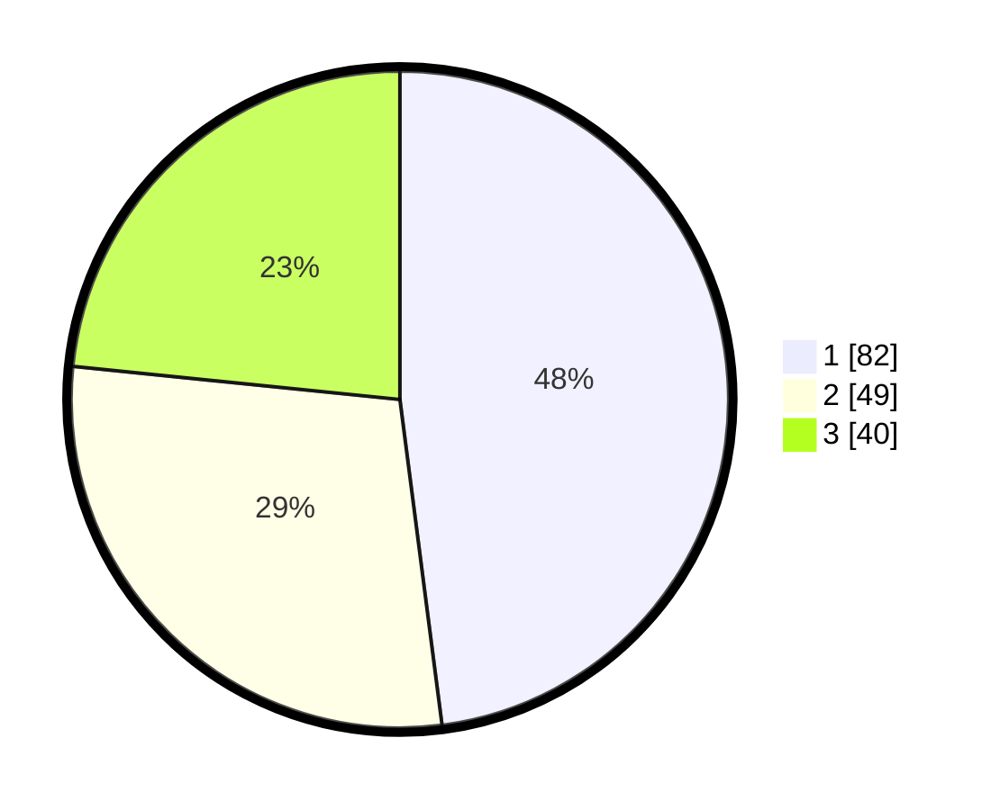

# Hasil

## Grafik

## Tabel

| No. | Nama Paslon    | Suara | Suara (raw) | Persentase |
|:--- |:-------------- | -----:| -----------:| ----------:|
| 1   | ANIES MUHAIMIN | 82    | [82][p-1]   | 47,95      |
| 2   | PRABOWO GIBRAN | 49    | [49][p-2]   | 28,65      |
| 3   | GANJAR MAHFUD  | 40    | [40][p-3]   | 23,39      |

[p-1]: https://github.com/gigit-pemilu/pemilu-2024-35-jawa-timur/blob/main/pilpres/hitung-suara/sub/35-jawa-timur/sub/29-sumenep/sub/06-saronggi/sub/2001-pagar-batu/sub/005-tps/sub/paslon-1.txt
[p-2]: https://github.com/gigit-pemilu/pemilu-2024-35-jawa-timur/blob/main/pilpres/hitung-suara/sub/35-jawa-timur/sub/29-sumenep/sub/06-saronggi/sub/2001-pagar-batu/sub/005-tps/sub/paslon-2.txt
[p-3]: https://github.com/gigit-pemilu/pemilu-2024-35-jawa-timur/blob/main/pilpres/hitung-suara/sub/35-jawa-timur/sub/29-sumenep/sub/06-saronggi/sub/2001-pagar-batu/sub/005-tps/sub/paslon-3.txt

## Foto C Plano

https://sirekap-obj-formc.kpu.go.id/e251/pemilu/ppwp/35/29/06/20/01/3529062001005-20240214-194844--6e463776-ed26-4a02-b30b-b1ab19d14666.jpg

https://sirekap-obj-formc.kpu.go.id/e251/pemilu/ppwp/35/29/06/20/01/3529062001005-20240214-195050--0fd7dcd9-7b8c-4160-a22f-4e2f747e5ce2.jpg

## Metadata

| Key        | Value               |
| ---------- | ------------------- |
| Time Stamp | 2024-02-25 13:00:00 |

