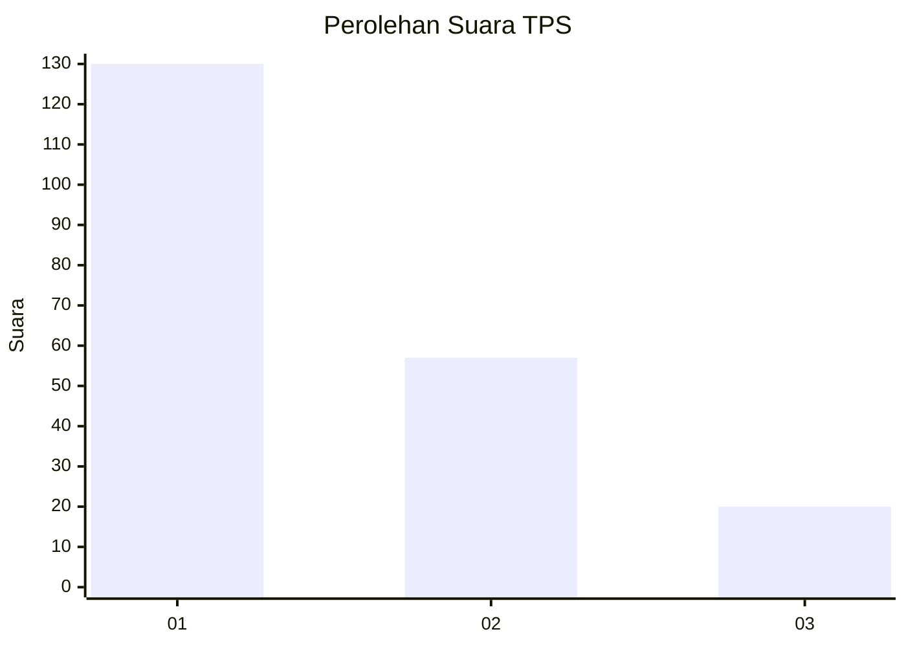
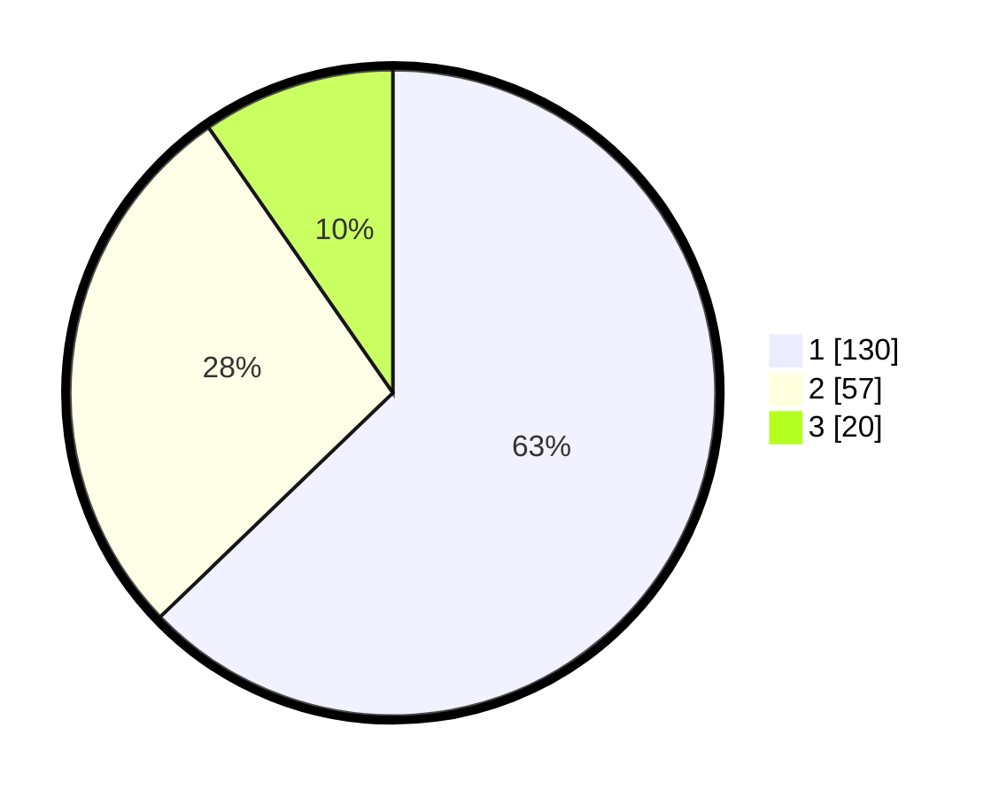

# Hasil

## Grafik

## Tabel

| No. | Nama Paslon    | Suara | Suara (raw) | Persentase |
|:--- |:-------------- | -----:| -----------:| ----------:|
| 1   | ANIES MUHAIMIN | 130   | [130][p-1]  | 62,80      |
| 2   | PRABOWO GIBRAN | 57    | [57][p-2]   | 27,54      |
| 3   | GANJAR MAHFUD  | 20    | [20][p-3]   | 9,66       |

[p-1]: https://github.com/gigit-pemilu/pemilu-2024-35-jawa-timur/blob/main/pilpres/hitung-suara/sub/35-jawa-timur/sub/29-sumenep/sub/06-saronggi/sub/2001-pagar-batu/sub/006-tps/sub/paslon-1.txt
[p-2]: https://github.com/gigit-pemilu/pemilu-2024-35-jawa-timur/blob/main/pilpres/hitung-suara/sub/35-jawa-timur/sub/29-sumenep/sub/06-saronggi/sub/2001-pagar-batu/sub/006-tps/sub/paslon-2.txt
[p-3]: https://github.com/gigit-pemilu/pemilu-2024-35-jawa-timur/blob/main/pilpres/hitung-suara/sub/35-jawa-timur/sub/29-sumenep/sub/06-saronggi/sub/2001-pagar-batu/sub/006-tps/sub/paslon-3.txt

## Foto C Plano

https://sirekap-obj-formc.kpu.go.id/90ed/pemilu/ppwp/35/29/06/20/01/3529062001006-20240214-212615--55a18218-6365-4c8c-ad0b-281a36822064.jpg

https://sirekap-obj-formc.kpu.go.id/90ed/pemilu/ppwp/35/29/06/20/01/3529062001006-20240214-212659--dda41f9e-d8ed-4b82-aa67-05aa5846eda0.jpg

https://sirekap-obj-formc.kpu.go.id/90ed/pemilu/ppwp/35/29/06/20/01/3529062001006-20240214-212737--2f408039-6000-4465-9e95-ab18dd3ddd80.jpg

## Metadata

| Key        | Value               |
| ---------- | ------------------- |
| Time Stamp | 2024-02-15 20:30:46 |

