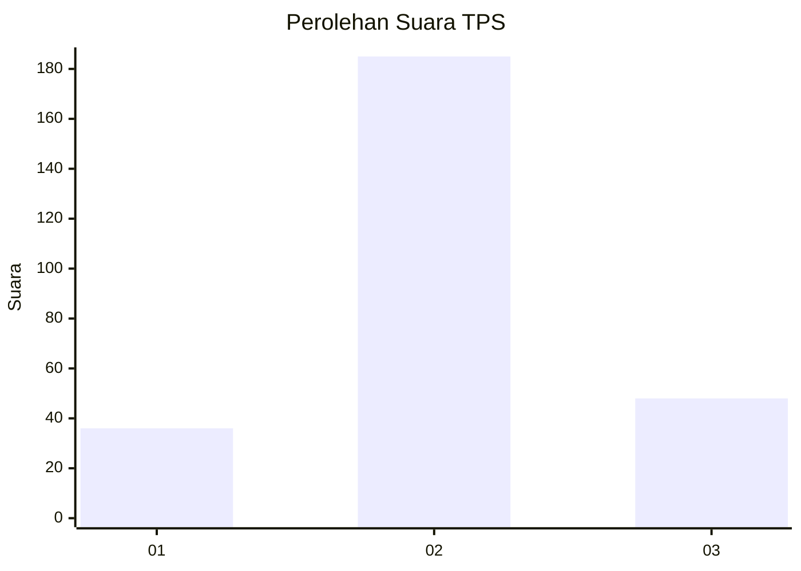
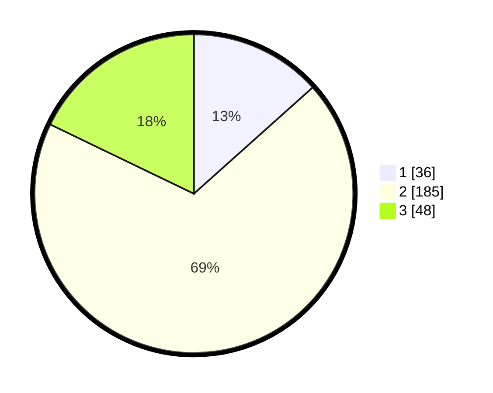

# Hasil

## Grafik

## Tabel

| No. | Nama Paslon    | Suara | Suara (raw) | Persentase |
|:--- |:-------------- | -----:| -----------:| ----------:|
| 1   | ANIES MUHAIMIN | 36    | [36][p-1]   | 13,38      |
| 2   | PRABOWO GIBRAN | 185   | [185][p-2]  | 68,77      |
| 3   | GANJAR MAHFUD  | 48    | [48][p-3]   | 17,84      |

[p-1]: https://github.com/gigit-pemilu/pemilu-2024-35-jawa-timur/blob/main/pilpres/hitung-suara/sub/35-jawa-timur/sub/29-sumenep/sub/06-saronggi/sub/2003-kebundadap-timur/sub/001-tps/sub/paslon-1.txt
[p-2]: https://github.com/gigit-pemilu/pemilu-2024-35-jawa-timur/blob/main/pilpres/hitung-suara/sub/35-jawa-timur/sub/29-sumenep/sub/06-saronggi/sub/2003-kebundadap-timur/sub/001-tps/sub/paslon-2.txt
[p-3]: https://github.com/gigit-pemilu/pemilu-2024-35-jawa-timur/blob/main/pilpres/hitung-suara/sub/35-jawa-timur/sub/29-sumenep/sub/06-saronggi/sub/2003-kebundadap-timur/sub/001-tps/sub/paslon-3.txt

## Foto C Plano

https://sirekap-obj-formc.kpu.go.id/e0bc/pemilu/ppwp/35/29/06/20/03/3529062003001-20240214-203321--6282ecde-63fd-4bbb-9be6-1607d35e49da.jpg

https://sirekap-obj-formc.kpu.go.id/e0bc/pemilu/ppwp/35/29/06/20/03/3529062003001-20240214-203432--13d94188-d71b-4547-a22b-1e9c86d44522.jpg

https://sirekap-obj-formc.kpu.go.id/e0bc/pemilu/ppwp/35/29/06/20/03/3529062003001-20240214-203535--fc1cff9c-8b15-4f91-8fc9-f2cefe0698e7.jpg

## Metadata

| Key        | Value               |
| ---------- | ------------------- |
| Time Stamp | 2024-02-25 13:00:00 |

