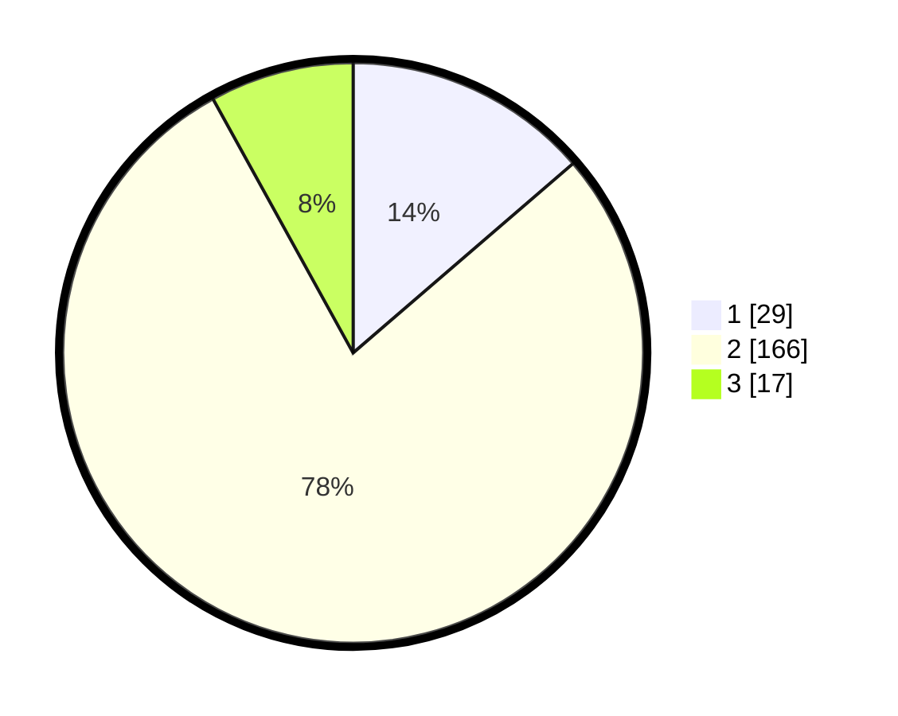

# Hasil

## Grafik

## Tabel

| No. | Nama Paslon    | Suara | Suara (raw) | Persentase |
|:--- |:-------------- | -----:| -----------:| ----------:|
| 1   | ANIES MUHAIMIN | 29    | [29][p-1]   | 13,68      |
| 2   | PRABOWO GIBRAN | 166   | [166][p-2]  | 78,30      |
| 3   | GANJAR MAHFUD  | 17    | [17][p-3]   | 8,02       |

[p-1]: https://github.com/gigit-pemilu/pemilu-2024/blob/main/pilpres/hitung-suara/sub/35-jawa-timur/sub/29-sumenep/sub/06-saronggi/sub/2005-kebundadap-barat/sub/002-tps/sub/paslon-1.txt
[p-2]: https://github.com/gigit-pemilu/pemilu-2024/blob/main/pilpres/hitung-suara/sub/35-jawa-timur/sub/29-sumenep/sub/06-saronggi/sub/2005-kebundadap-barat/sub/002-tps/sub/paslon-2.txt
[p-3]: https://github.com/gigit-pemilu/pemilu-2024/blob/main/pilpres/hitung-suara/sub/35-jawa-timur/sub/29-sumenep/sub/06-saronggi/sub/2005-kebundadap-barat/sub/002-tps/sub/paslon-3.txt

## Foto C Plano

https://sirekap-obj-formc.kpu.go.id/a28f/pemilu/ppwp/35/29/06/20/05/3529062005002-20240223-135122--a2e2d80c-277d-4852-99ad-4efdcfb3d91c.jpg

https://sirekap-obj-formc.kpu.go.id/a28f/pemilu/ppwp/35/29/06/20/05/3529062005002-20240223-134958--ade6809e-1cfa-419d-8671-a1bd97036add.jpg

https://sirekap-obj-formc.kpu.go.id/a28f/pemilu/ppwp/35/29/06/20/05/3529062005002-20240223-134845--dbc8c792-c4a1-4d7f-bc3a-06a8a053272f.jpg

## Metadata

| Key        | Value               |
| ---------- | ------------------- |
| Time Stamp | 2024-02-24 22:31:28 |

