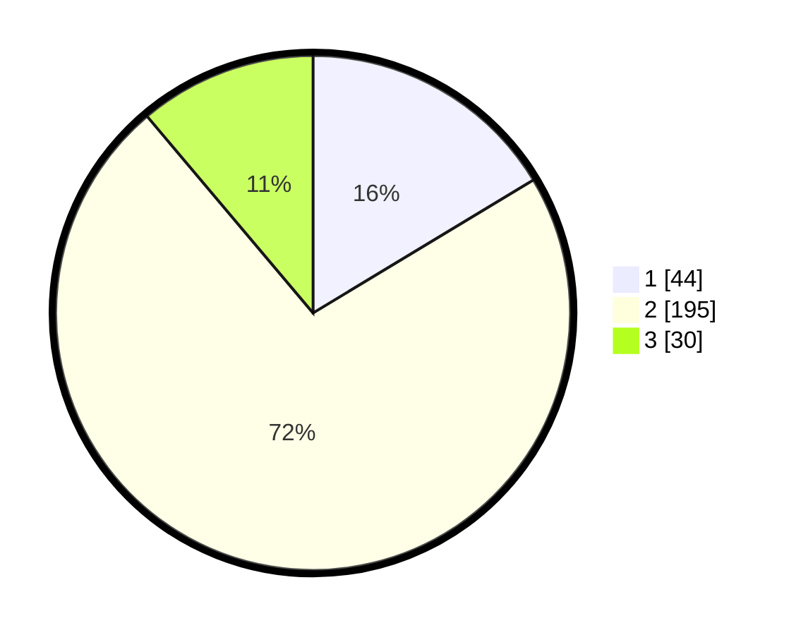

# Hasil

## Grafik

## Tabel

| No. | Nama Paslon    | Suara | Suara (raw) | Persentase |
|:--- |:-------------- | -----:| -----------:| ----------:|
| 1   | ANIES MUHAIMIN | 44    | [44][p-1]   | 16,36      |
| 2   | PRABOWO GIBRAN | 195   | [195][p-2]  | 72,49      |
| 3   | GANJAR MAHFUD  | 30    | [30][p-3]   | 11,15      |

[p-1]: https://github.com/gigit-pemilu/pemilu-2024/blob/main/pilpres/hitung-suara/sub/35-jawa-timur/sub/29-sumenep/sub/06-saronggi/sub/2005-kebundadap-barat/sub/003-tps/sub/paslon-1.txt
[p-2]: https://github.com/gigit-pemilu/pemilu-2024/blob/main/pilpres/hitung-suara/sub/35-jawa-timur/sub/29-sumenep/sub/06-saronggi/sub/2005-kebundadap-barat/sub/003-tps/sub/paslon-2.txt
[p-3]: https://github.com/gigit-pemilu/pemilu-2024/blob/main/pilpres/hitung-suara/sub/35-jawa-timur/sub/29-sumenep/sub/06-saronggi/sub/2005-kebundadap-barat/sub/003-tps/sub/paslon-3.txt

## Foto C Plano

https://sirekap-obj-formc.kpu.go.id/9a1d/pemilu/ppwp/35/29/06/20/05/3529062005003-20240223-134401--b51d0a99-0e2a-4572-a566-ee443dcadc12.jpg

https://sirekap-obj-formc.kpu.go.id/9a1d/pemilu/ppwp/35/29/06/20/05/3529062005003-20240223-134522--e92939da-18d5-4030-8aac-6f7a2a581cd0.jpg

https://sirekap-obj-formc.kpu.go.id/9a1d/pemilu/ppwp/35/29/06/20/05/3529062005003-20240223-134627--0e1d4c87-691f-4294-9b40-3853c4183745.jpg

## Metadata

| Key        | Value               |
| ---------- | ------------------- |
| Time Stamp | 2024-02-24 22:31:28 |

