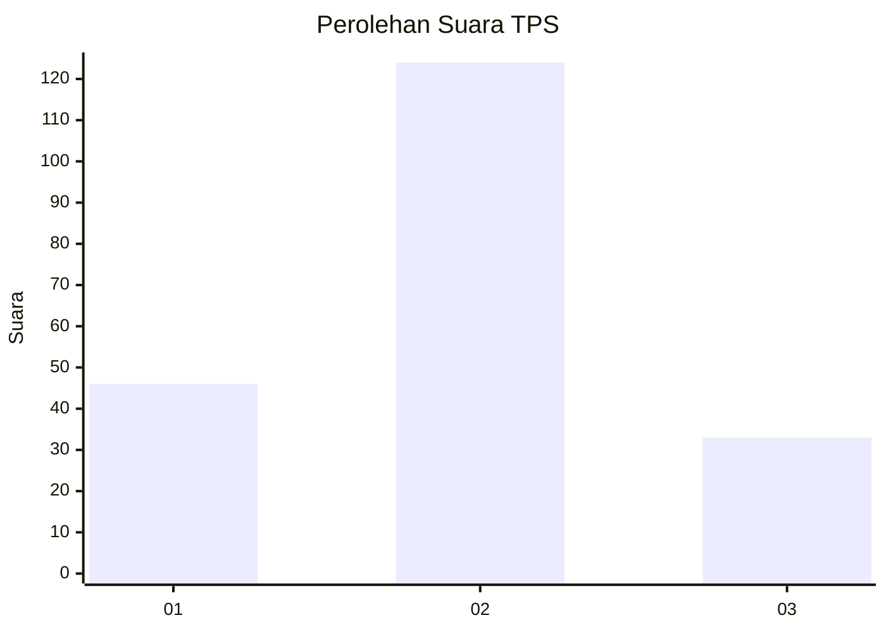

# Hasil

## Grafik

## Tabel

| No. | Nama Paslon    | Suara | Suara (raw) | Persentase |
|:--- |:-------------- | -----:| -----------:| ----------:|
| 1   | ANIES MUHAIMIN | 46    | [46][p-1]   | 22,66      |
| 2   | PRABOWO GIBRAN | 124   | [124][p-2]  | 61,08      |
| 3   | GANJAR MAHFUD  | 33    | [33][p-3]   | 16,26      |

[p-1]: https://github.com/gigit-pemilu/pemilu-2024/blob/main/pilpres/hitung-suara/sub/35-jawa-timur/sub/29-sumenep/sub/06-saronggi/sub/2005-kebundadap-barat/sub/004-tps/sub/paslon-1.txt
[p-2]: https://github.com/gigit-pemilu/pemilu-2024/blob/main/pilpres/hitung-suara/sub/35-jawa-timur/sub/29-sumenep/sub/06-saronggi/sub/2005-kebundadap-barat/sub/004-tps/sub/paslon-2.txt
[p-3]: https://github.com/gigit-pemilu/pemilu-2024/blob/main/pilpres/hitung-suara/sub/35-jawa-timur/sub/29-sumenep/sub/06-saronggi/sub/2005-kebundadap-barat/sub/004-tps/sub/paslon-3.txt

## Foto C Plano

https://sirekap-obj-formc.kpu.go.id/320f/pemilu/ppwp/35/29/06/20/05/3529062005004-20240223-140329--6e20a791-80dd-4713-a95f-f7c82114aa82.jpg

https://sirekap-obj-formc.kpu.go.id/320f/pemilu/ppwp/35/29/06/20/05/3529062005004-20240223-140441--5ef5da4c-cc52-4787-a18b-d8516092e71c.jpg

https://sirekap-obj-formc.kpu.go.id/320f/pemilu/ppwp/35/29/06/20/05/3529062005004-20240223-140555--af73fc71-c725-4cfc-a3da-a9f51d3162ce.jpg

## Metadata

| Key        | Value               |
| ---------- | ------------------- |
| Time Stamp | 2024-02-25 21:00:00 |

