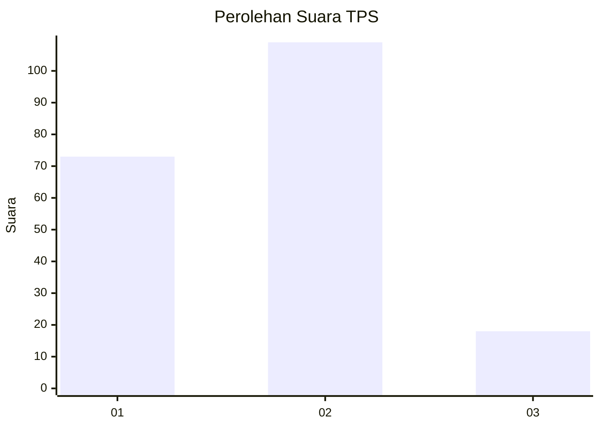

# Hasil

## Grafik

## Tabel

| No. | Nama Paslon    | Suara | Suara (raw) | Persentase |
|:--- |:-------------- | -----:| -----------:| ----------:|
| 1   | ANIES MUHAIMIN | 73    | [73][p-1]   | 36,50      |
| 2   | PRABOWO GIBRAN | 109   | [109][p-2]  | 54,50      |
| 3   | GANJAR MAHFUD  | 18    | [18][p-3]   | 9,00       |

[p-1]: https://github.com/gigit-pemilu/pemilu-2024-35-jawa-timur/blob/main/pilpres/hitung-suara/sub/35-jawa-timur/sub/29-sumenep/sub/06-saronggi/sub/2009-saronggi/sub/006-tps/sub/paslon-1.txt
[p-2]: https://github.com/gigit-pemilu/pemilu-2024-35-jawa-timur/blob/main/pilpres/hitung-suara/sub/35-jawa-timur/sub/29-sumenep/sub/06-saronggi/sub/2009-saronggi/sub/006-tps/sub/paslon-2.txt
[p-3]: https://github.com/gigit-pemilu/pemilu-2024-35-jawa-timur/blob/main/pilpres/hitung-suara/sub/35-jawa-timur/sub/29-sumenep/sub/06-saronggi/sub/2009-saronggi/sub/006-tps/sub/paslon-3.txt

## Foto C Plano

https://sirekap-obj-formc.kpu.go.id/64e8/pemilu/ppwp/35/29/06/20/09/3529062009006-20240215-130710--b4002163-30ee-4924-9935-0e4980452543.jpg

https://sirekap-obj-formc.kpu.go.id/64e8/pemilu/ppwp/35/29/06/20/09/3529062009006-20240215-161951--34bec48e-4184-4aae-9d83-9de9fd36ed47.jpg

https://sirekap-obj-formc.kpu.go.id/64e8/pemilu/ppwp/35/29/06/20/09/3529062009006-20240215-002815--ec08b1eb-9fe9-42b0-a9a5-8012082bd24a.jpg

## Metadata

| Key        | Value               |
| ---------- | ------------------- |
| Time Stamp | 2024-02-15 19:00:26 |

