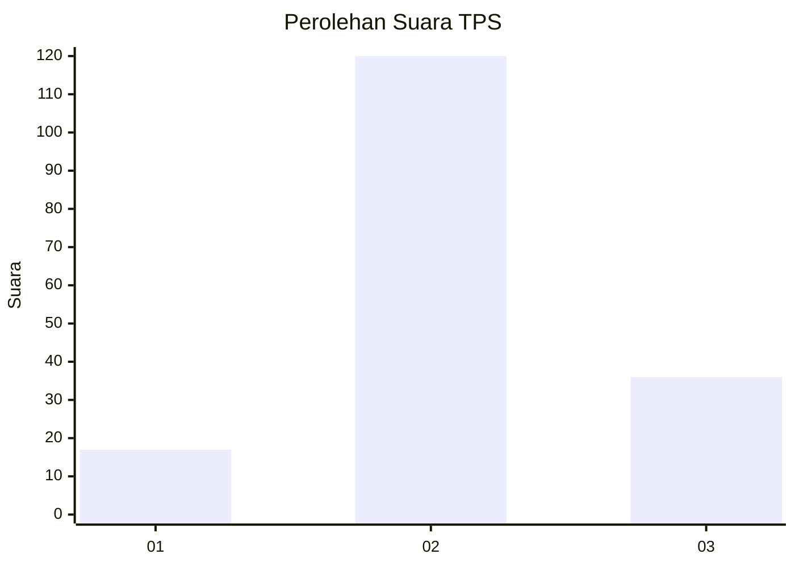
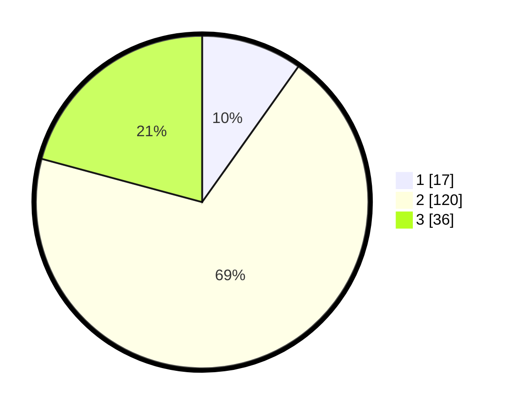

# Hasil

## Grafik

## Tabel

| No. | Nama Paslon    | Suara | Suara (raw) | Persentase |
|:--- |:-------------- | -----:| -----------:| ----------:|
| 1   | ANIES MUHAIMIN | 17    | [17][p-1]   | 9,83       |
| 2   | PRABOWO GIBRAN | 120   | [120][p-2]  | 69,36      |
| 3   | GANJAR MAHFUD  | 36    | [36][p-3]   | 20,81      |

[p-1]: https://github.com/gigit-pemilu/pemilu-2024/blob/main/pilpres/hitung-suara/sub/35-jawa-timur/sub/29-sumenep/sub/06-saronggi/sub/2012-aengtongtong/sub/003-tps/sub/paslon-1.txt
[p-2]: https://github.com/gigit-pemilu/pemilu-2024/blob/main/pilpres/hitung-suara/sub/35-jawa-timur/sub/29-sumenep/sub/06-saronggi/sub/2012-aengtongtong/sub/003-tps/sub/paslon-2.txt
[p-3]: https://github.com/gigit-pemilu/pemilu-2024/blob/main/pilpres/hitung-suara/sub/35-jawa-timur/sub/29-sumenep/sub/06-saronggi/sub/2012-aengtongtong/sub/003-tps/sub/paslon-3.txt

## Foto C Plano

https://sirekap-obj-formc.kpu.go.id/cc71/pemilu/ppwp/35/29/06/20/12/3529062012003-20240215-024052--a2a7297d-9383-4407-83ff-8e5964a0fe91.jpg

https://sirekap-obj-formc.kpu.go.id/cc71/pemilu/ppwp/35/29/06/20/12/3529062012003-20240215-024258--311978c9-39ec-4e94-b0d0-2589eff872db.jpg

https://sirekap-obj-formc.kpu.go.id/cc71/pemilu/ppwp/35/29/06/20/12/3529062012003-20240215-024438--48a8b37c-eb22-4938-a682-edbae4c19876.jpg

## Metadata

| Key        | Value               |
| ---------- | ------------------- |
| Time Stamp | 2024-02-25 14:00:00 |

