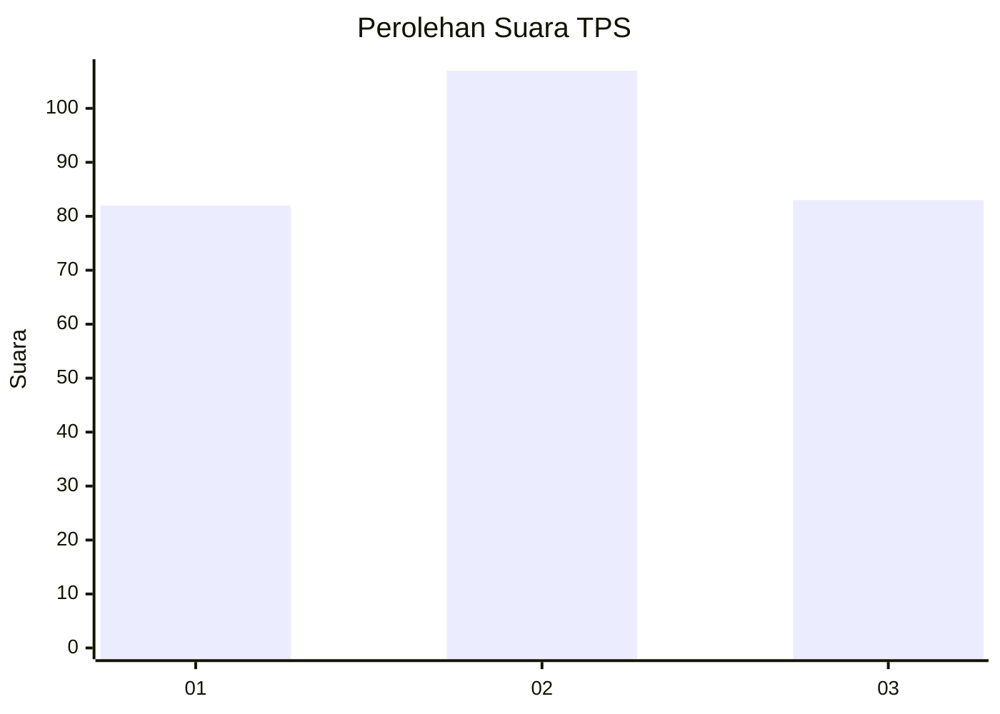
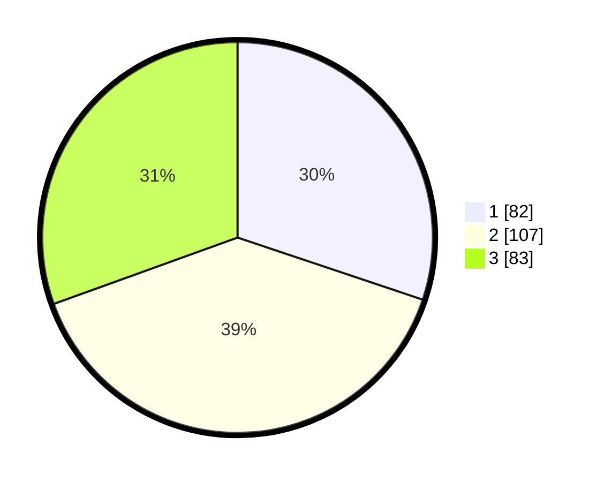

# Hasil

## Grafik

## Tabel

| No. | Nama Paslon    | Suara | Suara (raw) | Persentase |
|:--- |:-------------- | -----:| -----------:| ----------:|
| 1   | ANIES MUHAIMIN | 82    | [82][p-1]   | 30,15      |
| 2   | PRABOWO GIBRAN | 107   | [107][p-2]  | 39,34      |
| 3   | GANJAR MAHFUD  | 83    | [83][p-3]   | 30,51      |

[p-1]: https://github.com/gigit-pemilu/pemilu-2024-35-jawa-timur/blob/main/pilpres/hitung-suara/sub/35-jawa-timur/sub/29-sumenep/sub/06-saronggi/sub/2013-talang/sub/016-tps/sub/paslon-1.txt
[p-2]: https://github.com/gigit-pemilu/pemilu-2024-35-jawa-timur/blob/main/pilpres/hitung-suara/sub/35-jawa-timur/sub/29-sumenep/sub/06-saronggi/sub/2013-talang/sub/016-tps/sub/paslon-2.txt
[p-3]: https://github.com/gigit-pemilu/pemilu-2024-35-jawa-timur/blob/main/pilpres/hitung-suara/sub/35-jawa-timur/sub/29-sumenep/sub/06-saronggi/sub/2013-talang/sub/016-tps/sub/paslon-3.txt

## Foto C Plano

https://sirekap-obj-formc.kpu.go.id/d2b0/pemilu/ppwp/35/29/06/20/13/3529062013016-20240215-164026--32c4690a-c941-4638-a94a-f5e701745f4b.jpg

https://sirekap-obj-formc.kpu.go.id/d2b0/pemilu/ppwp/35/29/06/20/13/3529062013016-20240215-001700--21260438-0e87-4584-94ec-1542c1c529be.jpg

https://sirekap-obj-formc.kpu.go.id/d2b0/pemilu/ppwp/35/29/06/20/13/3529062013016-20240215-001746--0600cfe3-795e-487c-a9bc-1c292460e468.jpg

## Metadata

| Key        | Value               |
| ---------- | ------------------- |
| Time Stamp | 2024-02-19 06:16:00 |

