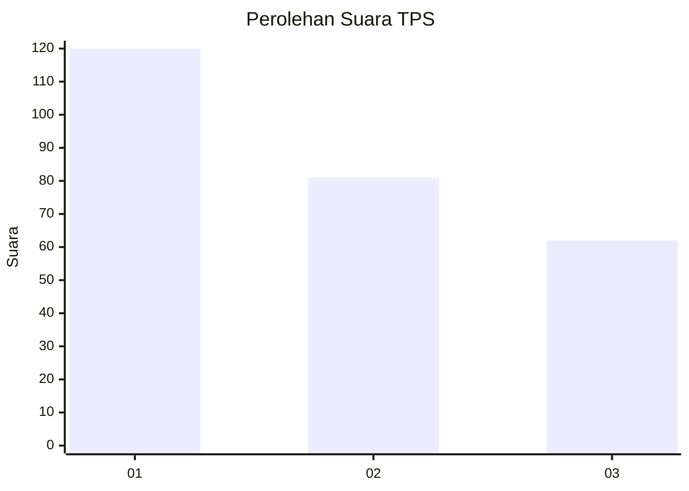
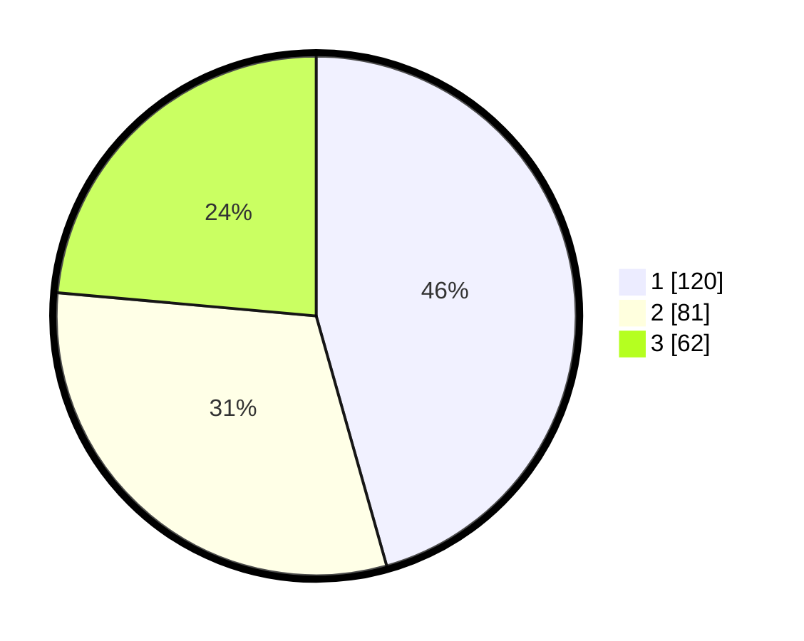

# Hasil

## Grafik

## Tabel

| No. | Nama Paslon    | Suara | Suara (raw) | Persentase |
|:--- |:-------------- | -----:| -----------:| ----------:|
| 1   | ANIES MUHAIMIN | 120   | [120][p-1]  | 45,63      |
| 2   | PRABOWO GIBRAN | 81    | [81][p-2]   | 30,80      |
| 3   | GANJAR MAHFUD  | 62    | [62][p-3]   | 23,57      |

[p-1]: https://github.com/gigit-pemilu/pemilu-2024/blob/main/pilpres/hitung-suara/sub/35-jawa-timur/sub/29-sumenep/sub/07-lenteng/sub/2001-moncek-barat/sub/004-tps/sub/paslon-1.txt
[p-2]: https://github.com/gigit-pemilu/pemilu-2024/blob/main/pilpres/hitung-suara/sub/35-jawa-timur/sub/29-sumenep/sub/07-lenteng/sub/2001-moncek-barat/sub/004-tps/sub/paslon-2.txt
[p-3]: https://github.com/gigit-pemilu/pemilu-2024/blob/main/pilpres/hitung-suara/sub/35-jawa-timur/sub/29-sumenep/sub/07-lenteng/sub/2001-moncek-barat/sub/004-tps/sub/paslon-3.txt

## Foto C Plano

https://sirekap-obj-formc.kpu.go.id/ad23/pemilu/ppwp/35/29/07/20/01/3529072001004-20240216-160130--9d7328bc-996f-409c-b4cb-8b086ad60c0f.jpg

https://sirekap-obj-formc.kpu.go.id/ad23/pemilu/ppwp/35/29/07/20/01/3529072001004-20240216-160131--afbc9bcd-82ea-4a9b-a6ca-5938417829fb.jpg

https://sirekap-obj-formc.kpu.go.id/ad23/pemilu/ppwp/35/29/07/20/01/3529072001004-20240216-160130--01a642ba-efaa-45a0-a388-6de9726b2b30.jpg

## Metadata

| Key        | Value               |
| ---------- | ------------------- |
| Time Stamp | 2024-02-16 16:25:10 |

## DATA PEMILIH TETAP

Jumlah pemilih dalam DPT: **279**.
 * L: **134**.
 * P: **145**.

## DATA PENGGUNA HAK PILIH

Jumlah pengguna hak pilih dalam DPT: **263**.
 * L: **126**.
 * P: **137**.

Jumlah pengguna hak pilih dalam DPTb: **0**.
 * L: **0**.
 * P: **0**.

Jumlah pengguna hak pilih dalam DPK: **0**.
 * L: **0**.
 * P: **0**.

Jumlah pengguna hak pilih: **263**.
 * L: **126**.
 * P: **137**.

## JUMLAH SUARA SAH DAN TIDAK SAH

JUMLAH SELURUH SUARA SAH: **263**.

JUMLAH SUARA TIDAK SAH: **0**.

JUMLAH SELURUH SUARA SAH DAN SUARA TIDAK SAH: **263**.

