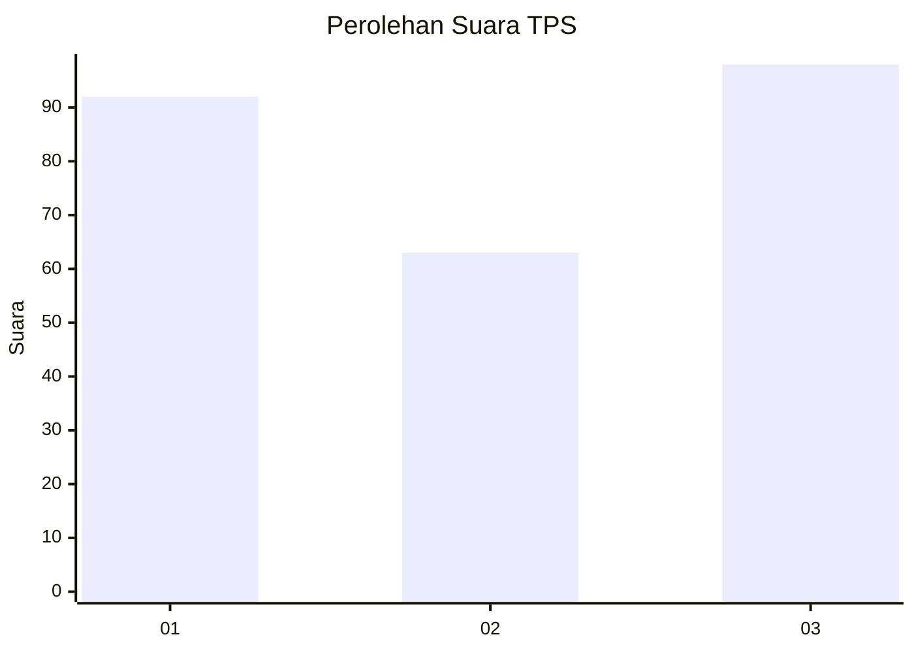
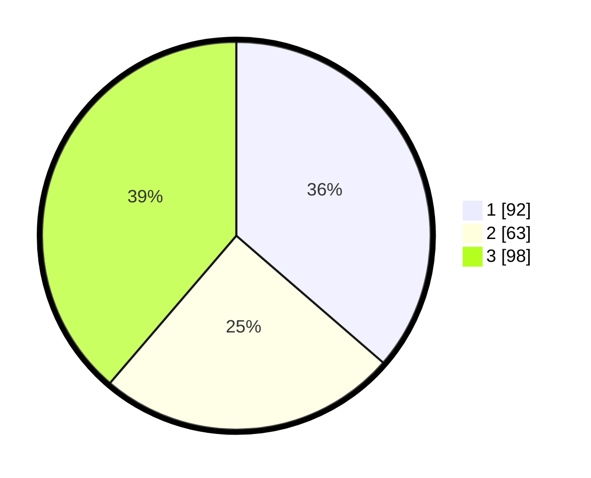

# Hasil

## Grafik

## Tabel

| No. | Nama Paslon    | Suara | Suara (raw) | Persentase |
|:--- |:-------------- | -----:| -----------:| ----------:|
| 1   | ANIES MUHAIMIN | 92    | [92][p-1]   | 36,36      |
| 2   | PRABOWO GIBRAN | 63    | [63][p-2]   | 24,90      |
| 3   | GANJAR MAHFUD  | 98    | [98][p-3]   | 38,74      |

[p-1]: https://github.com/gigit-pemilu/pemilu-2024-35-jawa-timur/blob/main/pilpres/hitung-suara/sub/35-jawa-timur/sub/29-sumenep/sub/07-lenteng/sub/2002-moncek-tengah/sub/003-tps/sub/paslon-1.txt
[p-2]: https://github.com/gigit-pemilu/pemilu-2024-35-jawa-timur/blob/main/pilpres/hitung-suara/sub/35-jawa-timur/sub/29-sumenep/sub/07-lenteng/sub/2002-moncek-tengah/sub/003-tps/sub/paslon-2.txt
[p-3]: https://github.com/gigit-pemilu/pemilu-2024-35-jawa-timur/blob/main/pilpres/hitung-suara/sub/35-jawa-timur/sub/29-sumenep/sub/07-lenteng/sub/2002-moncek-tengah/sub/003-tps/sub/paslon-3.txt

## Foto C Plano

https://sirekap-obj-formc.kpu.go.id/6bfc/pemilu/ppwp/35/29/07/20/02/3529072002003-20240214-230221--ad57e96f-4fbb-4415-8bc5-a2284cf9fc04.jpg

https://sirekap-obj-formc.kpu.go.id/6bfc/pemilu/ppwp/35/29/07/20/02/3529072002003-20240214-230305--57d0d45f-7774-426f-ab11-90fbf31ee045.jpg

https://sirekap-obj-formc.kpu.go.id/6bfc/pemilu/ppwp/35/29/07/20/02/3529072002003-20240214-230349--5cbf1956-12af-46a9-bfa9-087e6a02a269.jpg

## Metadata

| Key        | Value               |
| ---------- | ------------------- |
| Time Stamp | 2024-02-25 14:00:00 |

