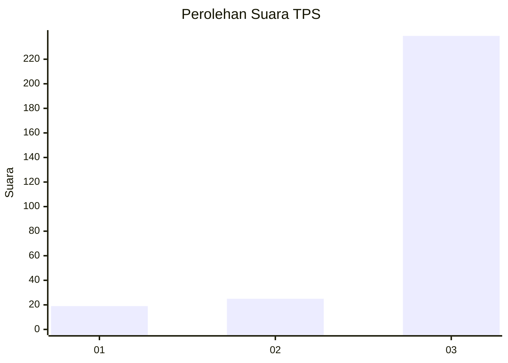
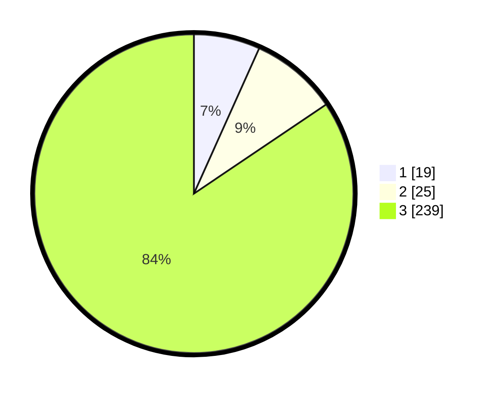

# Hasil

## Grafik

## Tabel

| No. | Nama Paslon    | Suara | Suara (raw) | Persentase |
|:--- |:-------------- | -----:| -----------:| ----------:|
| 1   | ANIES MUHAIMIN | 19    | [19][p-1]   | 6,71       |
| 2   | PRABOWO GIBRAN | 25    | [25][p-2]   | 8,83       |
| 3   | GANJAR MAHFUD  | 239   | [239][p-3]  | 84,45      |

[p-1]: https://github.com/gigit-pemilu/pemilu-2024-35-jawa-timur/blob/main/pilpres/hitung-suara/sub/35-jawa-timur/sub/29-sumenep/sub/07-lenteng/sub/2004-banaresep-timur/sub/001-tps/sub/paslon-1.txt
[p-2]: https://github.com/gigit-pemilu/pemilu-2024-35-jawa-timur/blob/main/pilpres/hitung-suara/sub/35-jawa-timur/sub/29-sumenep/sub/07-lenteng/sub/2004-banaresep-timur/sub/001-tps/sub/paslon-2.txt
[p-3]: https://github.com/gigit-pemilu/pemilu-2024-35-jawa-timur/blob/main/pilpres/hitung-suara/sub/35-jawa-timur/sub/29-sumenep/sub/07-lenteng/sub/2004-banaresep-timur/sub/001-tps/sub/paslon-3.txt

## Foto C Plano

https://sirekap-obj-formc.kpu.go.id/0202/pemilu/ppwp/35/29/07/20/04/3529072004001-20240215-103924--a3921041-11b6-495a-9979-5002ebe1507e.jpg

https://sirekap-obj-formc.kpu.go.id/0202/pemilu/ppwp/35/29/07/20/04/3529072004001-20240215-104346--67df27ec-6e1b-4430-ac53-cf41a6742163.jpg

## Metadata

| Key        | Value               |
| ---------- | ------------------- |
| Time Stamp | 2024-02-24 22:31:28 |

