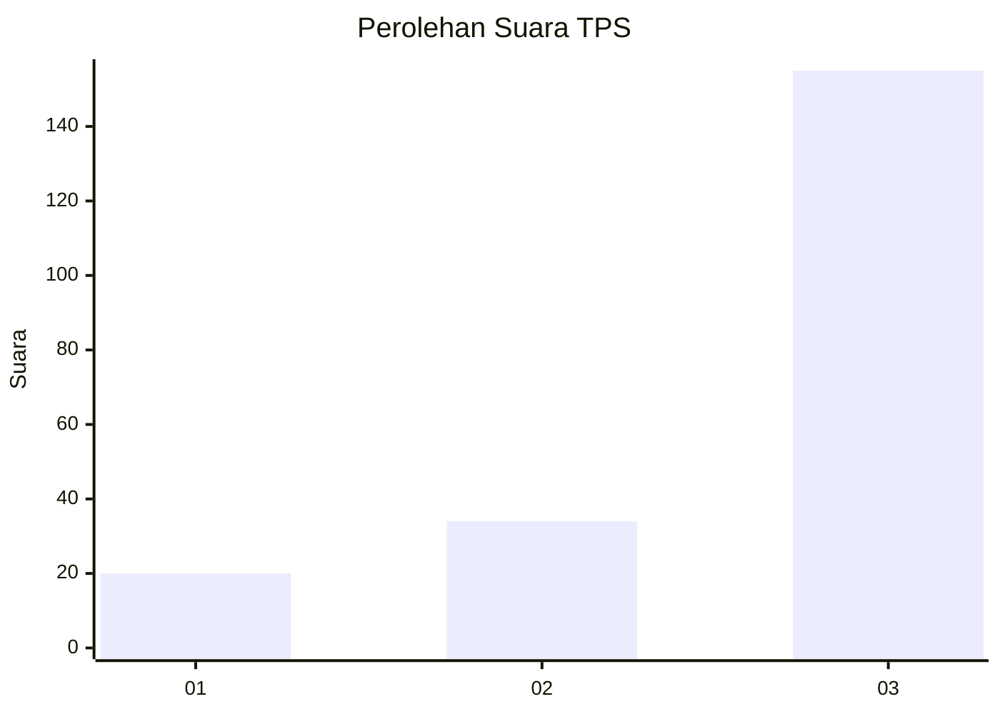
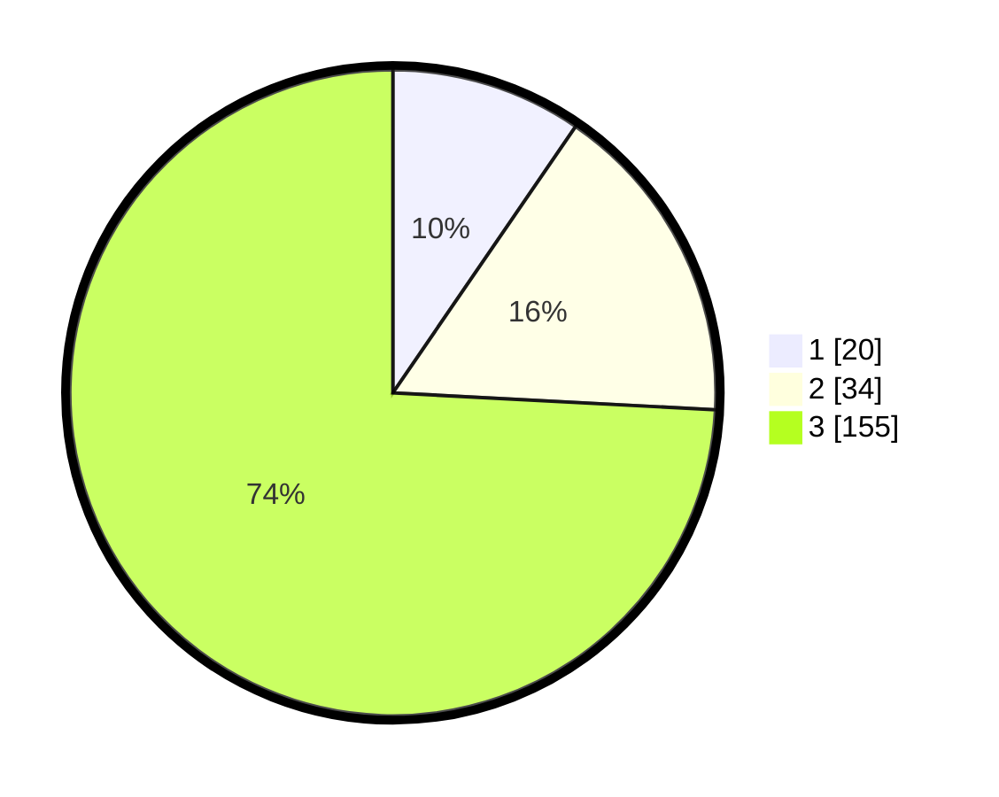

# Hasil

## Grafik

## Tabel

| No. | Nama Paslon    | Suara | Suara (raw) | Persentase |
|:--- |:-------------- | -----:| -----------:| ----------:|
| 1   | ANIES MUHAIMIN | 20    | [20][p-1]   | 9,57       |
| 2   | PRABOWO GIBRAN | 34    | [34][p-2]   | 16,27      |
| 3   | GANJAR MAHFUD  | 155   | [155][p-3]  | 74,16      |

[p-1]: https://github.com/gigit-pemilu/pemilu-2024-35-jawa-timur/blob/main/pilpres/hitung-suara/sub/35-jawa-timur/sub/29-sumenep/sub/07-lenteng/sub/2004-banaresep-timur/sub/002-tps/sub/paslon-1.txt
[p-2]: https://github.com/gigit-pemilu/pemilu-2024-35-jawa-timur/blob/main/pilpres/hitung-suara/sub/35-jawa-timur/sub/29-sumenep/sub/07-lenteng/sub/2004-banaresep-timur/sub/002-tps/sub/paslon-2.txt
[p-3]: https://github.com/gigit-pemilu/pemilu-2024-35-jawa-timur/blob/main/pilpres/hitung-suara/sub/35-jawa-timur/sub/29-sumenep/sub/07-lenteng/sub/2004-banaresep-timur/sub/002-tps/sub/paslon-3.txt

## Foto C Plano

https://sirekap-obj-formc.kpu.go.id/cdb4/pemilu/ppwp/35/29/07/20/04/3529072004002-20240214-225029--efc861e6-c3f6-42da-9c2e-cecf99ac1f6e.jpg

https://sirekap-obj-formc.kpu.go.id/cdb4/pemilu/ppwp/35/29/07/20/04/3529072004002-20240214-204211--d250dfb8-3139-4426-a635-163b76805fe0.jpg

https://sirekap-obj-formc.kpu.go.id/cdb4/pemilu/ppwp/35/29/07/20/04/3529072004002-20240214-225223--3b37c9a2-35f0-4190-b4a7-b341657b6870.jpg

## Metadata

| Key        | Value               |
| ---------- | ------------------- |
| Time Stamp | 2024-02-15 21:01:18 |

