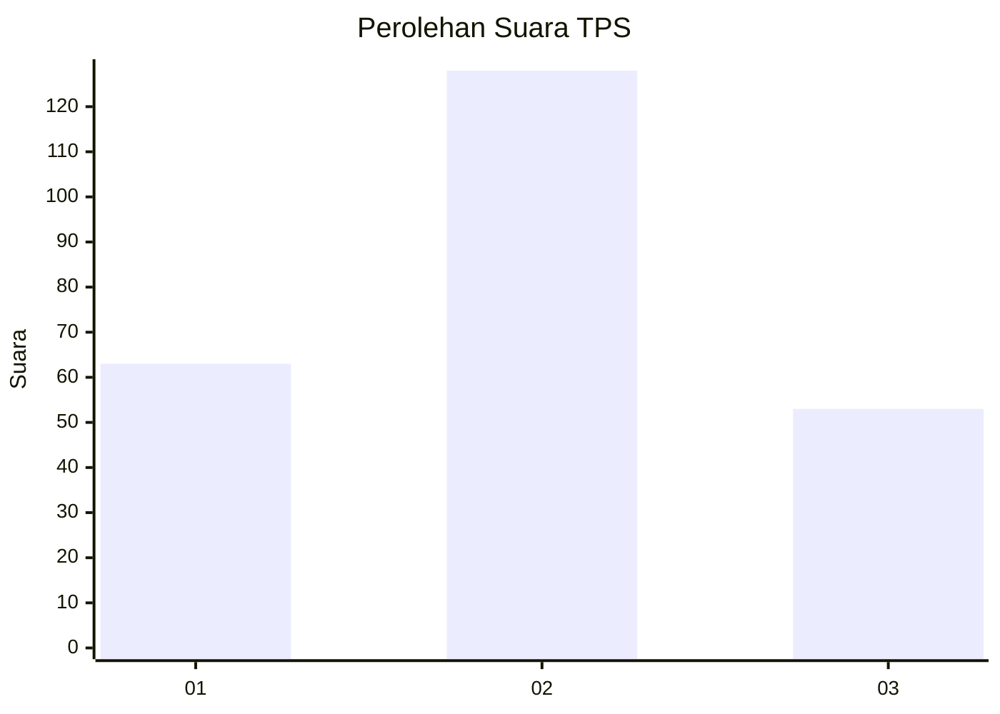
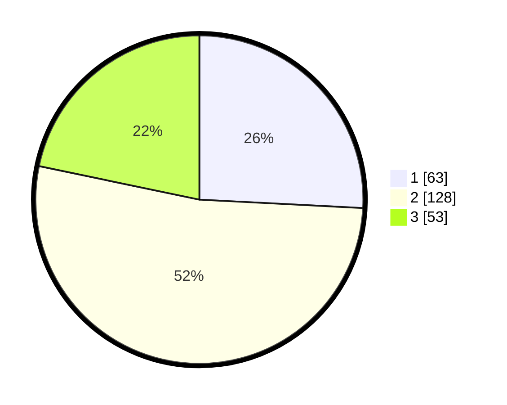

# Hasil

## Grafik

## Tabel

| No. | Nama Paslon    | Suara | Suara (raw) | Persentase |
|:--- |:-------------- | -----:| -----------:| ----------:|
| 1   | ANIES MUHAIMIN | 63    | [63][p-1]   | 25,82      |
| 2   | PRABOWO GIBRAN | 128   | [128][p-2]  | 52,46      |
| 3   | GANJAR MAHFUD  | 53    | [53][p-3]   | 21,72      |

[p-1]: https://github.com/gigit-pemilu/pemilu-2024-35-jawa-timur/blob/main/pilpres/hitung-suara/sub/35-jawa-timur/sub/29-sumenep/sub/07-lenteng/sub/2005-tarogan/sub/002-tps/sub/paslon-1.txt
[p-2]: https://github.com/gigit-pemilu/pemilu-2024-35-jawa-timur/blob/main/pilpres/hitung-suara/sub/35-jawa-timur/sub/29-sumenep/sub/07-lenteng/sub/2005-tarogan/sub/002-tps/sub/paslon-2.txt
[p-3]: https://github.com/gigit-pemilu/pemilu-2024-35-jawa-timur/blob/main/pilpres/hitung-suara/sub/35-jawa-timur/sub/29-sumenep/sub/07-lenteng/sub/2005-tarogan/sub/002-tps/sub/paslon-3.txt

## Foto C Plano

https://sirekap-obj-formc.kpu.go.id/473c/pemilu/ppwp/35/29/07/20/05/3529072005002-20240215-200541--853b7c96-0819-48f6-b071-2f1c1d3e7b7a.jpg

https://sirekap-obj-formc.kpu.go.id/473c/pemilu/ppwp/35/29/07/20/05/3529072005002-20240215-200749--ae3e2e8d-1c2e-42b8-a6b3-4102d55ace0a.jpg

https://sirekap-obj-formc.kpu.go.id/473c/pemilu/ppwp/35/29/07/20/05/3529072005002-20240215-200941--a30c2a35-2811-4882-9c74-9e5492b05ac8.jpg

## Metadata

| Key        | Value               |
| ---------- | ------------------- |
| Time Stamp | 2024-02-25 15:00:00 |

