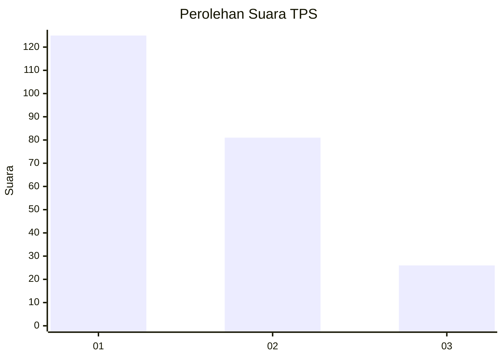
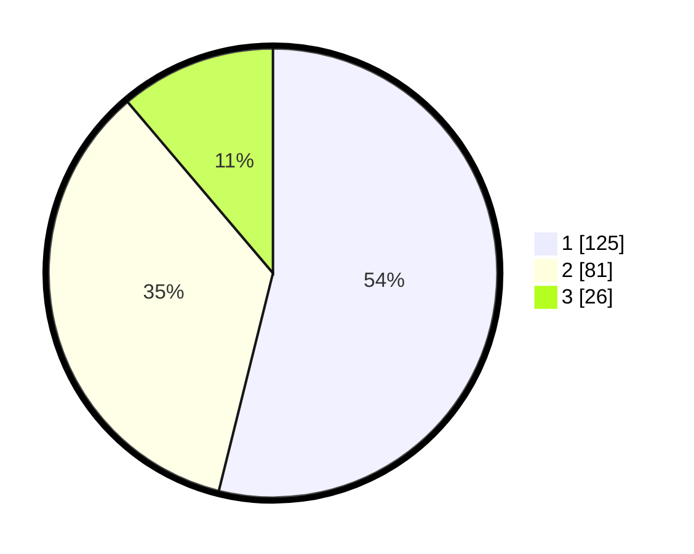

# Hasil

## Grafik

## Tabel

| No. | Nama Paslon    | Suara | Suara (raw) | Persentase |
|:--- |:-------------- | -----:| -----------:| ----------:|
| 1   | ANIES MUHAIMIN | 125   | [125][p-1]  | 53,88      |
| 2   | PRABOWO GIBRAN | 81    | [81][p-2]   | 34,91      |
| 3   | GANJAR MAHFUD  | 26    | [26][p-3]   | 11,21      |

[p-1]: https://github.com/gigit-pemilu/pemilu-2024-35-jawa-timur/blob/main/pilpres/hitung-suara/sub/35-jawa-timur/sub/29-sumenep/sub/07-lenteng/sub/2007-poreh/sub/001-tps/sub/paslon-1.txt
[p-2]: https://github.com/gigit-pemilu/pemilu-2024-35-jawa-timur/blob/main/pilpres/hitung-suara/sub/35-jawa-timur/sub/29-sumenep/sub/07-lenteng/sub/2007-poreh/sub/001-tps/sub/paslon-2.txt
[p-3]: https://github.com/gigit-pemilu/pemilu-2024-35-jawa-timur/blob/main/pilpres/hitung-suara/sub/35-jawa-timur/sub/29-sumenep/sub/07-lenteng/sub/2007-poreh/sub/001-tps/sub/paslon-3.txt

## Foto C Plano

https://sirekap-obj-formc.kpu.go.id/8ea8/pemilu/ppwp/35/29/07/20/07/3529072007001-20240214-225317--e2fa3de7-d898-47c1-b17d-3b399d167e06.jpg

https://sirekap-obj-formc.kpu.go.id/8ea8/pemilu/ppwp/35/29/07/20/07/3529072007001-20240214-225430--06d68729-7af6-423b-ad6c-f060d16f880b.jpg

https://sirekap-obj-formc.kpu.go.id/8ea8/pemilu/ppwp/35/29/07/20/07/3529072007001-20240214-225607--d8da3991-3c4e-4c3f-8513-0947d9c4796a.jpg

## Metadata

| Key        | Value               |
| ---------- | ------------------- |
| Time Stamp | 2024-02-15 21:30:27 |

